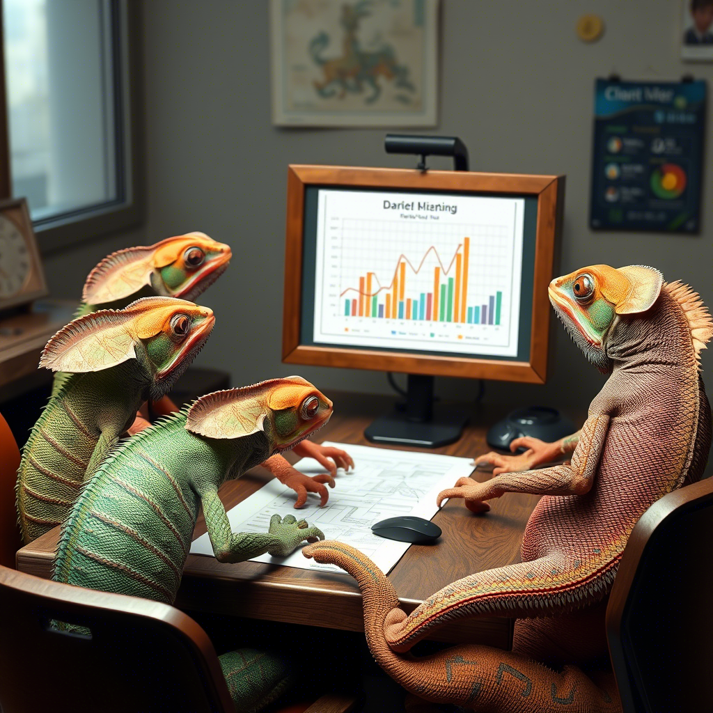
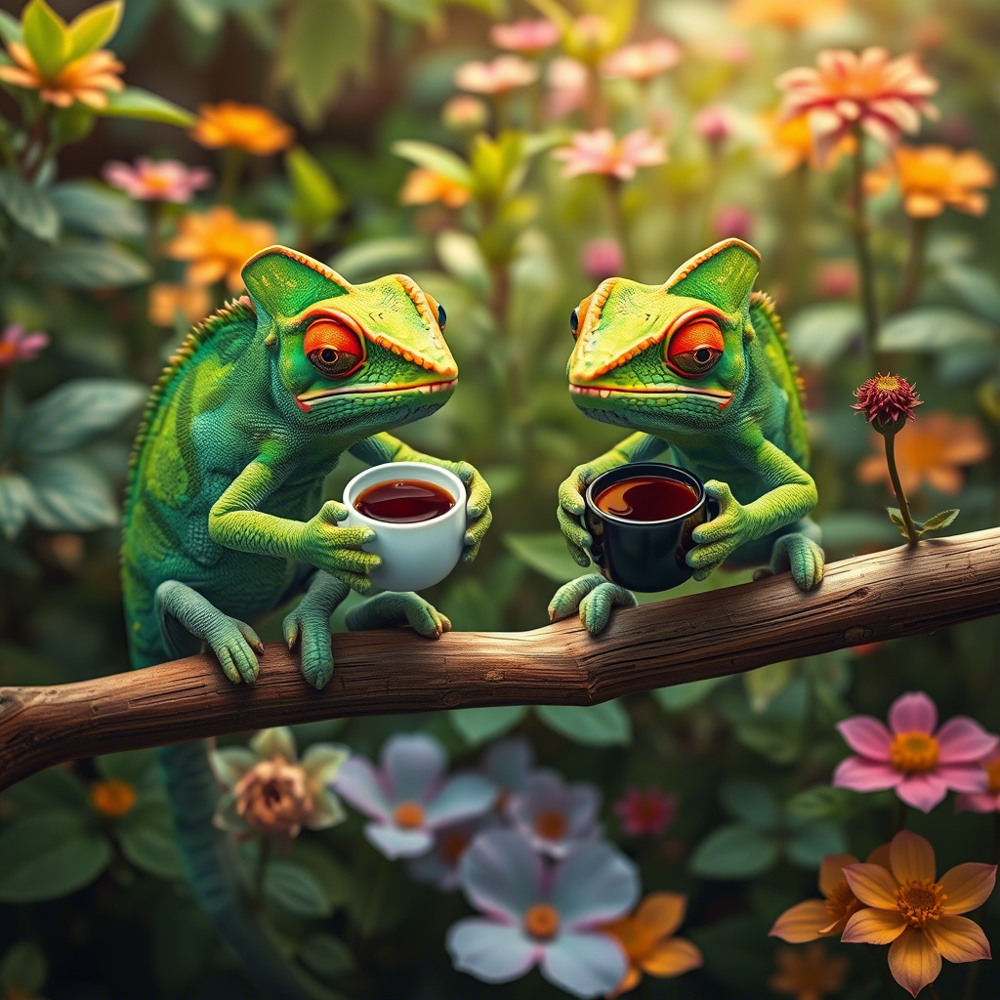

Project Management, Future Trends, Workplace Strategy

 ## Grab Your Board: 2021’s Project Management Megatrends **Plot twist:** Waterfall just joined TikTok. Hybrid work became your new office mascot. And emotional IQ? It’s now your secret weapon. Let’s unpack 2021’s wildest PM predictions with more sizzle than a scrum master’s coffee machine.

### 1. Hybrid Work’s Glow-Up

Forget “remote vs office” – 2021’s MVP is the **chameleon workforce**. Teams will toggle between couch and cubicle like Netflix switching genres. Tools? Think **Miro whiteboards** for virtual sticky-note wars and **Zoho Projects** for tracking tasks across time zones. Pro tip: Master the “camera-on” poker face for those 6am pajama meetings[2](https://kanbanzone.com/2021/top-5-emerging-project-management-trends-in-2021/)[6](https://www.pmtraining.com/about/five-project-management-trends-managers-should-be-on-the-lookout-for-in-2021).

### 2. Methodology Mashups Go Viral

Agile purists, meet your Frankenstein future. 2021’s recipe? **1 part Scrum + 2 parts Six Sigma + a dash of Waterfall**. Teams will create mutant workflows that make PMP textbooks blush. Construction crews using Kanban? Healthcare teams sprinting? You bet your burn-down chart[2](https://kanbanzone.com/2021/top-5-emerging-project-management-trends-in-2021/)[7](https://www.thepmosquad.com/blog/pmo-trends-in-2021-a-collection-from-the-industry).

### 3. The CSR Takeover

Sustainability stops being the office hippie’s pet project. Enter **green Gantt charts** tracking carbon footprints and **diversity dashboards** measuring team inclusion. Forget ROI – the new rockstar metric is **SROI (Social Return on Investment)**. Companies ignoring this? They’ll crash faster than a Zoom call with your ex[3](https://pm360consulting.ie/top-emerging-trends-for-project-management-2021/)[9](https://approval.studio/blog/7-project-management-trends-for-2021/).

### 4. Automation Nation ➡

Robots are coming for your busywork. **Automated resource allocation** tools will handle scheduling like a caffeine-fueled octopus. But here’s the twist: PMs become **orchestra conductors** instead of note-takers. Pro move: Upskill in bot wrangling or risk becoming the fax machine of your team.

### 5. Emotional IQ Arms Race ❤️

Forget PMP certs – 2021’s hottest credential? **Virtual vibe-check mastery**. PMs will need Spidey senses for detecting Zoom fatigue and Slack tension. Expect **empathy metrics** in performance reviews and **emoji fluency** becoming core competency. Can’t read a room through 16 Brady Bunch squares? Start practicing.

| Traditional Skill | 2021 Upgrade |
| --- | --- |
| Risk Management | **Meme Warfare Prevention** |
| Gantt Charts | **TikTok Project Updates** |
| Stakeholder Updates | **Netflix-Style Binge Reports** |

### 6. Cybersecurity Joins the Iron Triangle

Data protection becomes the fourth constraint alongside time/scope/budget. PMs will need **GDPR ninja skills** and **encryption fluency**. Tools like **Workfront** will bake security into every workflow. Forget “password123” – your new mantra is “zero-trust architecture”.

### 7. Collaboration Tools Get Superpowers

Slack’s having a baby with Trello, and it’s glorious. Watch for **all-in-one platforms** combining:

- Real-time doc collaboration

- Version control that actually works

- Meeting notes that auto-magically become action items**The prize? Killing app-switching fatigue that currently murders 3h/week per employee[6](https://www.pmtraining.com/about/five-project-management-trends-managers-should-be-on-the-lookout-for-in-2021)[8](https://xplorexit.com/top-10-project-management-solution-providers-2021/).

### 8. Gig Economy Goes Mainstage

With **41% of workers freelancing**, PMs become **hive mind architects**. You’ll juggle contractors across:

- 7 time zones

- 3 tax codes

- 12 different coffee preferences**Tool pro tip: **Toggl Track** for monitoring global productivity pulses without becoming Big Brother

### 9. PMOs Evolve or Die ➡

Project Management Offices ditch their spreadsheet addiction. 2021’s PMO? It’s now the **Company’s Swiss Army Knife** handling:

- Hybrid workflow design

- Gig worker integration

- Sustainability reporting**Resistance to change? That’s how PMOs become the office equivalent of Blockbuster.

### 10. Continuous Learning Gets Caffeinated ☕

PMP certs so 2020. 2021’s hot tickets? Certifications in:

- **Virtual Team Alchemy**

- **Zombie Process Elimination**

- **Crisis Jiu-Jitsu****Platforms like **LinkedIn Learning** will offer nano-courses you can digest during elevator rides[3](https://pm360consulting.ie/top-emerging-trends-for-project-management-2021/)[7](https://www.thepmosquad.com/blog/pmo-trends-in-2021-a-collection-from-the-industry).

### Wipeout or Wave Ride?

2021’s PM landscape looks wilder than a ping pong match between Agile and Waterfall devotees. The survival formula? **Embrace chaos, automate drudgery, and become a hybrid sensei**. Companies clinging to 2019 playbooks will sink faster than a project with no RAID log.

**Final Pro Tip:** Start testing hybrid tools TODAY. Your future self (sipping margaritas on a 2022 beach) will thank you.

## Looking back from a few years later — what actually happened?

Reading this with the benefit of hindsight, here's a quick scorecard on the 10 predictions:

- **Hybrid work**: nailed it. The toggle-between-couch-and-cubicle thing became the default in knowledge work, and the orgs that mastered async-first documentation outshipped the ones still trying to force 9-5 attendance.
- **Methodology mashups**: nailed it. Pure-scrum and pure-waterfall both lost. *Hybrid is now the default.*
- **Sustainability/CSR**: half-right. The metrics happened in big enterprises, smaller shops still treat it as decoration. The SROI movement is real but slow.
- **Automation Nation**: nailed it, harder than predicted — AI ate even more of the busywork than expected by 2024.
- **Emotional IQ**: nailed it. Empathy-as-skill became the highest-leverage trait for distributed-team leads.
- **Cybersecurity as fourth constraint**: nailed it. Zero-trust went from buzzword to baseline.
- **All-in-one collab tools**: half-right. Some won (Notion, Linear), most stayed point-tools. The "kill app-switching" promise mostly didn't ship.
- **Gig economy/fractional**: nailed it, hard. Fractional PMs and contract PgMs became a real career track.
- **PMO transformation**: half-right. The PMOs that evolved survived. *Plenty died.*
- **Continuous learning**: nailed it. Nano-courses and async upskilling became table stakes.

## The meta-lesson

Predicting trends is the easy part. **Acting on them early is the hard part.** The PMs who treated 2021's predictions as a *checklist to test against* — picking two or three to actually implement before competitors did — got 18 months of lead time. The ones who treated them as light reading lost it.

The same rule will apply to whatever the next set of trends turns out to be. *Pick two, run experiments, ship behavior changes.* That's the formula. Always has been.

## Gratitude beat

Big thanks to every PM who let me run a "hybrid workflow experiment" inside their team in early 2021 instead of waiting for HQ to publish a playbook. The teams that ran the experiments early built the playbooks the rest of the org copied 18 months later. *Thank you.*
