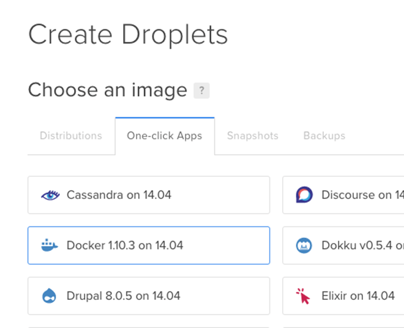
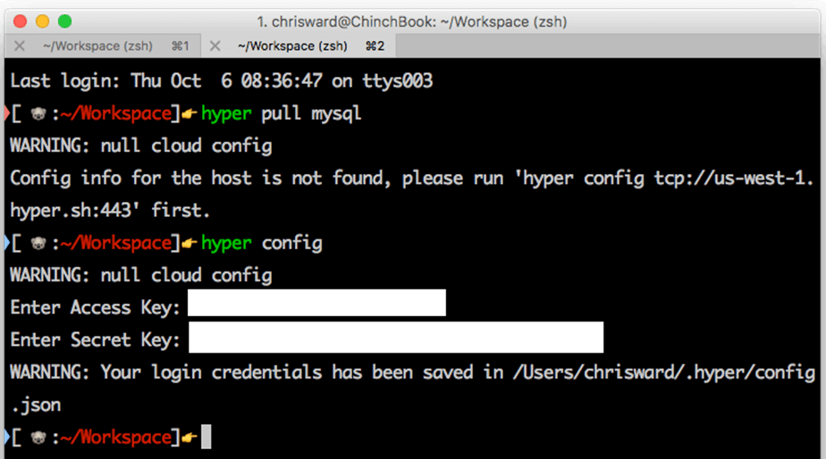
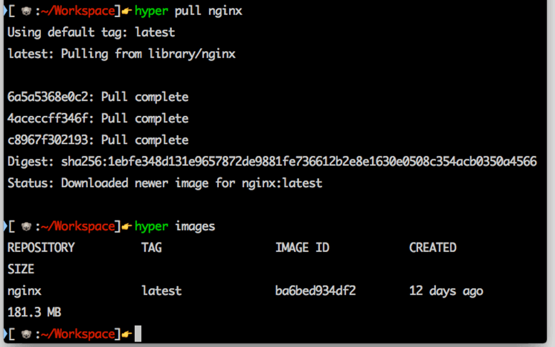

We all know that Docker is simple to get up and running on our local machines. ~~If you don’t click on the banners below and I’ll teach you.

But seamlessly transitioning our honed application stacks from development to production was a piece of the puzzle lacking until the past six to twelve months.**

Now there are so many specialized and optimized Docker hosting services available, it’s high time for a review to see what’s on offer.**

One of the complexities with comparing Docker hosting options is that many are offering management and orchestration tools on top of actual hosting providers. Not all make it clear which provider they use, when, or where, and this may or may not be an important issue to you. For this reason, I haven’t included services such as [Deis Workflow](https://github.com/deis/workflow), [Docker Cloud](https://cloud.docker.com/), or [ContainerShip](https://containership.io/) as they don’t claim to be or offer integrated hosting services.

While I will include services that host elsewhere, these costs are included in the price.

Of course, it’s possible to just install Docker on a Linux-based VM on any hosting provider, and I could produce pages of profiles of “standard” hosting companies. Instead, I’ve tried to focus on services that offer something else on top of simple hosting to make your Docker experience smoother and enhanced.**

## 

## ~~Docker Machine**

For many hosting providers, the easiest way to deploy and manage your containers is via [Docker Machine drivers](https://docs.docker.com/machine/drivers/). Unless these hosts offer anything extra on top of the driver, I won’t list them separately. Currently these include:

More are likely to follow soon, and you may be able to use [the generic driver](https://docs.docker.com/machine/drivers/generic/) for other hosts.

## ~~Amazon Web Services (AWS)**

AWS is the biggest cloud-hosting service on the planet and offers support for Docker across most of its standard EC2 machines.

AWS then offers [the EC2 container service](https://aws.amazon.com/ecs) (ECS) that exposes a set of API calls for managing containers installed across your EC2 instances. ECS isn’t charged separately, but it sits on top of any other AWS resources your containers are using. This means that containers have access to [the wide variety of services](https://aws.amazon.com/products/?nc2=h_ql_ny_livestream_blu) that AWS offers, including [storage](https://aws.amazon.com/s3/) and [scaling](https://aws.amazon.com/elasticbeanstalk).

[~~aws.amazon.com/ecs~~](https://aws.amazon.com/ecs)

## ~~Digital Ocean**

Docker container support on Digital Ocean is simple, reflecting the way the company generally works. Sign in to your [account](https://cloud.digitalocean.com/droplets) and create a new Droplet based on the Docker application.

This will create a VM running Docker on top of Ubuntu to use as usual.

## ~~Carina**

Rackspace offers a Docker Machine driver, but it also has a container hosting service. Carina is still in public beta and lets you create Docker Swarm-like clusters. It also enables you to manage your containers from development to production by using mostly standard Docker commands. For example:

carina create chriscluster –wait –nodes=3 –autoscale**

There is also a web console available for managing your containers and applications.**

[~~getcarina.com~~](https://getcarina.com/)

## ~~Sloppy.io**

Sloppy.io provides CLI tools, web interface, persistent storage between container launches, and statistics. You construct application stacks through a JSON file, and thanks to the underlying Mesos integration, Sloppy allows you to set machine specifications. For example:

{ “project”: “chrisexample”, “services”: [ { “id”: “frontend”, “apps”: [ { “id”: “node”, “domain”: { “type”: “HTTP”, “uri”: “chrisexample.sloppy.zone” }, “mem”: 1024, “image”: “chrischinchilla/frontend”, “instances”: 1, “port_mappings”: [ { “container_port”: 5000 } ], “env”: { “LCB_DATABASE_URI”: “mongodb://mongodb.backend.chrisexample/chrisexample” }, “dependencies”: [ “[https://docs.docker.com/backend/mongodb](https://docs.docker.com/backend/mongodb)” ] } ] }, { “id”: “backend”, “apps”: [ { “id”: “mongodb”, “mem”: 512, “image”: “mongo”, “instances”: 1, “port_mappings”: [ { “container_port”: 27017 } ] } ] } ] }

[~~sloppy.io~~](https://support.sloppy.io/hc/en-us)~~.

## ~~Giant Swarm**

This is a new startup that likes to keep it simple and focus on providing a solid product and support. Giant Swarm doesn’t use VMs and will only deploy your containers and services to private AWS machines and their own bare metal services.

Exact pricing is a little unclear, and the service is invite-only right now, but they are open about their [infrastructure](https://giantswarm.io/products/), with several custom components available on [GitHub](https://github.com/giantswarm). Setup is via [a command line tool](https://docs.giantswarm.io/), with applications defined by a JSON file that resembles a Docker Compose file. For example:

{ “name”: “chris-app”, “components”: { “front-end”: { “image”: “registry.giantswarm.io/chrischinchilla/front-end”, “ports”: 8000, “domains”: { “8000”: “chris-app.com” }, “links”: [ {“component”: “redis”, “target_port”: 6379} ] }, “redis”: { “image”: “redis:2.6”, “ports”: 6379 } } }

Images can be from the Docker Hub, as well as custom images from your account on the Giant Swarm registry.**

Start your application with a simple command that can pass a variety of parameters to the JSON file.**

swarm up –var=domain=chrisapp-chrischinchilla.gigantic.io**

An API is available for more fine-grained control of your services, and co-workers can be organized into teams to allow for collaboration.**

[~~giantswarm.io~~](https://giantswarm.io/)

## ~~Google Compute Engine (GCE)**

Kubernetes underpins Google’s container hosting and management service, their own open-source project that powers many large container-based infrastructures. The containers sit on top of Google’s own hosting service, one of the most reliable cloud-hosting services available. GCE provides a [container registry](https://cloud.google.com/container-registry/docs/) and (in beta) [a build service](https://cloud.google.com/container-builder/docs/) that will create Docker images from code hosted in Google’s Cloud.

## ~~Microsoft Azure**

While AWS looms over all other cloud providers, Azure is actually the second most popular. Backed by a large company, it’s not going anywhere any time soon and is your best source of Windows-based VMs. Besides a Docker Machine driver, [pre-built VM extensions](https://github.com/Azure/azure-docker-extension) are also available.

Azure is an official Docker [trusted registry partner](https://docs.docker.com/docker-trusted-registry/overview/), either through their own VM image or by installing [yourself](https://docs.docker.com/docker-trusted-registry/install/dtr-vhd-azure/).

## ~~Heroku**

Most of Heroku’s workflow is triggered by git push commands. These are still possible with a Docker setup, but an alternative is available via a [Docker Compose plugin](https://devcenter.heroku.com/articles/docker) for pushing your containerized applications straight to the service. Heroku also maintains Docker images for most of the languages it supports.

## ~~Quay**

Quay offers container hosting tightly integrated with the existing Docker toolset. You log in to Quay’s registry via the Docker command and [manage containers in your account](https://docs.quay.io/solution/getting-started.html).

docker login quay.io

Quay will work with many common developer tools to allow for fully automated workflows, has CLI and web tools available for managing your container deployments, as well as logging and collaboration tools.**

If you need Kubernetes for managing and orchestrating your containers, then Quay has a partner service called [Tectonic](https://tectonic.com/). Quay and Tectonic are built by the CoreOS team, so you can also use them to host and manage rkt containers. In fact, Tectonic only works with rkt containers, but I thought I would sneak a mention in.

[~~https://quay.io/~~](https://quay.io/)

## ~~Hyper**

Hyper has a simple proposition: providing a local command line abstraction to running Docker containers on Hyper’s hosting (provider and location is unspecified). The tool is easy to use, but the setup steps are slightly misleading.

If you try following the instructions on the homepage, you’ll quickly find that you actually need to sign up and get an authentication token first. This involves giving Hyper your credit card details even if all you’re intending to do is test the platform. Once you run hyper config and these steps are complete, then the process is straightforward.**

In this first image, I pull the NGINX image and then check that it has been pulled with the images.

Using the command line tool, you can start and link services and attach data volumes and IP addresses to them. Most of [Hyper’s commands](https://docs.hyper.sh/GettingStarted/index.html) are wrappers around familiar Docker commands, giving you access to a solid hosting provider. If you know Docker, you will know how to use Hyper.

## ~~Dokkur**

With containers hosted on Azure infrastructure, Dokkur manages your containers from an application level, allowing you to select your applications from GitHub or create a new application. As far as I can tell from their documentation, it uses containers for separating your applications into code, database, and persistent storage, but there is no direct Docker support or control.

[~~https://dokkur.com/~~](https://dokkur.com/)

## ~~Triton from Joyent**

Triton offers a comprehensive suite of services for creating, running, and orchestrating containers across cloud and bare metal servers. I mentioned in the introduction that I wouldn’t include services that just orchestrated hosting options, but Triton also offers its own hosting solution (the Triton cloud), so I will focus on that.

With a few clicks, Triton gives you a comprehensive graphical interface to launch and manage images and containers from the Docker Hub or your own image repositories. You can create overlay networks, add persistent storage, and add debug jobs. With API access to all functionality, a CLI tool, and deep integration with Docker, [HashiCorp Terraform](https://www.terraform.io/), and other tools from Joyent, Triton is a power user’s dream.

## ~~IBM Bluemix**

By default, Bluemix doesn’t include container images on the Docker Hub. This is confusing because initially you only have access to five ‘certified’ containers. You can copy public Docker images into your Bluemix account, but [this involves first installing a series of CLI tools](https://console.ng.bluemix.net/docs/containers/container_cli_cfic_install.html) and navigating Bluemix’s confusing documentation.

I struggled to get this to work, so instead I experimented with one of IBM’s own containers to see what’s possible. This also caused an ‘unknown error’. If you can get Bluemix to work, then it has powerful integration options available with IBM’s IoT and machine learning offerings, but it’s not for the inexperienced.

## ~~Openshift**

Another solution aimed squarely at enterprise customers, Red Hat’s Openshift can be self-installed or in Red Hat’s cloud. You can’t trial or experiment with Openshift without contacting a sales representative, so I couldn’t try the service, but it offers a lot of support and infrastructure features that will appeal to high-scale enterprise users.

So if it’s time to move on from playing with Docker in development to integrating it with production, these are the hosting services to check out. Got something to add to the list? Let me know in the comments.**
