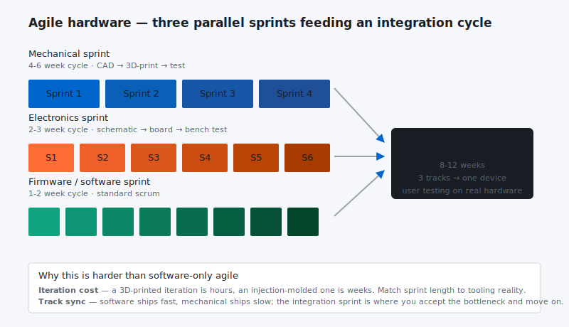

Although [Agile principles ](http://agilemanifesto.org/principles.html)can be applied with benefit in hardware product development (Agile hardware development), it misses the mark in terms of a complete solution for hardware product development. Let me explain.

[The Agile Manifesto](http://agilemanifesto.org/), first developed in 2001, has revolutionized software development. The principles, tools, and practices which have stemmed from it have been refined and spread through many software development companies. In the world of software, Agile consultants and development tools are multiplying like rabbits.

The rapid growth of [Agile development ](http://en.wikipedia.org/wiki/Agile_software_development)is understandable because there are huge financial and cultural improvements realized by operating in an Agile mode in software. Yet, in hardware product development, Agile principles, tools, and practices have been slow to take hold. Why is that? It is because software product development and hardware product development are different.

That is not to say that there aren’t similarities. Just as [Lean Manufacturing](http://en.wikipedia.org/wiki/Lean_manufacturing) has some commonalities with Lean product development, Agile software development has some commonalities with Lean hardware product development. Some examples include the value of faster feedback and earlier learning enabled by smaller batches , test driven development, daily standups, and visual work management. In many cases, a hardware team striving to be more Agile *is* moving in the right direction — Agile hardware development.

However, just as there are critical differences between Lean manufacturing and Lean product development, there are critical differences between Lean software development and Lean hardware development.

***Lean manufacturing practices can do more harm than good if blindly applied to new product development. The same is true of applying Agile to hardware.***

It is time we saw the differences clearly and built our software and development systems to operate *Leanly* under these different conditions.

Just to get us started, I will mention what I see as the ‘top 3’ differences. These have huge impacts on how we plan, manage, and execute our product development projects.

**#1 – Lead Time**

Where software teams have a relatively short ‘compile’ step which resides within the Design-Build-Test cycle, hardware teams have a relatively long ‘procure’ step. Driving down the length of the procure steps is a key initiative in Lean NPD today, but we are not, nor will we be anytime soon, anywhere close to procuring parts and building assemblies in the few minutes it takes to compile software. From the first day of a new project through its last minute changes, lead time is ever present and highly impactful. This simple fact changes a lot about what we do and how we do it.

**#2 – Component Cost**

Software development is almost all labor cost. It isn’t difficult or expensive to give everyone full access to the latest and greatest version of the software for them to test. However, in hardware development, it costs a lot to give everyone who needs it access to the latest and greatest hardware, and it takes longer to deliver those units. Like lead time, component cost changes what we should do for maximum profit.

**#3 – Non-homogenous Work**

Where software teams are comprised of several different skill sets such as marketing, design, a few different fields of development, and quality, hardware teams are typically comprised of these and a great many more. In addition to the software increasingly present in new hardware products, there are often molded components, optics, sheet metal, castings, cabling, piping, circuitry, assembly, and packaging skills needed by different people who must stay in sync during product development. There are other additional skills needed in hardware development such as the research scientists, supply chain, manufacturing, receiving/inspection, and field service not typically involved in a software project. The list goes on and on.

***The complexity of the communication channels and keeping everyone in sync on such a necessarily large team, like component lead time and cost, changes what we do in hardware product development.***

This blog series will explore many differences between these two types of product development. We will not only cover what is different but, more importantly, the implications of these differences and how we must modify the principles, practices and tools to meet the challenges of hardware Lean New Product Development.
