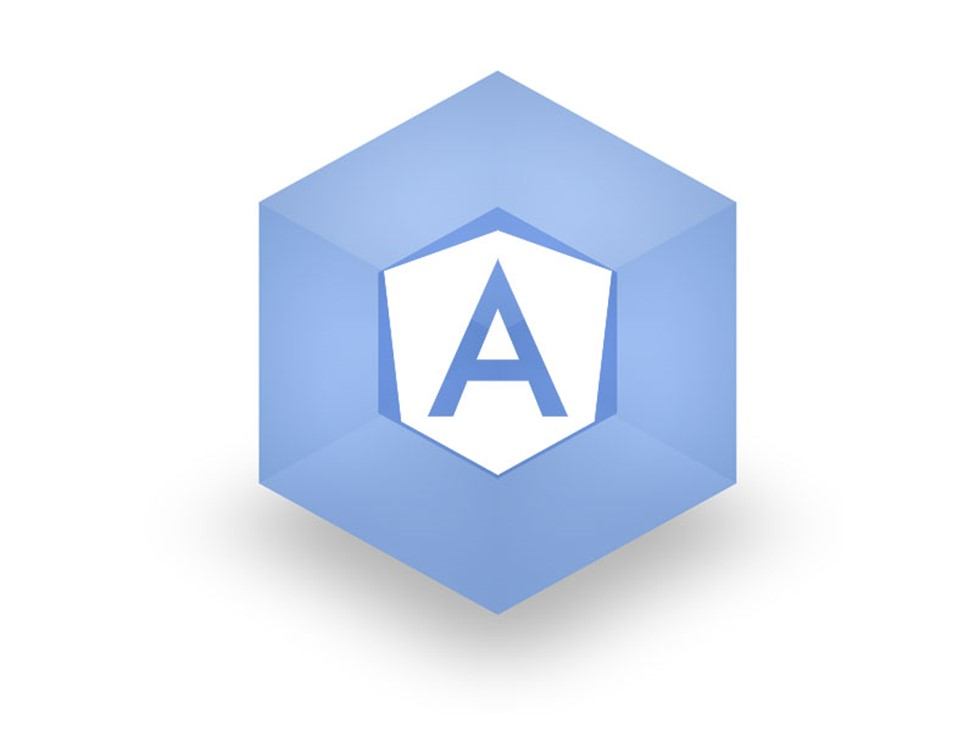

The modern JavaScript ecosystem has reached the point of maturity where some projects are becoming the **de facto standard**. Build-system veterans like Grunt and Gulp were first challenged by Browserify for packaging files for distribution; now Webpack is the norm. The Angular CLI, curiously, started with **SystemJS** for loading modules.

[Angular CLI](https://cli.angular.io/) is the official scaffolding project from the Angular team. It aims to help developers waste less time setting up before getting started. The original scaffolding used [SystemJS](https://github.com/systemjs/systemjs) — *a universal dynamic module loader* capable of loading different JavaScript formats (ES6, AMD, CommonJS).

Edging toward the 1.0 release, the Angular CLI team announced [a move to Webpack over SystemJS](https://github.com/angular/angular-cli/blob/master/CHANGELOG.md) for loading JavaScript. Work continues, but this is another move toward a more unified JavaScript ecosystem. The recently released [React project scaffolding tool](http://react-etc.net/entry/react-gets-official-boilerplate-scaffolding-through-react-cli), influenced by the [Ember CLI](https://ember-cli.com/) tool, also uses [Webpack](https://webpack.github.io/).

## Why this matters more than it sounds

When a major framework's *official* CLI switches bundlers, it's not just a build-tool change. **It's a vote.** Webpack just got the deciding ballot in a multi-year skirmish between half a dozen bundlers (Browserify, Rollup, SystemJS, Webpack, Brunch, Fly, Broccoli, take your pick).

The downstream effects:

- **Library authors** stop publishing multiple build artifacts and align on Webpack-friendly formats
- **Tooling vendors** (linters, code-splitters, source-map tools) prioritize Webpack integration
- **Tutorials and docs** standardize on one mental model of how a build works
- **New developers** have one fewer bewildering choice in their first hour

Just like NPM is now the default package manager for all JavaScript regardless of framework, **Webpack is cementing its position as the de facto module packaging tool**. That means in your decoupled-CMS projects, your headless setups, your React app, your Angular app, your Vue app — you can spend more time on productive work rather than learning yet another bundler.

## What this means for your existing project

The transition from SystemJS to Webpack is still work in progress, but the Angular team is looking to make the change as simple as possible:

> *We want to make sure it's ready. That's why we need your help. Basically, things should work. Build and Serve should work. Also, testing and E2E should too. To put it short, everything should work as it was before. But we're not certain! Test every command you can think of. Use your normal workflows. Test your projects and file issues about it.*

Developers already using Angular CLI should look at [the migration pull request](https://github.com/angular/angular-cli/pull/1456). If you're starting a new Angular project using the CLI, **you should probably already use the Webpack-powered beta** as that will spare you from migration later.

## What I'm watching next

- **HMR (Hot Module Replacement)** — Webpack's killer feature. The Angular CLI integration should make HMR a one-flag affair.
- **Tree-shaking with Webpack 2** — Angular's heavy initial bundle has historically been a sore spot. Webpack 2's tree-shaking + Angular's AOT compilation should slim it down considerably.
- **Code-splitting per route** — pairing Angular's lazy-loaded modules with Webpack's dynamic imports lets you ship a 200KB initial bundle instead of 2MB.
- **The Rollup question** — Rollup is winning the *library*-bundling battle. Webpack is winning the *app*-bundling battle. Expect this split to persist.

## Gratitude beat

Big thanks to the Angular CLI team for making the move publicly and transparently. The migration PR thread is a master class in how to change a foundational dependency without breaking the world. *Thank you* — saving every Angular developer a week of build-config hell.

## Quick migration checklist

If you're staring at an existing Angular CLI project on SystemJS and wondering whether to wait or migrate:

- **Migrate.** The Webpack-based CLI is the path forward. Waiting gets you a bigger pile to migrate later.
- **Pin your Angular version first.** Lock to a known-good minor version before swapping bundlers — one variable at a time.
- **Run your existing test suite against the new build.** It catches more than the framework's own smoke tests will.
- **Check your asset pipeline.** Anything pulled in via SystemJS's dynamic loading needs an explicit Webpack import. Use the `--prod` build during the migration to flush out lazy-loading bugs early.
- **Watch the bundle size.** First-time Webpack builds of an Angular app often come in *bigger* than the SystemJS equivalent until you turn on AOT + tree-shaking. Budget an afternoon for the optimization pass.

Most teams complete the migration in 1-3 days for a small app, 1-2 weeks for a large one. Worth it.
