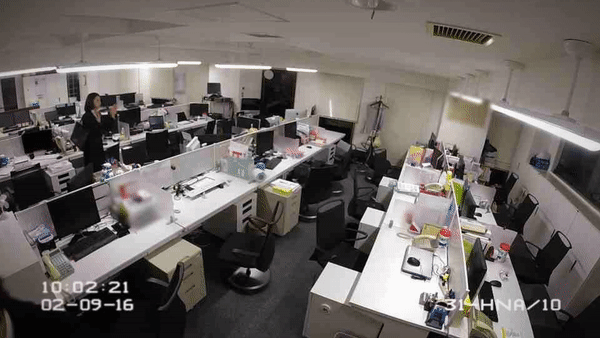

While motorized human transporters have yet to truly take off, **the folks over at Nissan have come up with something more practical for the time being: self-parking office chairs.**

With a single clap, these futuristic furniture pieces automagically tuck themselves back into their rightful positions, keeping the meeting room neat. It's also genuinely fun to watch. Nissan says these modified [Okamura](http://www.okamura.jp/en_eu/products/) chairs are tracked by four motion cameras on the walls and simultaneously controlled via Wi-Fi.

Don't expect these on Amazon any time soon. The whole thing is **a marketing stunt** to promote Nissan's intelligent parking assist tech. *And that's actually the interesting part.*

## Why this is a great product-marketing move

Nissan had a problem: their parking-assist technology is impressive but **abstract**. The customer reads "intelligent parking assist" and pictures... what, exactly? A car? Doing a thing? In a parking lot? Their eyes glaze.

So Nissan did the opposite of what most automakers would do. They didn't:

- Post a whitepaper
- Run a TV ad of a car parking itself (every car company does this — it's invisible)
- Build a configurator that explains the sensors
- Sponsor a press junket with engineering interviews

Instead, they **built the same technology into a chair** and posted it to YouTube. The chair version is:

- *Instantly* relatable (everyone has pushed a chair under a desk)
- *Visually* clean (the whole video is one frame of a meeting room from above)
- *Memorable* (you remember the chair video; you don't remember the spec sheet)
- *Shareable* (it's a 30-second clip you forward to a coworker)

Two minutes of YouTube did more for the brand than a quarter of conventional automotive marketing spend.

## The lesson for any PM trying to make abstract tech tangible

This applies to *every* abstract-tech product I've ever worked on. AI features. Latency optimization. Encryption. Eventing systems. Caching. The thing you built is **invisible by design** — and that's the marketing problem.

The Nissan move is the antidote: **demo the abstract capability in a context the customer already understands viscerally.**

- AI feature? Don't show a chart of accuracy improvements. Show the AI doing the thing the customer is currently doing manually. *Side by side. Stopwatch.*
- Latency win? Don't show the p99 graph. Show two browser windows racing to render the same page. *The user sees the win in 2 seconds.*
- Encryption? Don't explain key rotation. Show a paper version of a secret being passed in a sealed envelope. *Done.*

## The follow-the-thread test

Nissan's chair video passes what I call the *follow-the-thread test*: a journalist or social media post can reference the chair, the link gets clicked, and the visitor lands on Nissan's parking-tech page understanding the connection within 10 seconds. The chair → parking → Nissan → "I should test-drive the new model" chain takes less mental work than reading the spec sheet would have.

This is the part you can't shortcut. **The demo has to map cleanly to the actual product capability.** If Nissan's chair video had been a robot pouring coffee, the thread would have broken. The mapping (parking a chair = parking a car) is what makes it work.

## The patience part

Nissan posted that chair video in 2016. They've been promoting the same intelligent parking tech in ad campaigns for years. The stunt didn't *replace* the campaigns; it *anchored* them. Every time someone sees a Nissan ad about parking assist, the chair video is sitting in the back of their head as a visual.

That's the long game. **One clean demo of an abstract capability can do 5+ years of marketing work.** Most PMs and marketers don't have the patience to build the right one and let it run.

## Gratitude beat

Thank you to whoever at Nissan's marketing department got the chair-video idea past the legal review and the brand-consistency review and the *"but how does this directly drive showroom traffic?"* review. That sequence of meetings is where most good ideas die. The fact that this one survived is its own small miracle.

So you'll probably still be pushing office chairs around for many years to come. But the next time you see a clever, visceral demo for an abstract product, look closer — there's almost always a Nissan-chair move in there.
