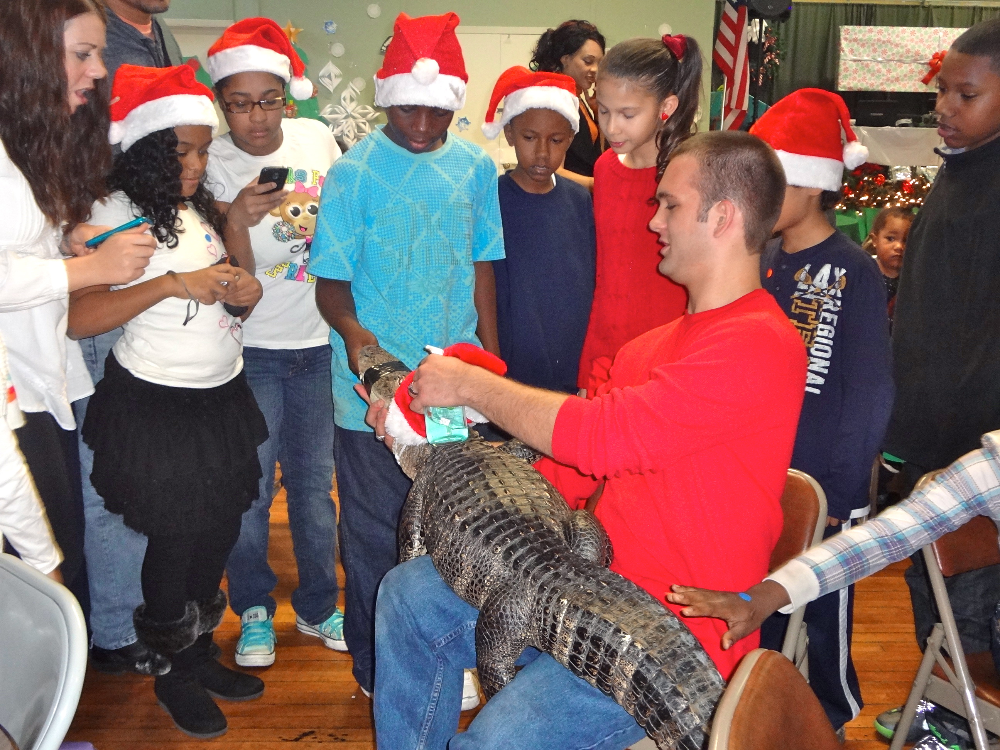
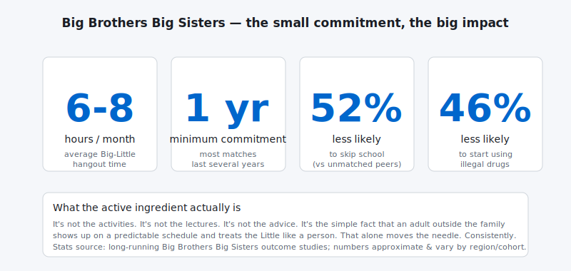

Being a **Big Brother** was one of the most enjoyable things I did last year. Also one of the most fulfilling. Also — and this is the part that surprises everyone — *the lowest-effort volunteer commitment I've ever signed up for*.

The pitch from the [Big Brothers Big Sisters](http://www.bbbs.org/) program is straightforward: get matched with a kid (your "Little"), spend a few hours a month doing stuff you'd already do anyway, **don't try to be their parent — be their friend**. That's it.

I keep meeting adults who *want* to do this and don't because they think:

1. *It's too big a commitment* — it isn't; we'll get to the math
2. *I'm not qualified to mentor anybody* — you don't need to be qualified; you need to be present
3. *What if I'm not a good Big?* — the program trains you, matches you, and is very forgiving of normal-human imperfection

## What "being a Big" actually looks like

Here's the schedule, in honest hours:

- **First meeting:** match orientation, ~2 hours
- **Monthly hangouts:** 2-4 hours, your choice of activity
- **Total time per month:** ~6-8 hours, roughly *one Saturday afternoon*

That's it. You're not adopting them. You're not their tutor. You're not responsible for their report card. You're an adult outside their family who shows up consistently for a few hours a month and treats them like a person.

What you actually do together:

- **Play sports** — basketball at the park, a Little League game, learning to throw a frisbee
- **Go on a hike** — get them outdoors if they don't get there much
- **Read books** — at the library, at a bookstore, at the coffee shop they're not old enough to hang out at unsupervised
- **Eat pizza** — with extra anchovies, because they pick the toppings and they're 11 and have something to prove
- **Give advice and inspiration** — when asked, in small doses, not as a lecture
- **Whatever you already enjoy** — odds are you'll enjoy it even more with your Little tagging along

## Why a few hours a month actually moves the needle

There's a thing the BBBS research is increasingly clear about: **the impact of a Big isn't from teaching the kid anything specific.** It's from being a *consistent adult outside the family* who shows up. That's the active ingredient. Not the activities. Not the advice. *The consistency.*

For a kid who hasn't had that consistency — from any cause: an absent parent, a single parent stretched thin, a family in a hard spot — the predictable monthly Saturday with you is sometimes the only stable adult relationship they have outside their household. The math on that is brutal and the leverage is enormous.

You're not fixing their life. You're providing one stable adult relationship. The rest of the work is theirs.

## What it does for you

This part I didn't expect. Being a Big is:

- **Genuinely fun.** Not "I'm doing this because it's noble" fun. Real fun. Your Little is going to be the most honest, unpretentious person you spend time with all month.
- **A perspective correction.** Whatever you were stressed about at work matters less after two hours of letting your Little kick your ass at mini-golf.
- **A standing reminder** that the world has 11-year-olds in it, and the choices you make at your job affect what kind of world they grow up into.
- **Cheaper than therapy.** (Same disclaimer as last time: I'm not actually saying skip therapy.)

## The thing that might be holding you back

Most adults I've talked to who *thought* about being a Big but didn't sign up cite one of these:

- *"I don't want to start something I can't finish."* The program asks for a one-year commitment. One year. You can do one year.
- *"What if I don't bond with my Little?"* The match coordinator is *good at this*. If it's not clicking after a few sessions they re-match. Nobody is judging.
- *"I'd be a bad influence."* If you're worried about this, **you're definitionally not going to be**. The bad-influence Bigs are the ones who never wondered if they would be.

## Sign up

If you want to be a Big Brother, [start here](http://www.bbbs.org/site/lookup.asp?c=9iILI3NGKhK6F&b=5961309).  
If you want to be a Big Sister, [start here](http://www.bbbs.org/site/lookup.asp?c=9iILI3NGKhK6F&b=5961311).

Volunteering just a few hours a month with a kid can start something amazing — for the kid *and* for you. There are 11-year-olds out there ready to get started. Are you?

## Gratitude beat

To every Big Brother and Big Sister currently showing up for a Saturday morning with their Little: thank you. To the program staff who make the matches and handle the logistics: thank you. To the parents who trust strangers with their kids in exchange for a small good thing in their lives: thank you, you're braver than I am.

And to my Little — if you ever read this somehow — thank you. You taught me more about presence than the 20 management books on my shelf combined.
