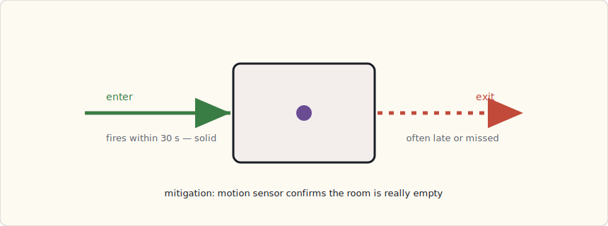

GPS geofencing tells my house I'm *home*. It has no idea which room I'm standing in, and for the automations I actually want — lights that follow me at 2 AM, a workshop outlet that cuts power when I walk away from the table saw — "home" is uselessly coarse. I've spent the last three weeks getting room-level presence working off Bluetooth beacons, and it's good enough to build on. It is also flakier than any writeup will admit, so this is both the recipe and the list of where it lies to you.

## The setup

**Eight iBeacons**, one per room I care about: kitchen, living room, master bedroom, master bath, the kid's room, the basement workshop, the garage, and the office. A mix of Estimote stickers I've had kicking around and a few RadBeacon Dots for the newer spots. Roughly $10–$15 a beacon, each on a CR2032 that lasts about two years.

Every beacon advertises a standard iBeacon packet — three numbers and a calibration constant:


The trick is the addressing. **One UUID for the whole house**, so iOS treats the lot as "my beacons." **Minor** is the part that does the work — a different value per beacon, which is how the phone knows *kitchen* from *office*. TX power is the calibrated RSSI at one meter, there for distance estimation I mostly don't use. Keep the UUID constant and let Minor carry the room, and the whole thing stays legible when you're staring at a config file six months later.

## How the phone feeds Home Assistant

This is the part the breathless tutorials skip, so plainly: the Home Assistant iOS app doesn't have a dedicated "room presence" feature. What it has is **zones**, and each zone can be tied to an iBeacon by its UUID, Major, and Minor. You add a zone per beacon in your HA config, the app registers each as a Core Location *region*, and iOS fires enter/exit callbacks against those regions. The app relays them to HA, and `sensor.luke_room` flips to the name of whatever region I just entered.

```yaml
# configuration.yaml — a zone per beacon, keyed on the iBeacon identity
zone:
  - name: kitchen
    beacon:
      uuid: E2C56DB5-DFFB-48D2-B060-D0F5A71096E0
      major: 1
      minor: 2
  - name: office
    beacon:
      uuid: E2C56DB5-DFFB-48D2-B060-D0F5A71096E0
      major: 1
      minor: 8
  # ...one per beacon
```

Core Location gives you two ways to watch beacons, and the difference is the entire battery story:


**Region monitoring** is the only one viable for a thing your family carries all day. It's cheap, it survives in the background, and iOS will even relaunch the app to deliver an enter event after you've force-quit it. You pay for that with latency — ten to thirty seconds, because iOS coalesces the events to save power. **Ranging** is precise and near-instant but foreground-only and a battery furnace; it's for the few seconds you have a beacon-setup screen open, not for living in. So: region monitoring, and you design around the latency rather than fighting it.

## The automation primitive

Once `sensor.luke_room` is trustworthy, you get a class of automation GPS simply can't do — keyed on the room, not the house.

```yaml
- alias: "Kitchen, after dark → warm scene"
  trigger:
    - platform: state
      entity_id: sensor.luke_room
      to: "kitchen"
      for: "00:00:30"      # require a real stay, not a pass-through
  condition:
    - condition: sun
      after: sunset
    - condition: state
      entity_id: light.kitchen
      state: "off"
  action:
    - service: scene.turn_on
      data:
        entity_id: scene.kitchen_evening   # 2700K, 60%
```

The `for: "00:00:30"` matters more than the trigger. It says "only if I'm *still* in the kitchen thirty seconds later," which throws away the beacon flicker you get when someone walks *through* a room on the way somewhere else. Presence without a dwell requirement is a strobe light.

The inverse — turning the kitchen off when I leave — is where it gets interesting, because of how unreliable *leaving* actually is.

## The exit-event problem

Here's the thing nobody puts in the tutorial. **Enter events are solid; exit events are not.** iOS reliably tells me when I walk into the kitchen, usually within thirty seconds. It is far less reliable about telling me when I *leave* — the exit callback comes late, or sometimes not until I enter another region and the kitchen one finally times out. Three weeks of logs make it unmistakable: enter, trustworthy; exit, a suggestion.



That asymmetry quietly breaks the obvious "leave the room, lights off" automation: the lights linger because the exit never fired. Three things made it usable:

1. **Don't trust a single exit — corroborate it.** I don't turn the kitchen lights off on a kitchen-exit event. I turn them off when *nobody's* `sensor.*_room` reads kitchen AND the kitchen motion sensor hasn't fired for a few minutes. The beacon proposes; the motion sensor disposes. An Aqara motion sensor per room is the cheap, reliable backstop the beacons need.
2. **Placement beats everything.** The master-bath beacon's signal bled into the bedroom and iOS flip-flopped between the two regions all night. Moving it to the far wall, away from the doorway, dropped the cross-room false positives sharply. Beacon range is a blob, not a room, and walls barely matter to 2.4 GHz — you place for the blob, not the floor plan.
3. **A smoothed "where is the family" sensor.** A template sensor that reports the room someone's been in for more than a minute, rather than the instantaneous reading, sands off the worst of the flicker for any automation that doesn't need to be twitchy.

## The automations I actually kept

- **Lights follow me at night.** Walking the house at 2 AM lights only the room I'm in, dim red; everything else stays dark. A little state machine over the `sensor.*_room` entities.
- **Workshop tool timeout.** Leave the basement workshop for more than ten minutes and the table-saw outlet de-energizes; it comes back when I return. This one I gate hard on the motion sensor — a tool that re-energizes because a beacon glitched is not a safety feature.
- **Kid's bedtime light.** Kid enters their room after 7 PM, soft amber for twenty minutes, then off. It only acts — it never notifies anyone that the kid went to their room at a particular time. That restraint is deliberate; see below.

## The privacy question — have it out loud

Logging which room each family member is in, all day, is surveillance, however benevolent the intent. The data never leaves my LAN, but "it's local" is not the same as "it's fine." We talked about it as a family and wrote down rules, because the system should encode the agreement, not my mood:

- **Thirty-day retention.** HA's recorder purges room history after that; I don't keep a year of where everyone stood.
- **Anyone can opt out** by turning off the app's beacon monitoring, no questions and no nagging automation to turn it back on.
- **No automation that narrates behavior.** Things may *act* on presence; nothing *reports* it. The kid's light turns on; it does not announce a bedtime to the group chat.
- **Room events off the logbook.** HA logs everything by default; I excluded the `sensor.*_room` entities so the day-to-day history view isn't a movement tracker.

The technology made this easy to build and easy to abuse, and the line between the two is a conversation, not a setting. Worth having explicitly before you flip it on.

## What I'd tell a team

Beacons are a great *hint* and a terrible *source of truth.* Treat an enter event as "probably here" and an exit as "maybe gone," then confirm anything that matters — power tools, locks, anything with a real-world consequence — against a motion or door sensor that fails in a way you understand. Build presence as a fusion of cheap signals, not as one oracle. The day I stopped trusting the beacon's exit event and started corroborating it was the day the whole system stopped feeling haunted.

## What's next

Weatherproof beacons for the backyard, so "in the yard" stops leaning on GPS. A beacon in each car to catch arrivals. And more of that sensor fusion — every room-presence automation that touches something physical gets a motion-sensor second opinion before it's allowed to act.
