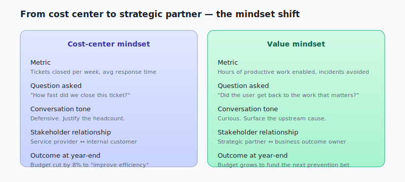

We’ve all been there. Staring at a frozen computer screen, deadline looming, frustration mounting. You call IT support, only to be met with a robotic script and a long wait time. This isn’t just a minor inconvenience; it’s a roadblock to productivity, a drain on morale, and ultimately, a hit to the bottom line. This scenario perfectly illustrates the *lack* of focus on value in IT service management. And it’s exactly what ITIL, a widely recognized framework for IT Service Management (ITSM), aims to address.

This blog post will delve into the first of ITIL’s guiding principles – **“Focus on Value”** – and explore how it can transform a frustrating user experience into a positive and productive one.

**ITIL’s “Focus on Value”: What Does it Mean?**

At its core, “Focus on Value” means that everything we do in IT should be geared towards creating value for the business and its customers. It’s not just about keeping the systems running; it’s about understanding how those systems enable business outcomes and ensuring they are delivered in a way that maximizes that value. This principle encourages us to ask:

- What are the business goals?

- How do our IT services support those goals?

- Are we delivering services in a way that meets the needs of our users?

- How can we improve our services to create even more value?

**The Real-World Scenario: The Case of the Frozen Screen**

Let’s revisit our frozen computer scenario. A traditional IT approach might focus on simply fixing the immediate technical issue. The technician might remotely access the machine, diagnose the problem (perhaps a software conflict), and resolve it. Case closed, right? Not quite.

While the immediate problem is solved, a “Focus on Value” approach would go further. It would consider the *impact* of the frozen screen on the user and the business. This might involve:

- **Understanding the User’s Needs:** The technician would recognize that the user isn’t just dealing with a technical glitch; they’re facing a deadline, potentially impacting a critical project.

- **Prioritizing the Issue:** Recognizing the urgency, the technician would prioritize this issue over less time-sensitive requests.

- **Communicating Effectively:** The technician would keep the user informed of the progress, managing expectations and reducing anxiety.

- **Identifying the Root Cause:** Beyond fixing the immediate problem, the technician would investigate *why* the software conflict occurred in the first place. Is it a recurring issue? Are other users experiencing similar problems? This proactive approach can prevent future disruptions and save the business time and money.

- **Measuring the Impact:** After resolving the issue, the IT team would analyze the incident. How long was the user impacted? What was the cost to the business? This data can be used to identify areas for improvement and demonstrate the value of IT services.

**From Frustration to Value: The Transformation**

By applying the “Focus on Value” principle, the frozen screen scenario transforms from a frustrating experience to an opportunity to build trust and demonstrate the value of IT. The user feels heard and understood, the business avoids potential losses due to delays, and the IT team gains valuable insights into potential systemic issues.

**Key Takeaways:**

- “Focus on Value” is more than just a buzzword; it’s a fundamental shift in mindset.

- It requires us to understand the business context and the needs of our users.

- It encourages proactive problem-solving and continuous improvement.

- By focusing on value, we can transform IT from a cost center to a strategic partner.

## How to operationalize "Focus on Value" this quarter

The principle is easy to nod at and hard to actually run. Three concrete moves that turn it from a slide into a behavior:

**1. Add a "user impact" field to your ticket schema and *require* it.** Most ticketing systems track urgency and priority but not *impact*. Add a free-text field that the technician must fill before closing. "User missed a deadline" is different from "user was mildly inconvenienced," and the data trail is what shifts the team's mindset over months.

**2. Run a weekly 15-minute "what did we ship that mattered" review.** Not a status update. Not a metrics dashboard. A short conversation about one or two specific incidents that, if mishandled, would have cost the business — and what the team *actually did* to handle them well. Repeating this for 12 weeks builds the value-first instinct better than any training course.

**3. Re-write one SLA in terms of user outcome, not response time.** Most SLAs say "we respond within 4 hours." That measures *us*, not *value*. Swap one to "user is back to productive work within 2 hours" and watch how the team's prioritization changes immediately.

## The mindset shift the framework is really asking for

ITIL 4's "Focus on Value" is a *Trojan horse* for a much bigger mental model: **stop measuring IT by IT's metrics; measure it by the business outcomes IT enables.** Uptime is meaningless if the right people can't do their work. Ticket-close-rate is meaningless if every closed ticket reopens a week later. Response time is meaningless if response means "we acknowledged the ticket and routed it to a queue nobody owns."

The hard work is teaching the team to think this way *without* turning every conversation into a values lecture. The data trail (impact field + outcome SLA + weekly review) does the teaching for you. People follow the metric.

## Gratitude beat

Big thanks to every IT director who's quietly fighting to be measured on business outcomes instead of ticket throughput. The shift is slow, the data is sparse, the wins are quiet, and the org is grateful even when it doesn't say so. *Thank you.*
