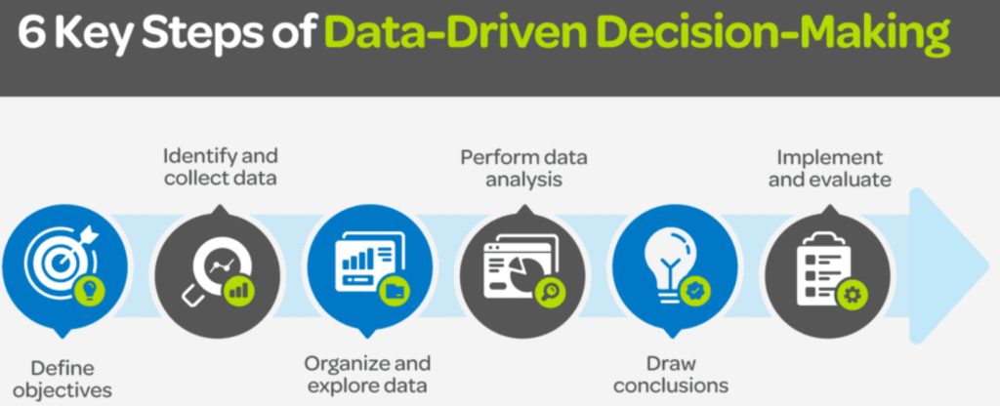

Hey there, fellow program management ninjas! Ready to dive into the wild world of data-driven decision-making? Buckle up, because we’re about to embark on a thrilling journey that’ll make your programs shine brighter than a supernova!

## The Data-Driven Revolution: Not Just for Nerds Anymore

Gone are the days when we'd rely on gut feelings and magic 8-balls to make decisions. Welcome to the era of data-driven program management, where numbers reign supreme and spreadsheets are sexier than ever! But don't worry, we won't let you drown in an ocean of data. Instead, we'll teach you to surf those waves like a pro.

## Real-World Example #1: Google’s People Analytics Extravaganza

Picture this: Google, the tech giant that probably knows what you had for breakfast, decided to tackle a burning question – “Do managers actually matter?” Talk about existential crisis, right?Instead of playing eeny, meeny, miny, moe, they unleashed their data hounds. The result? A treasure trove of insights that would make even Sherlock Holmes jealous. They discovered that teams with awesome managers performed better, were happier, and probably had better dance moves (okay, I made that last part up, but you get the idea).But they didn’t stop there. Oh no, my friends. They dug deeper, identifying the top traits of high-scoring managers and the factors that made managers struggle. It was like “CSI: Management Edition,” and the data was the star witness!

## Real-World Example #2: Starbucks’ Data-Fueled Real Estate Domination

Ever wondered how Starbucks seems to pop up exactly where you need your caffeine fix? It’s not magic (though their Pumpkin Spice Latte might be). It’s data-driven decision-making at its finest!Starbucks uses a mix of geographic and demographic data to decide where to plant their next coffee oasis. They analyze foot traffic, local businesses, and even the average income of an area. It’s like playing SimCity, but with real money and really good coffee.

## Tools of the Trade: Your Data-Driven Swiss Army Knife

Now, let’s talk tools. Because let’s face it, even Superman needs his gadgets. Here are some must-haves for your data-driven toolkit:

- **Tableau**: The Picasso of data visualization. Turn boring numbers into jaw-dropping charts that’ll make your stakeholders weep with joy.

- **Power BI**: Microsoft’s answer to “How can we make Excel cooler?” Spoiler alert: They succeeded.

- **Jira**: For when you need to track every. Single. Task. It’s like having a really organized stalker for your projects.

- **Asana**: Because sometimes, you just want your project management tool to look pretty while being functional.

## KPIs: Not Just Another Annoying Acronym

Key Performance Indicators, or as I like to call them, “Numbers That’ll Save Your Bacon.” Here are some KPIs that’ll make you the rockstar of your next program review:

- **Schedule Performance Index (SPI)**: Are we on time, or are we playing catch-up?

- **Cost Performance Index (CPI)**: Is our wallet happy or crying?

- **Customer Satisfaction Score**: Are our clients singing our praises or writing angry tweets?

- **Resource Utilization**: Are our team members superheroes or couch potatoes?

## Dashboards: Your Program’s Mission Control

Now, let’s bring it all together in a dashboard that’ll make NASA jealous. Here’s how to build a dashboard that’ll knock socks off:

- **Keep it simple, stupid**: Don’t overwhelm with data. Pick the most crucial KPIs.

- **Make it pretty**: Use colors, charts, and graphs. Think less “tax form,” more “modern art.”

- **Update in real-time**: Because yesterday’s data is so… yesterday.

- **Customize for your audience**: Your CEO doesn’t need to know how many coffee breaks the team took (unless that’s a critical KPI, in which case, can I join your team?).

## The Grand Finale: Putting It All Together

Imagine this: You walk into your next program review, armed with a dashboard that looks like it’s from the future. You’ve got Google-level insights into your team’s performance, Starbucks-worthy location analytics for your project sites, and KPIs that tell a story clearer than a Morgan Freeman narration. You’re not just managing a program anymore. You’re conducting a symphony of data, with each number and chart playing its part in perfect harmony. So, there you have it, folks! Data-driven decision-making isn’t just for the nerds in lab coats anymore. It’s for the cool kids in program management who want to rule their project world with an iron fist (and a velvet glove of data, of course). Now go forth and conquer, you data-driven demigods! May your KPIs be ever in your favor, and your dashboards always sparkle. Remember, in the world of program management, the data-savvy shall inherit the earth (or at least the corner office).
