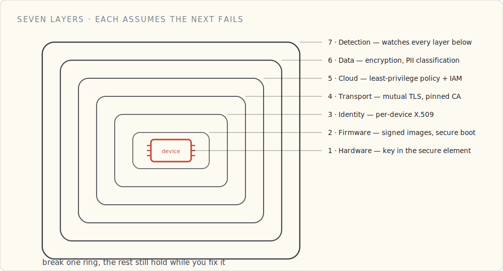

This is the map for the whole series. Every other post takes one layer of connected-product security down to the studs; this one is the shape of the whole thing — how the layers sit on the real data path, device to cloud:

The series walks that stack one layer at a time:

1. **Hardware** — [Secure Boot](/blog/secure-boot-trusting-your-own-code/): a device learns to trust its own code.
2. **Identity** — [the device-and-cloud handshake](/blog/pki-behind-a-device-cert/): proving who's who, both ways.
3. **Authorization** — [authenticated isn't authorized](/blog/authenticated-isnt-authorized/): least privilege.
4. **Data** — [at rest and in motion](/blog/protecting-device-data/): encryption and classification.
5. **Updates** — [securing what you flash](/blog/securing-ota-updates/): blast radius, signing, key rotation.
6. **Detection** — [the smoke alarm, not the lock](/blog/detection-and-response/): anomaly detection and response.
7. **The fleet** — [identity at scale](/blog/field-grade-device-identity-at-fleet-scale/): provisioning, rotation, revocation.

The rest of this post is the layer model itself — seven owners, seven failure modes, seven remediation costs, and what I'd rebuild differently next time.

## The framing

A connected-product fleet has roughly **seven layers** where security decisions get made. Each layer has a different owner, a different failure mode, and a different remediation cost. Defense in depth means treating each layer as independent and assuming the layer above and below will, eventually, be compromised.

| # | Layer | Owns it | Worst failure mode |
| --- | --- | --- | --- |
| 1 | Hardware | Hardware engineer + manufacturing | Key extracted from device via probe |
| 2 | Firmware | Firmware engineer | Unsigned image flashed to fleet |
| 3 | Identity | Cloud + firmware (shared) | Stolen cert used to impersonate device |
| 4 | Transport | Cloud + firmware (shared) | MITM downgrade, TLS termination at wrong point |
| 5 | Cloud / Application | Cloud / platform engineer | Misconfigured IAM, overly broad IoT policy |
| 6 | Data | Data engineer + privacy team | PII leak, GDPR exposure, replay attack |
| 7 | Detection + Response | Ops / security engineer | Compromised device runs undetected for weeks |

The order isn't strict — many of these run in parallel — but it's the order in which compromise *cascades*. A broken Layer 1 invalidates 3 and 4. A broken Layer 5 invalidates 6 and 7.

Below is the same seven-layer model laid out by owner and by what a break actually costs to remediate — the silicon at the bottom is the one you can't patch:

## Layer 1 — Hardware

**The non-negotiable.** A secure element on the board (we use the ATECC608A; NXP SE05x and Microchip's CryptoAuthentication family are equivalent). The device's private key is generated *inside* the secure element at first boot and **never leaves**. Sign things with it, yes. Read it out, no — even physical access to the chip doesn't expose it.

Add to that: anti-tamper indicators (a switch that trips if the case is opened), secure boot with a fuse-locked root key, and disabled debug interfaces (JTAG fused off in production firmware).

What this costs: $1.50 – $4 of BOM, depending on which secure element. It is the single highest-leverage security investment a connected-product team will ever make. If you defer it to v2, you ship v1 with a defect that will cost you a board respin.

## Layer 2 — Firmware

Three things, every release:

- **Signed firmware images.** The device firmware embeds the public key of our signing CA (in the secure element, ideally). Before any update is flashed, the bootloader verifies the signature. Unsigned or wrong-signed → reject.
- **A/B firmware slots with auto-rollback.** New firmware goes into the inactive slot, the bootloader is told to try it, and the new firmware has to "phone home, mark itself good" within N minutes or the bootloader reverts. I covered the OTA-side details [in a later post](/blog/ota-firmware-without-bricking-the-fleet/); the security relevance here is that a compromised firmware can't permanently brick a device.
- **Secure-boot chain.** The bootloader is signed; the bootloader verifies the application image; the application verifies any loaded modules. Chain of trust rooted in the fuse-locked secure-element key.

What this costs: real engineering time. A team that hasn't done it before should budget six weeks to do it right.

## Layer 3 — Identity

Covered at length in the [cert post](/blog/field-grade-device-identity-at-fleet-scale/). Short version: **per-device X.509 cert, private key in the secure element, Just-In-Time Registration at first connect, cert rotation designed for staged rollout, revocation that takes minutes via real-time IoT Core policy flips.**

The thing I'd add to that post in hindsight: think about the *first 60 seconds* of a device's life on the network as a separate threat model. A device that has bootstrapped but not yet been *registered* to a customer is in the most vulnerable state it will ever be in. We have a separate Lambda that handles the registration handshake, with stricter rate limits and tighter logging than normal traffic. Most teams overlook this; we did for the first nine months.

## Layer 4 — Transport

**MQTT over TLS 1.3, mutual auth, certificate pinning on the device side.**

Three specifics:

- **TLS 1.3 only.** AWS IoT Core supports TLS 1.2 and 1.3. We refuse the older version at the policy layer. There is no business case to support a pre-2018 cipher suite on a device shipping in 2024.
- **Mutual TLS (mTLS).** Device authenticates the cloud (via the AWS Root CA the device trusts) and the cloud authenticates the device (via the per-device cert). Both directions, every connection.
- **Certificate pinning on the device.** The device firmware doesn't trust the system trust store; it trusts *exactly* the AWS Root CA(s) we've baked into firmware. Stops a hostile DNS or a rogue captive portal from terminating the connection somewhere we don't expect.

What this costs: very little if you build for it from day one. A retrofit is harder.

## Layer 5 — Cloud / Application

This is the layer that fails by *misconfiguration* more often than by attack. The principles:

- **Per-device IoT policies, not shared.** The IoT policy for `device-abc-123` allows publish to `telemetry/device-abc-123` and subscribe to `commands/device-abc-123`. Nothing else. No wildcard topics. No shared policies across the fleet. AWS IoT Just-in-Time Provisioning generates these for us at registration time.
- **Least-privilege IAM on the cloud side.** The ingest Lambda can write to *one* DynamoDB table. The query Lambda can read from *one* GSI. The CDK stack defines these tightly enough that a security review can read the IAM in five minutes and know there's nothing surprising.
- **Topic schema with rule-level validation.** The IoT rule SQL doesn't `SELECT *`. It selects the specific fields we expect, with type coercion. A device publishing junk gets dropped at the rule layer; bad data never reaches the Lambda.
- **AWS IoT Device Defender Audit.** Runs continuously, flags overly permissive policies, expired certs, and shared credentials. Free, on by default. If you haven't turned it on, do it before you finish reading this post.

## Layer 6 — Data

The PII layer. I'll write this up in much more depth eventually — there's a whole rubric I've been running internally on operator data from tool telemetry — but the short version of the principles is:

- **Direct identifiers** (operator email, device serial) → hashed with a rotating salt.
- **Quasi-identifiers** (operator ID, name) → tokenized to a stable random string, namespaced per data domain so cross-table joins fail.
- **Sensitive attributes** (GPS location, biometric) → generalized (GPS snapped to a 1km grid, etc.).
- **Behavioral data** (battery level, torque readings, usage minutes) → kept as-is.

Behind the rubric: AWS KMS for all encryption-at-rest keys (we use a per-table CMK with rotation enabled), TLS for encryption-in-transit at every hop, and S3 bucket policies that deny `aws:SecureTransport == false` outright.

Pair that with **AWS Macie** running across the raw bucket to catch any column that should have been classified PII and wasn't.

## Layer 7 — Detection + Response

The layer that catches the failures the other six layers missed.

Two pieces:

- **Behavioral detection via Device Defender Detect.** Baseline behaviors per device (messages per minute, topics published to, bytes per message), alert on deviations. We tune the thresholds quarterly. The false-positive rate is annoying but the true positive we caught last summer — a misconfigured firmware build talking to debug topics in production — paid for the whole program.
- **Real-time revocation playbook.** Incident response runbook with a one-button "revoke device" tool that flips the IoT policy in IoT Core to `deny *`. The device-side state machine handles "got disconnected, can't reconnect, light the LED, stop publishing." We've tested this end-to-end on a quarterly cadence in dev. We've used it once in prod.

The runbook also covers fleet-wide compromise scenarios (revoke an entire CA, push emergency OTA, rotate all device certs). We don't *expect* to use it. We don't run a connected product without it.

## What I'd build differently if starting over

Three things:

**One: design Layer 7 first.** I built layers 1–6 first and then bolted on detection. That's backwards. If you don't know how you'll detect compromise, you don't know if your other layers are doing anything useful. *Build the dashboards and alarms before you ship the feature.*

**Two: separate the data-residency story from the data-protection story.** They are different problems. Data residency (where does the byte physically live) is a cloud-architecture decision; data protection (who can read the byte) is an IAM/encryption decision. We conflated them in v1 and had to re-untangle in v2.

**Three: write the threat model down.** Not as a one-time exercise. As a *living document* the team revisits quarterly. The threat landscape changes; the threat model needs to keep up. Ours lives in our wiki next to the architecture doc, both are reviewed in the same quarterly meeting.

## The bigger framing

The thing that makes defense in depth *work* is the discipline of treating each layer as **independent**. A single layer of security is hope. Seven layers, each cheap and known to its owner, is a posture.

Every layer above can be done badly. Most teams do at least one of them badly. The point of having seven is that you can survive one or two being broken, because the others compensate while you fix.

That posture is what auditors are looking for, what enterprise customers are looking for, and what your CISO is looking for. The piece I keep telling new engineering managers: *don't try to make any one layer perfect. Make all seven layers acceptable.*

That's the work.
