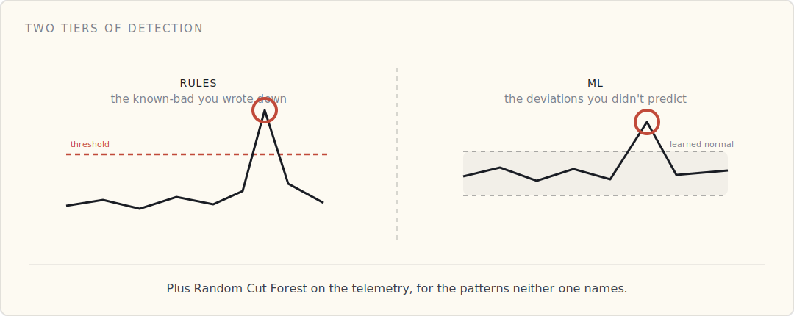
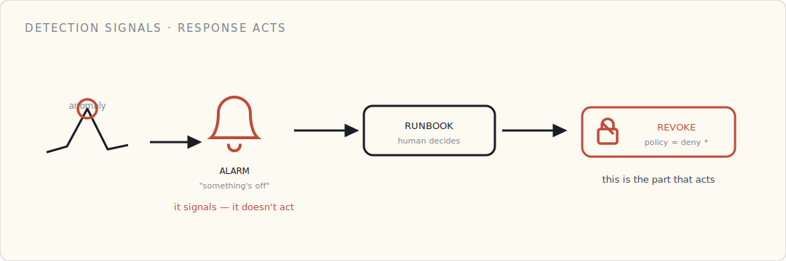

Everything so far — [boot](/blog/secure-boot-trusting-your-own-code/), [identity](/blog/pki-behind-a-device-cert/), [authorization](/blog/authenticated-isnt-authorized/), [encryption](/blog/protecting-device-data/) — is prevention. It's the locks. But locks fail: a cert leaks, a misconfiguration opens a door, a device gets physically compromised. Prevention is necessary and it is never sufficient. Detection is the layer that *notices* when something's wrong; response is what you actually do about it. Most teams build the first halfway and the second not at all.

## Two tiers of detection

- **Rules — the things you already know are bad.** Static thresholds: a device sending 100× its normal message rate, a production device publishing to a debug topic, a spike in authorization failures. AWS IoT Device Defender *Rules* Detect. Fast to write — and they only ever catch what you thought to write down.
- **ML — the things you didn't predict.** Device Defender *ML* Detect builds a behavioral model per security metric — messages per minute, message size, connect/disconnect rate, source IP, auth failures — learns each device's normal over a training window, and flags deviations with a confidence (low / medium / high). No thresholds to guess; it learns "normal" and tells you when a device stops looking like itself.
- **Custom anomaly detection on telemetry.** For the behaviors the fixed security metrics miss — "this device's torque / battery / usage pattern went weird" — run an unsupervised model like Random Cut Forest (in Kinesis Data Analytics on the live stream, or in SageMaker). These signals straddle security *and* fleet health: a device behaving strangely might be compromised, or it might just be failing.

## The honest part about ML detection

It isn't magic, and it has two costs you pay up front.

**The cold start.** ML Detect needs a training window — on the order of two weeks, with enough data — before it's useful. You're effectively blind to "abnormal" until it has learned "normal." Plan for it; don't ship and assume coverage on day one.

**An anomaly is not an attack.** This is the cost that wears teams down. Most anomalies are benign — a firmware update shifted a traffic pattern, a region had a network blip. You will tune false positives forever, and alert fatigue is the failure mode that quietly kills detection programs. The discipline is a feedback loop: every alert gets triaged, every false positive tightens the model.

The payoff is real, though. The one true positive that earns the whole program for us: a misconfigured firmware build that started talking to debug topics in production. No static rule would have caught it — the behavioral model did, because the device stopped looking like itself.

## ML is the smoke alarm, not the lock

Here's the framing to hold onto: **detection tells you something is wrong. It does not fix it.** A smoke alarm doesn't put out the fire — it tells you there's a fire while you can still act. ML anomaly detection is exactly that. The acting is a separate thing, and it's the half teams under-build.

## Response: the runbook that actually does something

A flagged anomaly is worthless without a practiced response.

- **The one-button revoke.** The incident runbook flips the suspect device's IoT policy to deny-all; on its next connection attempt it's refused, in under a minute. (This is the revocation from the [identity](/blog/pki-behind-a-device-cert/) and [authorization](/blog/authenticated-isnt-authorized/) layers, used in anger.) The device-side state machine handles "disconnected, can't reconnect, light the LED, stop publishing."
- **The fleet-wide playbook.** The scenarios you hope never to use: revoke an entire CA, push an emergency signed OTA, rotate every device cert. You don't expect to. You also don't run a connected product without the runbook written and drilled — we test ours on a quarterly cadence in dev.

Detection without response is a smoke alarm with no exit. Response without detection is an exit you never know to use.

## Deployment-agnostic

- **AWS:** Device Defender ML Detect + Rules Detect; Random Cut Forest in Kinesis Data Analytics or SageMaker for telemetry anomalies.
- **Azure:** Microsoft Defender for IoT (agentless anomaly detection) + Stream Analytics' built-in anomaly functions.
- **GCP:** roll your own — Dataflow plus BigQuery ML's `DETECT_ANOMALIES`, since the managed IoT service is gone.

## What I'd tell a team

- **Rules for the known-bad, ML for the unknown.** You need both; neither alone is enough.
- **Budget for the cold start**, and tell people detection isn't live on day one.
- **Treat ML output as a signal, not an action.** It flags; humans and runbooks act.
- **Build and drill the revoke runbook** before you need it — the one-button revoke should be boring by the time it's real.
- **Instrument for detection before you ship.** You cannot detect what you never measured; the metrics have to exist from the very first device.

The smoke alarm doesn't make the building fireproof. It means that when prevention fails — and over a long enough fleet life, it will — you find out while you can still act, and you have a practiced way to act. That's the whole job of this layer: not to stop the fire, but to make sure it's never the first you hear of it.

## What's next

Everything so far has been about *one* device — its boot, its identity, its permissions, its data, its behavior. The last post zooms out to the whole fleet: provisioning thousands of devices, and rotating and revoking their identities at scale, without a human in the loop.
