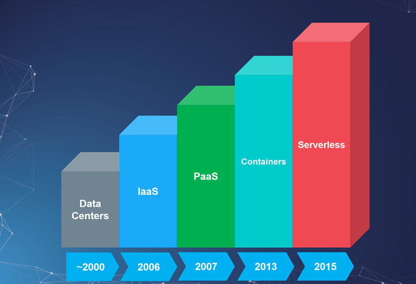
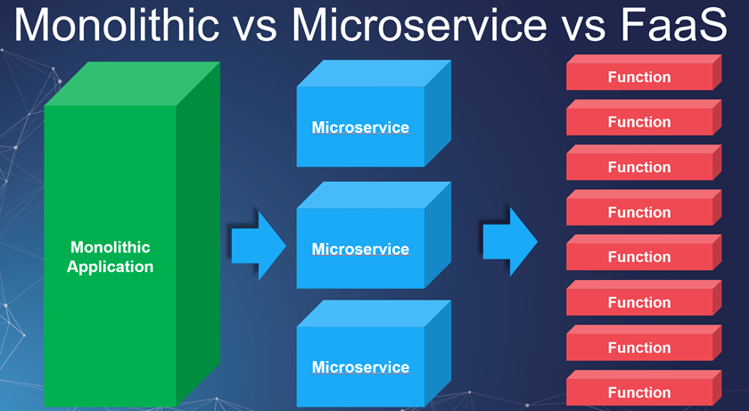
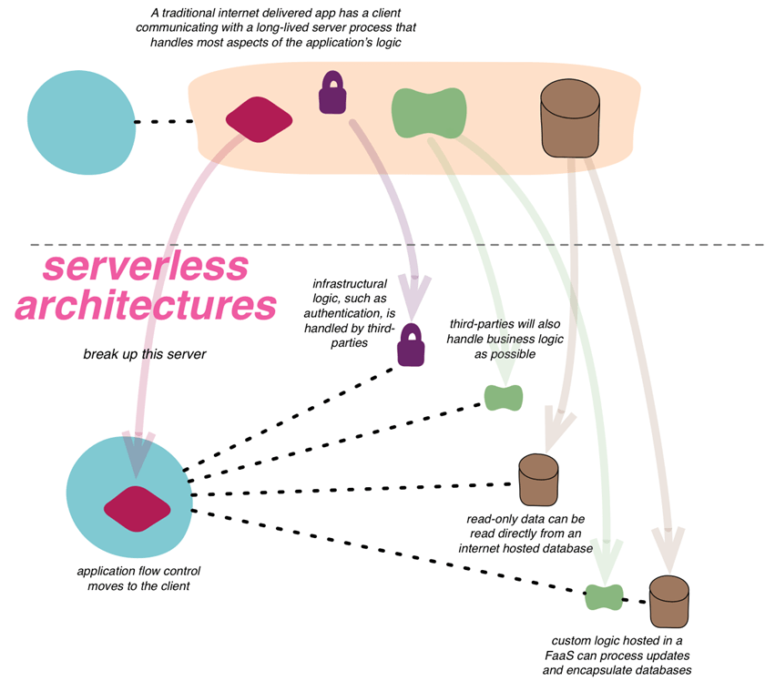
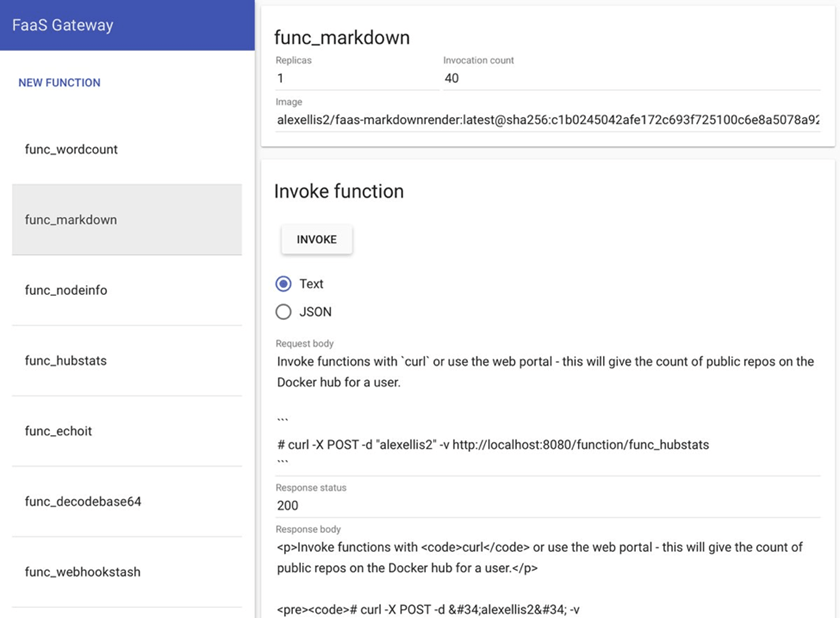
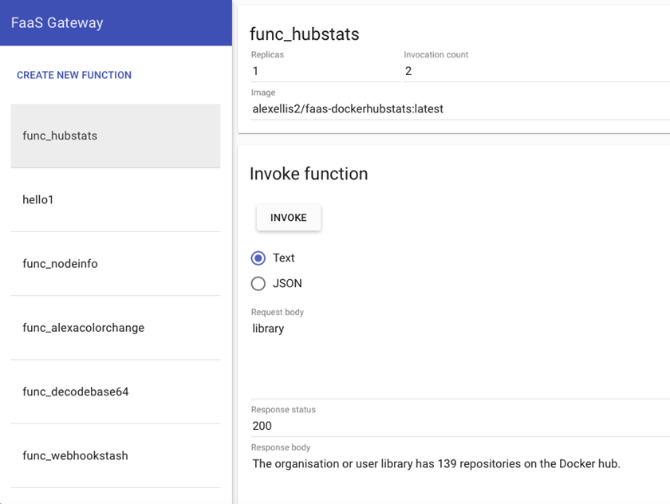
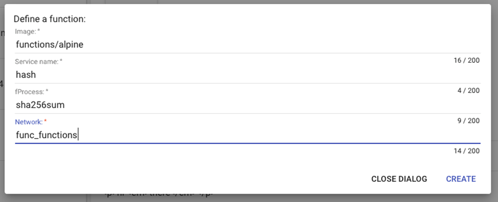
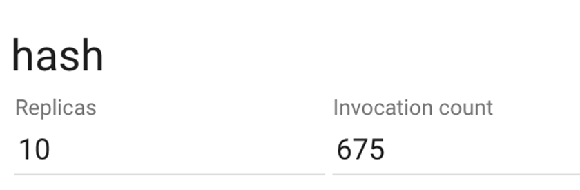
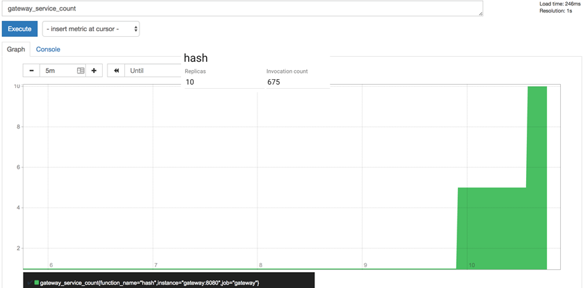
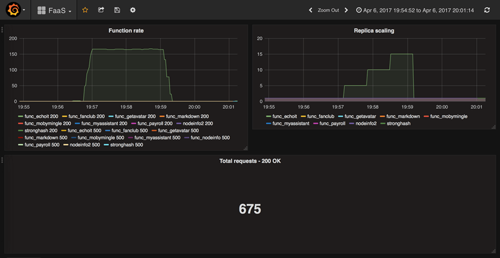

So what Is Faas? FaaS is a framework for building serverless functions on Docker Swarm with first class support for metrics. Any UNIX process can be packaged as a function enabling you to consume a range of web events without repetitive boilerplate coding.

Before we jump in straight into this nitty gritty you may be asking yourself what is server less? Well it’s only the most talked about non implemented project of 2016. All joking aside if you have heard of or used [Amazon lambda](https://aws.amazon.com/lambda/) or M[icrosoft functions](https://azure.microsoft.com/en-us/services/functions/) or [Google functions](https://cloud.google.com/functions/) then you have already used a Serverless cloud architecture .

Wikipedia describes FaaS as:

“FaaS is a category of cloud computing services that provides a platform allowing customers to develop, run, and manage application functionalities without the complexity of building and maintaining the infrastructure typically associated with developing and launching an app”

What does this look like in the technology evolution?

And from an application view

Cool so let’s break those down a bit more.

- tends involve invoking short-lived functions (Lambda has a default 1-sec timeout)~~** 

- does not publish TCP services – often accesses third-party services or resources~~** 

- tends to be ad-hoc/event-driven such as responding to web hooks~~** 

- should deal gracefully with spikes in traffic~~** 

- despite name, runs on servers backed by a fluid, non-deterministic infrastructure~~** 

- when working well makes the complex appear simple~~** 

- has several related concerns: infrastructure management, batching, access control, definitions, scaling & dependencies~~** 

 A deeper dive from Martin Fowler Can be found on his blog. ~~https://martinfowler.com/bliki/Serverless.html

This picture from his site gives a good snap shot

## ~~My Shallow dive into Serverless

I always like to dabble in new things so as I kept hearing more and more about serverless I decided it was time to jump in. The first thing that came up besides of lambda was the serverless framework 

[~~https://github.com/serverless/serverless~~](https://github.com/serverless/serverless)

So I spun it up. I am impressed this is super simple. I had a colleague save over a 1000 dollars taking down some of his personal VM’s. I liked what I was seeing so I dug into it some more and then I ran into some issues of my libraries not working. I write a lot of node.js code so as I dug in I found that lambda architecture which Serverless project proxies you are limited to some random version of node that you can’t control this stopped me dead to rights. There was no way I wanted to think about what libraries I was limited to based on the serverless host’s deployment of the environment. I mean thats why I got into Docker in the first place. Now this was last year and since then Serverless has gotten a lot further also proxying Azure Functions amongst other.

Not giving up I went to a couple of meetups on serverless including one hosted by the Serverless project and I kept hearing the same issue. The environment is limiting. So, although I liked the idea of it I left it behind to see how it baked and went back to using Docker as my primary tool. 

## ~~Enter in FaaS

Now fast forward to the new project FaaS. New kid in town FaaS combines Docker with this serverless approach allowing you to you write serverless functions in any language in just a few lines of code.

Best thing is ~~Alex provides dozens of sample functions for you to get started. FaaS has Prometheus metrics baked-in which means it can automatically scale your functions up and down for demand.

You can see the functions used in Alex’s demo in this GitHub repository: [https://github.com/alexellis/faas-dockercon/](https://github.com/alexellis/faas-dockercon/)

FaaS also comes with a convenient gateway tester that allows you to try out each of your functions directly in the browser.

So, you might ask yourself why I chose Docker FaaS over the other available frameworks? I’m glad you asked. The features that persuaded me were:

- ~~Integrates directly with Docker Swarm** 

- ~~Built-in Prometheus metrics** 

- ~~Any container can become a function** 

- ~~Auto scaling** 

- ~~Ease of use, a one-line script starts everything** 

- ~~Can launch new functions directly from UI** 

- ~~Integrate with other services via Web Hooks like GitHub** 

Docker FaaS has two main components; the API Gateway and Function Watchdog.

The API Gateway is responsible for routing external traffic to the functions, collecting metrics for Prometheus, and auto scaling functions via Docker Swarm replicas. FaaS includes a clean UI which allows you to invoke functions and create new functions as needed.

The Function Watchdog runs inside each container. The Watchdog then marshals HTTP requests between the public HTTP URL the target function.

What’s unique about Docker FaaS is that it runs one replica of your function all the time. This enables Docker FaaS to have lightning fast response times when a function is triggered. Other projects require the trigger of the function to provision a new replica for each trigger. This action consumes precious start time before the function can be executed. When time to execution matters, Docker FaaS is the clear leader.

**Docker FaaS Review**

My first impression of the Docker FaaS is how dead simple it is to launch the entire FaaS stack. Once the stack is up and running launching the clean and simple UI reveals about 10 sample functions installed by default. These functions range from simple word counting to querying the Docker Hub for Repo’s.

When you click on a function the UI opens the function and provides the ability to invoke the function directly. It’s possible to pass either Text or JSON to the function and click the Invoke button which triggers the function and responds with an output.

Creating new functions is available at the click of a button. Once you click Create New Function. It is easy to define a new function. Alex made a great boilerplate image functions/alpine which is a great starting point for new functions. This image makes it easy to turn any UNIX process into a function. I chose to use sha256sum for my demo.

Next, I called the newly created function via the curl command.

curl *:8080/function/hash -d “hi”; done

This passed “hi” to the function. The function then returns the hash value as the output. It is possible to pass “hi” directly via the UI as well if desired. Works the same.

**Auto scaling**

Testing the auto scaling capability was very straight forward. Engaging auto scaling was as easy as passing a loop to the newly created hash function.

while [ true ] ; do sleep 0.3 && curl *:8080/function/hash -d “hi”; done

After the loop runs for a minute or 2 you will notice the Invocation Count increase in the UI and eventually, a number of replicas will scale in increments of 5 and then 10. See the screenshots below of the FaaS UI, the Prometheus graph, and Grafana of how the replicas are scaling with the load.

### ~~Video

Great video by the founder.

## Conclusion

*So, what now? Get out there and try this out! Let me know what you think.*

