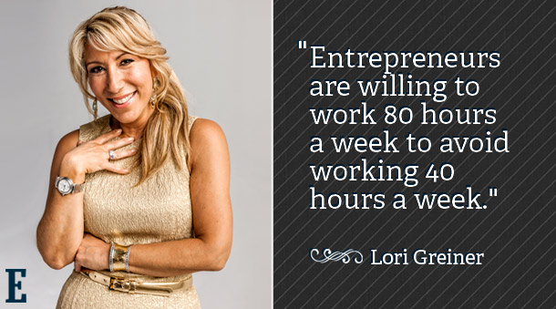

> *Entrepreneurs are the only people who will work 80 hours a week to avoid working 40 hours a week.*  
> — usually credited to Lori Greiner (the Shark Tank Shark, not the chair)

It's funny because it's true, and it's true because **the trade isn't actually about hours.** It's about whose calendar you live inside.

## The actual math

A 40-hour job is rarely 40 hours. You answer the slack thread at 8pm. You're on the call from the airport. You're "off" but you're checking your inbox during dinner. The number on the offer letter and the number on the wall clock are not the same number.

A 40-hour W-2 looks like:

- 32 hours of *real* output
- 18 hours of meetings, two-thirds of which you didn't book
- 6 hours of context-switching on Slack
- 10 hours of email
- ~14 hours of overhead nobody clocked but everybody endured

Call it 80 weighted hours.

Founder math, in contrast, looks more like:

- 60 hours of output
- 8 hours of meetings, *all of which you booked or accepted with intent*
- 3 hours of Slack with three people
- 2 hours of email because your inbox is empty by 9am
- ~7 hours of admin that you actually own

Call it 80 hours. **Same number. Wildly different shape.**

The founder is not avoiding 40 hours of work. They're avoiding spending 40 hours of their 80 doing *somebody else's prioritization for them*.

## What the joke gets wrong

The Greiner line plays for laughs and skips the part where:

- Founders fail. Most of them. Sleep loss is *not* a magic 9-figure exit pill.
- Founders trade *certainty* for autonomy. The mortgage doesn't care about your runway.
- The first 18 months of a startup are *cheaper* than a corporate job in social capital, *more expensive* in actual capital, and roughly the same in stress.
- Many people are better off employed. The framing that founders are a superior species is **a real industry brain worm** and it makes a lot of perfectly good engineers and PMs miserable in their first six months of self-employment.

If you're reading this and considering the jump, the question is not *can I work 80 hours*. You can. The question is **do I want my calendar to be mostly mine, knowing the trade-off is "you eat what you kill" applied to literally everything for the next two years.**

## The middle path nobody markets

A lot of the energy that goes into "should I go found something" is actually energy that wants to go into **"how do I get more agency in my current job."** And the answer to that is much cheaper than starting a company:

- **Take more initiative on what you work on.** Write the brief. Run the meeting. Pick the project nobody else picked. (See: [opportunity is dressed in overalls](/blog/opportunity-is-missed-by-most-because-it-is-dressed-in-overalls-and-looks-like-work/).)
- **Renegotiate your meetings.** Half of them are not necessary; you can decline them.
- **Move teams every 18-24 months inside your company** instead of changing companies. Same effect, less paperwork.
- **Build something small on the side** — a tool, a course, a writeup, a course launch — that gives you a *second calendar* you control.

Most of the autonomy you're looking for is available with less risk than a full founding gamble.

And if you do make the jump: **go in with eyes open**, not with the Lori Greiner quote tattooed on your forearm.

## The gratitude beat

I am grateful to every founder I've worked for who was honest about what the trade actually costs. I'm grateful to every manager who let me run my own calendar inside a W-2. And I'm extremely grateful to the partners, friends, and editors who held the line when I picked the 80-hour version anyway and got grumpy about it on a Tuesday.

The 80 is fine. The calendar is the point.
