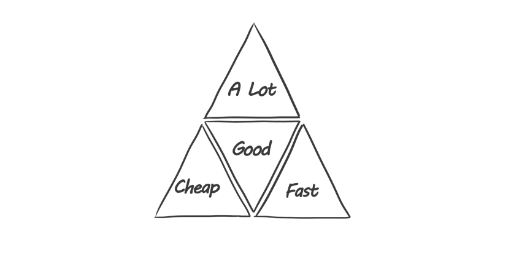
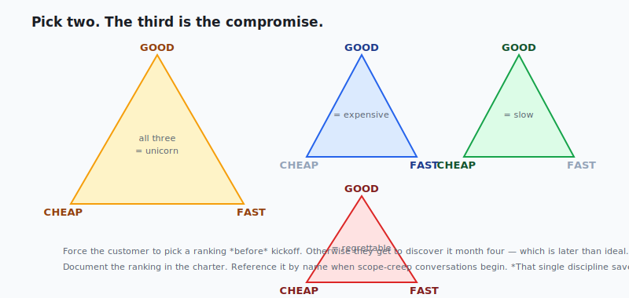

There are many ways to describe the boundaries of a project. The simplest is **"The Golden Triangle"** — three constraints (sometimes drawn as four dimensions) that determine both the limits of the project and the criteria for declaring it a success.

The Golden Triangle demonstrates the basic mathematical relationship between its parts: **any increase along one axis forces a corresponding change on another.** If scope grows, schedule or budget must grow with it. If you hold schedule fixed and budget fixed, scope must shrink — or quality breaks.

Another approach extends the triangle into a **hexagon** to include *scope, time, budget, quality, risks, and customer satisfaction*. Useful as a framing — also useful when the simpler triangle is letting a customer slip out the back door of "but I want all three."

## The notional variant nobody can deliver

There is a fourth-corner variant of the triangle that's never actually achievable but is still demanded weekly in real meetings:

*The Golden Triangle of Project Management — pick two, the third is a consequence.*

**"A Lot — Fast — Cheap — Good"** is the set of expectations that *can never* be achieved simultaneously. It's the result of:

- the customer's (completely understandable) lack of understanding of what the project actually requires
- a lack of trust about the estimates presented at sale time
- the well-documented industry tendency for projects to deviate from original timetable, resources, budget, *and* scope

Therefore, in order to create a solid basis for the project, **its premise must be ambitious but realistic, fully understood, and agreed to** by the client up front.

## How to actually have the trade-off conversation

The trick is to make the trade visible *before* the project starts, not in month four when you discover the customer believed all four corners. A few things that work:

**1. Force the ranking, not just the menu.** Don't ask "which is more important?" Ask "if I told you we could deliver two of these three perfectly, which two would you pick and which one are you willing to compromise on?" The "compromise" word forces a real ranking.

**2. Visualize the slider.** Draw the triangle on a whiteboard. Put a dot in the middle. Move the dot toward "Fast" and visually show the other two shrinking. **Customers feel the trade-off in their gut once they see it move.** A spreadsheet doesn't do this.

**3. Pre-commit to the trade-off ritual.** Write down which corner gets compromised when reality forces a choice, and store it in the project charter. When month four hits and a re-scoping decision is needed, you don't re-debate — you reference the charter.

**4. Use the hexagon when needed.** If the customer pushes back on "only three dimensions," upgrade to the hexagon (add risks, quality, customer satisfaction). You're not adding complexity — you're acknowledging the complexity that's already there.

## What changes once the customer feels it

In honest order:

1. **The "scope creep" conversation goes from adversarial to mathematical.** "If you add this, here's the corner that gives." Math, not feelings.
2. **Estimates stop being negotiated down.** The customer learns that "negotiating" a 3-month estimate to 2 months is just *pre-deciding which corner will fail.*
3. **The mid-project trade-offs land softer.** The customer already agreed to a ranking. The re-scoping conversation is a calendar event, not a fight.
4. **Status updates get more useful.** "We're on track" becomes "we're on track along the dimensions we agreed mattered most."

## Gratitude beat

Thanks to every project sponsor who's been patient with me drawing the triangle on a whiteboard for the fourth time in the same kickoff meeting. You're the reason this conversation gets cheaper over a career. *Thank you.*

## A few real-world variants worth knowing

**The "moving deadline" variant.** Customer locks budget and scope, then the deadline shifts left by six weeks because of an external event (trade show, regulatory date, competitor announcement). *Quality is the corner that gives* — even if nobody explicitly said so. Best practice: identify the *first* dimensions you'll cut on quality (testing depth? documentation? performance polish?) before the squeeze hits. Pre-decide, don't crisis-decide.

**The "phantom scope" variant.** Customer says scope is fixed, but the *interpretation* of each scope item is fluid. Six weeks in, "user can log in" turned out to mean SSO + 2FA + RBAC + audit logging. The corner that gives here is *whichever the customer hasn't been forced to rank yet.* Best practice: write acceptance criteria for every scope item at kickoff, not as needed.

**The "post-launch quality debt" variant.** Customer accepts a quality compromise to hit the date, ships, and then expects free post-launch polish. Be very clear at the trade-off conversation that the compromise is *permanent unless re-funded.* Otherwise the customer believes they got all four corners; you just delivered them in two phases.

## The single move that prevents most disasters

**Document the trade-off ranking in the project charter, get a signature, and reference it by name whenever a re-scoping conversation starts.** Not a clever phrase, no spreadsheet magic. Just the discipline of writing down "if reality forces a choice, *time* is what we'll compromise on, in this order: scope first, quality second, budget third." Re-read it at sponsor meetings. Re-reference it when the inevitable change request lands.

Most "scope creep" disasters are actually *unrecorded-trade-off* disasters. The work happened, but nobody wrote down the priorities, so every micro-decision became a re-negotiation. Write it down. Save yourself a quarter.
