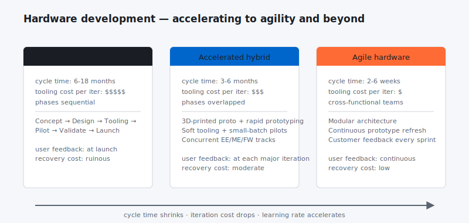

You pretty much have to have your head in the sand not to notice the changes in hardware product design innovation and new product development that are condensing product delivery timelines.

***Here are four product development trends worth watching.***

- ** Hardware development is becoming more agile**

The fact that hardware development is becoming more agile has been written about [extensively by Jon Bruner from O’Reilly](https://www.oreilly.com/ideas/how-the-new-hardware-movement-is-even-bigger-than-the-internet-of-things).   Hardware product development is becoming more agile on many fronts, but particularly in the design and prototyping phase. This is largely because of the availability and affordability of new prototyping tools such as 3-D printers. 3-D printers have also advanced in terms of their ability to create prototypes using a diverse set of materials. Advances in fast prototyping tools like 3-D printers condense the build, test and learn cycle.

- ** Makers are increasing the talent pool and speeding up product design innovation**

Just like the hackers of yesteryear coding in their dorm rooms, creating the platforms of today such as Facebook, the maker movement of hardware developers is increasing the hardware development talent pool and speeding up product design innovation.  Watch for the next big hardware startup to be launched by the next 20 something from their college dorm room.

- ** Software integration into hardware enables rapid innovation and new business models**

Hardware and software integration is increasing.  Many of these devices are now connected to the internet. Connected devices mean manufacturers, much like software companies, can upgrade products remotely and charge differently for different feature sets. New hardware business models and the opportunity for fast upgrades and innovation is manifold.

Which brings us to trend number 4.

- ** Time to market for hardware products is decreasing**

Increasing speed to market is part of what we do.  We decrease project timelines through thorough planning, and real-time, decentralized management of project plans.  However, with new prototyping tools available, increased product design talent, open hardware movements, the multitude of connected devices and the ability for remote management and upgrades, time to market is decreasing for hardware new product innovation, design and development.

## What this means for product teams

Three concrete shifts I keep seeing in teams that compress their hardware cycles successfully:

**1. Treat firmware/software as the lever, hardware as the constraint.** The mechanical and electrical stacks will always iterate slowly. The firmware and software stack on top of them can iterate weekly. Plan the platform so the slow tracks deliver one stable iteration per major milestone, and stack the fast tracks on top with continuous deployment via OTA updates. Most hardware-startup horror stories come from teams that tried to iterate the *mechanical* layer at software speed and bankrupted themselves on tooling costs.

**2. Adopt the modular architecture early — even if it costs 10-15% on the bill of materials.** A monolithic product that has to be redesigned end-to-end for any change is a slow product. A modular one where you can swap the camera module without redoing the chassis ships three times as many product variants in the same calendar window. The BOM premium pays for itself in iteration speed by month nine.

**3. Build the OTA update pipeline before you ship the first unit.** This sounds backwards. It isn't. The day after launch, you'll discover a bug or a feature you want to add. If your update pipeline is "ship a new SKU," you have one shot per product cycle. If it's an OTA push, you have unlimited shots. *Build the pipeline first; ship the hardware second.*

These three together account for most of the "agile hardware" success stories I can point to. Each is unfashionable in its own way. Each saves a quarter or two of calendar time, every time.

## Gratitude beat

Big thanks to every hardware engineer who patiently explained to me why my software-PM intuitions about "just iterate" needed a 4-6 week tooling delay built in. The empathy compounded over a career. *Thank you.*
