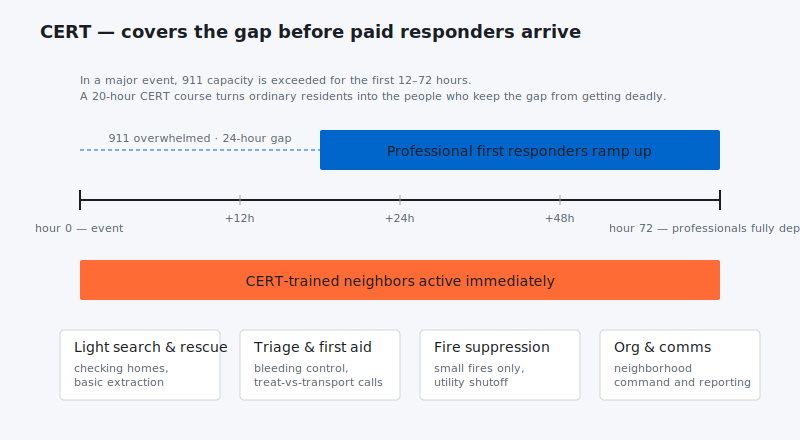

In Los Angeles, there are more than four million people in the city every day, whether they’re residents or visitors. The diverse nature of the city, not to mention more than 470 square miles of geography, make a high risk situation in the event of a major disaster. Thankfully, the city has not suffered the types of catastrophic earthquake, flood, and other FEMA categorized events that can bring a city to its knees. To ensure that the population has the best possible chance of surviving a disaster and thriving afterward, the LAFD supports and trains residents to be disaster first responders. The program is called Community Emergency Response Team, or CERT. Its super fun and free!

**The Origins of CERT****
Frank Borden introduces the CERT Concept. The program has been in effect for nearly a quarter of a century. It’s origins go back to 1985, when a group of Los Angeles fire officials, including now-retired Assistant Fire Chief Frank Borden, traveled to Japan to learn how the Japanese responded to disastrous earthquakes. While there, the visitors discovered first hand that community participants played a significant role in post-disaster support and response, because the deadly Kyoto Earthquake struck during their visit. Later that year, a separate trip was made to Mexico in the wake of the 8.1 Mexico City Earthquake that killed more than 10,000 people. LAFD officials observed that every-day people – neighbors and passers by – became first responders when the quake struck, often digging with their bare hands to help free trapped victims.

A year later, the Los Angeles Fire Department created a pilot program to teach a core group of community members about basic fire suppression, first aid, search, and evacuation techniques. The first 30 people who completed the training demonstrated the effectiveness of the CERT concept, but it wasn’t until the October 1, 1987 Whittier Narrows Earthquake that the city saw evidence of how valuable the CERT program could be and stepped up to support it.

In 1993, CERT became part of the Federal Emergency Management Agency (FEMA) offerings to communities nationwide.

**Who can Join CERT?****
Anyone in good health and with a sense of community can become a part of CERT. If you become a CERT member, you will learn about important life-safety support techniques. You will, however, not be expected to place yourself in dangerous situations, either in the training or when a disaster strikes.

**Training includes:**

- Learning to suppress small fires

- Basic first aid, including ABC treatment, treatment for shock, and related techniques

- Evacuation tactics and how to collaborate with city agencies to support neighborhood exits

- Search tactics

- Communications, including the use of radios

A key factor for CERT members is the ability to spontaneously organize and activate themselves in the event of a major disaster. If there is a significant earthquake, phones and other communications channels may be interrupted. CERT members will know where to go, how to organize their efforts, and will get to work without any specific order being issued.A CERT member’s first responsibility is to his or herself, then his or her family, and finally his or her community.

**What is Involved in Becoming a CERT Member?****
LAFD CERT members drillCERT members receive 17 ½ hours (one day a week for seven weeks) of initial training. The 7-week course is followed by full-day bi-annual refresher drills, and an opportunity to assist the LAFD at local incidents. CERT training is provided free of charge within the City of Los Angeles to anyone 18 or over.

Classes are taught mornings, afternoons and evenings continually throughout the year in locations all over Los Angeles.

If you in Los Angeles you can use this calendar to find out about classes http://www.cert-la.com/cert-la-news/calendar-3/

or by contacting them

CERT Unit
Los Angeles Fire Department
Homeland Security Division
201 N. Figueroa St., Suite 1225
Los Angeles, CA 90012
213.202.3136 [Direct Line]
213.202.3187 [Fax]
