While I was at an event last weekend I got into conversation where I was explaining to a group of people what the term IoT(internet of things) means. Since the term is used so broadly now I can see how people are starting to get confused about these things. Luckily I am a huge tech nerd and I get this question more often than you would think so I have a canned speech that I give out. I take the person through a IoT Journey starting with a basic thermostat and working up through Nest to the cloud and how inevitable there will be a AI that takes over the world. Just kidding. This in itself wouldn’t be blog worthy event but a very interesting conversation emerged about clothing. I have been following the smart/connected clothing market for some time. Most people think that IoT is only about electronics, but the reality is IoT is really anything that can send data back to a data repository to be analyzed and/or displayed. So is your [bra](http://shop.numetrex.com/product/adidas-micoach-seamless-sports-bra/) with a sensor an IoT device? I am going to take a boarder view and say if tracks information and then sends it somewhere to be analyzed/displayed its IoT. This gives us a broader group of clothing to look at.

Given the fact that the average use of a fitness tracking device is less than three months before individuals stop using them you could think  that wearables and smart clothing is a fad. I can guarantee you this is not the case. As sensors become cheaper and more ubiquitous the reality will be they will be sewn into the clothes we wear. It is only when the user doesn’t have to do something to incorporate this technology such as strapping on a watch or pedometer that it will proliferate. It’s this frictionless tracking ability that will really lead the evolution of smart clothes. The common UX acronym KISS (keep it simple stupid) and the phrase “Don’t make me think” fit perfectly here. If you don’t make the user have to do anything to achieve the desired outcome, then it will naturally prevail. So I decided to do a quick analysis of what is going on in the smart clothing market. Here is what I found.

## Nike/Apple

These two creative powerhouses have always had a close relationship. Nike started this whole fitness measuring business almost a decade ago, with Nike+iPod, a partnership with Apple. The FuelBand was released in early 2012 and it fared pretty well, grabbing 10% of the market by 2013, behind Jawbone and Fitbit. But as more and more companies joined in the fitness wristbands craze, the market quickly became saturated. And Nike concluded it no longer needed its own gadget.  Recently they released the custom Apple Watch the Nike+ . Since this is not a piece of clothing lets leave it be and move on to clothes.

In Q1 2016 Nike announced the [HyperAdapt 1.0](http://news.nike.com/news/hyperadapt-adaptive-lacing), which is a self-tightening/lacing shoe. Once you step into it, your heel activates a sensor that adjusts the shoe perfectly to fit your precise foot shape. There are + /- buttons on 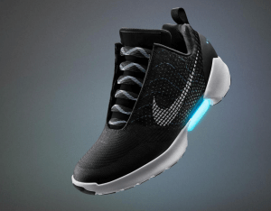the side that let you fine-tune it if you wish. It’s likely the realization of a long-term vision that started with the [Reebok Pump sneaker](https://en.wikipedia.org/wiki/Reebok_Pump) at the end of the 80s.

Nike re-launched Nike+ app will be more focused on selling products.  Nike’s other apps — Nike+ Training Club and Nike+ Running — will remain fitness-centric

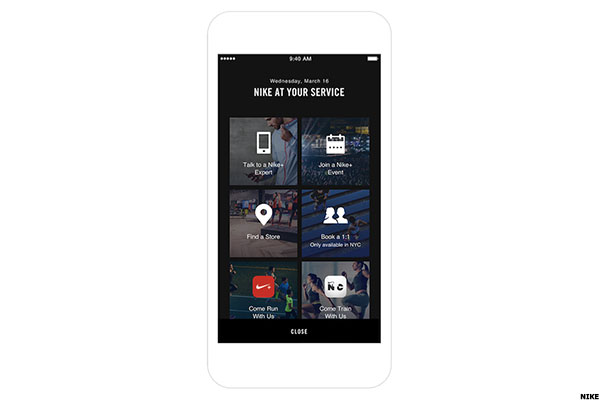

With so many strategic relationships already in place between Apple and Nike the continued development of Apple Music, Beats Wireless, and Ear Pods that can hold “1,000 songs in your ear”, measure heart rate all while Siri is whispering in your ear to “step your game up”, the future is theirs for the taking.

Here is a shirt Nike patented that showcases what could be upcoming technologies

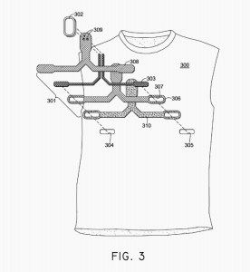 

Not sure if it would look anything like this but you could see it being close.

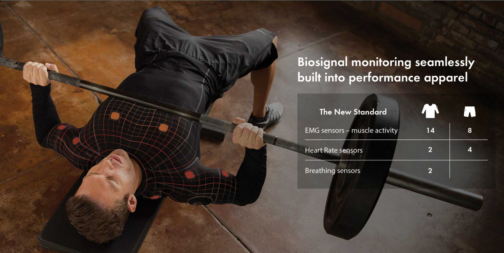

## Adidas

## 

Teamed with NuMetrex the company’s wearable heart monitoring garments include a sports bra for women and an athletic shirt for men. Both garments employ “smart fabric” technology consists of special sensing fiber electrodes woven directly into the product. These fibers look like nothing more than a small decorative weave pattern, about the size of two postage stamps side by side and placed near the heart of the wearer. Of note, running a finger over these fibers, they feel like very soft cotton, posing no discomfort of any kind to the wearer.

[OLYMPUS DIGITAL CAMERA

" data-medium-file="https://i0.wp.com/lukeangel.co/wp-content/uploads/2016/10/addias-bra.jpg?fit=300%2C225&ssl=1" data-large-file="https://i0.wp.com/lukeangel.co/wp-content/uploads/2016/10/addias-bra.jpg?fit=800%2C600&ssl=1" class="size-full wp-image-7583" src="https://i0.wp.com/lukeangel.co/wp-content/uploads/2016/10/addias-bra.jpg?resize=800%2C600" alt="OLYMPUS DIGITAL CAMERA" width="800" height="600" srcset="https://i0.wp.com/lukeangel.co/wp-content/uploads/2016/10/addias-bra.jpg?w=800&ssl=1 800w, https://i0.wp.com/lukeangel.co/wp-content/uploads/2016/10/addias-bra.jpg?resize=300%2C225&ssl=1 300w, https://i0.wp.com/lukeangel.co/wp-content/uploads/2016/10/addias-bra.jpg?resize=768%2C576&ssl=1 768w, https://i0.wp.com/lukeangel.co/wp-content/uploads/2016/10/addias-bra.jpg?resize=672%2C504&ssl=1 672w" sizes="(max-width: 800px) 100vw, 800px" data-recalc-dims="1" />](https://i0.wp.com/lukeangel.co/wp-content/uploads/2016/10/addias-bra.jpg)

[OLYMPUS DIGITAL CAMERA

" data-medium-file="https://i2.wp.com/lukeangel.co/wp-content/uploads/2016/10/addidas-shirt.jpg?fit=225%2C300&ssl=1" data-large-file="https://i2.wp.com/lukeangel.co/wp-content/uploads/2016/10/addidas-shirt.jpg?fit=600%2C800&ssl=1" class="size-full wp-image-7584" src="https://i2.wp.com/lukeangel.co/wp-content/uploads/2016/10/addidas-shirt.jpg?resize=600%2C800" alt="OLYMPUS DIGITAL CAMERA" width="600" height="800" srcset="https://i2.wp.com/lukeangel.co/wp-content/uploads/2016/10/addidas-shirt.jpg?w=600&ssl=1 600w, https://i2.wp.com/lukeangel.co/wp-content/uploads/2016/10/addidas-shirt.jpg?resize=225%2C300&ssl=1 225w" sizes="(max-width: 600px) 100vw, 600px" data-recalc-dims="1" />](https://i2.wp.com/lukeangel.co/wp-content/uploads/2016/10/addidas-shirt.jpg)

In 2013 They even went so far to create a wireless base station that serves as the gathering point for collecting wearable tech-derived data. This is a true M2M application — in this case a many-to-one set of interactions that are able to monitor all kinds of player activities, including heart rate as well as sweat and hydration levels. The adidas base station, soccer uniform and application that make up miCoach Elite are shown below.Underneath these M2M applications based on wearable technology there are also many collections of big data analysis at play. In the case of adidas, the analyses themselves also happen in real time although analysis can also be further conducted later on. On and in the field, coaches and doctors are able to monitor and react in real time to numerous player circumstances, both at the individual and team level.

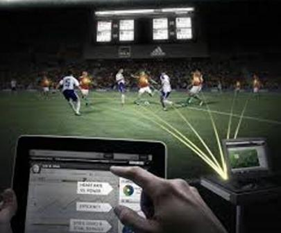 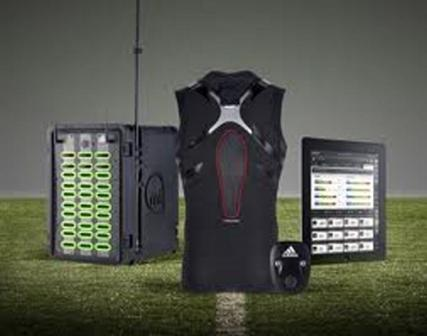

The not so good part of this system is before putting on the shirt or bra, the user need only do a few things. First, slightly moisten the heart- sensing fiber electrodes with a bit of water on a fingertip. Next, snap the transmitter into a dedicated pocket in the garment. Third, decide what device to use to monitor heart rate with: smartphone or watch.  I haven’t seen much progress from them and now they have dropped to third in the use behind Nike

and  Under Armor.

## Under Armor

Under Armor has lead a mad dash last year to buy as much of the fitness apps that would tie into their market from both a acquisition and acquihire perspective spending more then 700millon dollars.  They have since launched  HealthBox™, a Connected Fitness system**
created specifically to measure, monitor, and manage the factors that determine how you feel.

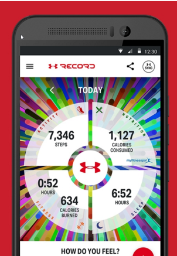

The $400 HealthBox, which includes an activity-tracking band, a heart rate strap, and a “smart” scale that records your weight and body-fat data and tracks them over time

.

UA’s $150 smart shoes that come with a built-in sensor—allowing youto run without any hardware, and that is where I know the biggest Gaines will be. Executives say this sensor-adorned gear can mold dedicated, higher-performing athletes, making them more conscious of their diets and the intensity of workouts. Under Armour has bet heavily on this strategy, spending $710 million in the past three years to buy just three mobile apps, including MapMyFitness. Together they create a digital community of 170 million members that log billions of activities and meals and offer continual advice.

## Samsung NFC suit

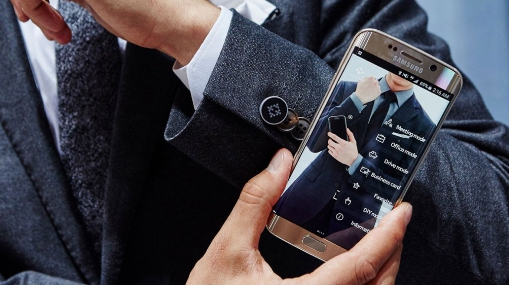

Samsung is going big on smart clothing and has already shown off its Body Compass workout shirt, which monitors biometric data, and a golf shirt in collaboration with Bean Pole Golf that includes weather and UV rating monitoring.

The Korean giant also has an NFC smart suit, built in collaboration with Rogatis, that lets the wearer unlock their phone, swap business cards digitally and set gadgets to office and drive modes.

It’s already sale in Korea for roughly $500, with no news yet as to whether it’s going to break out into other territories.

$TBD, ~~[~~samsung.com~~](http://www.samsung.com/)

## Heddoko

Coaches of all sports, collegiate and professional, have always wanted and have experimented with different ways that they could help their athletes. One way is with biomechanics. The Heddoko smartshirt and garment is an article of clothing that keeps information in 3D. Some of the other information that the Heddoko and its apps does is it shows a person if they are putting too much pressure on a certain part of their body.

The Heddoko keeps track of your performance and it allows for you to keep track of your goals. You get real time feedback and help through the Heddoko app and get information to help you from getting injured while training. The Heddoko is in a pre-order status and consumers can sign up at their website, heddoko.com. At the current no definite price has been listed on this product but if you sign up through their website you can get updates about the status of the product. The Heddoko is for the hardcore fitness and sports trainer at heart.**

Manufacturer MSRP: Not Available Yet
 Where to Buy: Manufacturer Pre-Order Only
 Product Page: [Heddoko](http://www.heddoko.com/)

## Hexoskin

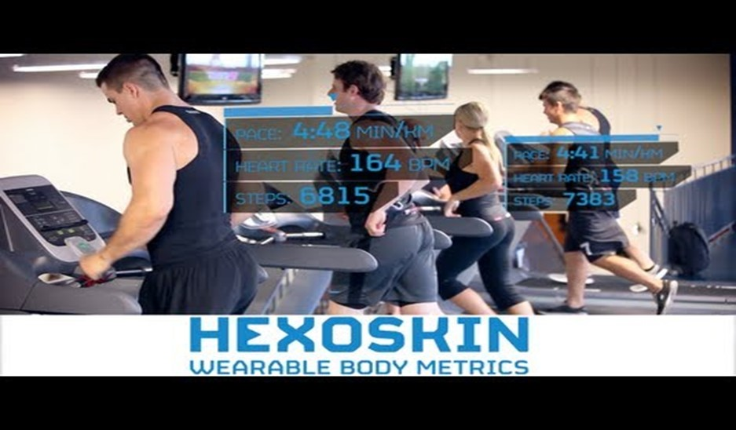

The Hexoskin is another one of the popular health related smartshirts and wearables coming out in 2016.  The Hexoskin can measure heart rate, breathing rate, and also can tell how much sleep you are getting and how intense your workouts are. Some of the other features that come with the Hexoskin are a battery with 14 hours of life, Bluetooth capability and compatible with iPhone, iPad, and Android, and independently verified data.

This smartshirt is made of a special Italian fabric and is machine washable. The Hexoskin has a compatible app which will store all your information and will allow for you to keep track of your workout targets.  Hexoskin has garments for all members of the family. Their products range anywhere from $169 to $579 depending if you buy just one article or if you buy a complete adult men, womens, and junior set. The Hexoskin can be purchased online from their website at hexoskin.com. Again, this is a product for the extreme athlete and would not be for someone who is not into intense training.**

The OM Bra records distances run, breathing rates and heart rate, and even tells you when you’re recovered enough to head back to the gym. And it links it all up with all the fitness platforms you’d expect, just in case you’re not that into OMsignal OMrun.

The bra is adjustable at almost every thread with straps, padding and cups all designed to fit your needs.

Manufacturer MSRP: $169-$579
 Where to Buy: [Hexoskin](http://www.hexoskin.com/)
 Product Page: [Hexoskin](http://www.hexoskin.com/)

##  Ralph Lauren Polo Tech Shirt

The inconic Polo shirts from Ralph Lauren have now gone to the high tech world of smartclothing.  The Ralph Lauren Polo Tech Shirt is able to take biosensing silver fibers woven into the shirt and have an elite product. Biometric data is stored and can be manipulated on an app through a smartphone or tablet. The shirt can track the amount of calories burned and the intensity of the movements in your workout.

The Polo Tech Shirt is composed of a moisture-wicking compression fabric which aids in blood circulation and also with muscle recovery. The Ralph Lauren Polo Tech Shirt is in a pre-order and pre-launch stage and consumers can get more information at ralphlauren.com. Again, this product is more for the hard core fitness buff in the family. Coaches from all over the world will also be after the Polo Tech Shirt in order to better test and get more knowledge on their players and athletes.**

Manufacturer MSRP: Pre-Launch Stage
 Where to Buy: Manufacturer Pre-Order Only
 Product Page: [Ralphlauren ](http://www.ralphlauren.com/shop/index.jsp?categoryId=46285296)

## Cityzen Sciences

Cityzen Sciences is a French based company that has been in the smartclothes business since 2008.  They are noted for their D-Shirt which is short for Digital Shirt. Microsensors are embedded all throughout the shirt and they are able to keep track of information such as keeping track of temperature, heart beat and heart rate, and the speed and intensity of your workouts. Cityzen Sciences can also customize smartclothes for clients.

Cityzen Sciences has a clientile of amateur and professional sports athletes and they have given high praises on the customization work done by the Cityzen Sciences engineers. They are part of the French based Smart System program.  It is a group of French smart technology scientists who join and meet together to work on new solutions for smartclothes. This company can be contacted at their website at [www.cityzensciences.fr](http://www.cityzensciences.fr/en). for more information and updates about when the shirt will come on to the market.

Manufacturer MSRP: N/A
 Where to Buy: [Cityzen Sciences](http://www.cityzensciences.fr/en)
 Product Page: [Cityzen Sciences](http://www.cityzensciences.fr/en)

## OMsignal

The biometric smartwear from OMsignal are certainly a high class and high tech product.  It has all of the fitness tracking abilities and can track heartbeat and breathing. It has the compatible app in order for you to track your health and fitness information. The shirt is not very bulky and is able to keep the biometric information by using a small black box woven into the shirt.

The OMsignal has moisture control, odor control, and is also machine washable. It also has the compression feature which helps with circulation and muscle recovery. The OMsignal certainly has fashion and functionality all written on it. There is really nothing negative that you can say about the OMsignal. This would be something for those who just like to keep track of their vitals while working out but not having to pay a very huge price for it.**

Manufacturer MSRP: $249
 Where to Buy: [OMsignal](http://www.omsignal.com/)
 Product Page: [OMsignal](http://www.omsignal.com/)

## Lyle & Scott contactless jacket

Can I pay by cuff? Barclaycard and Lyle & Scott recently teamed up to design a contactless payment jacket powered by bPay. The Contactless Jacket, which features the same contactless payment chip found in debit/credit cards discretely hidden in the cuff of the right sleeve, allows the wearer to pay for anything up to £30 across 300,000 shops, bars, restaurants and stations around the UK.

The double-faced, hooded jacket is available from the heritage brand in Admiral Blue and True Black online, or if you happen to stumble across Lyle & Scott’s Carnaby Street store.

£150, ~~[~~Lyle & Scott~~](http://www.lyleandscott.com/)

## Athos

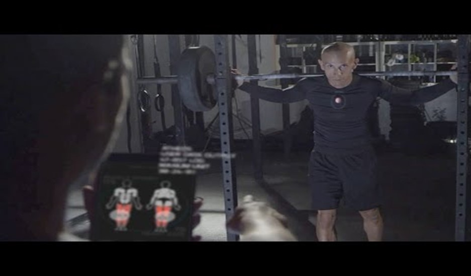

Athos is a biometric data smartclothes company that looks to be one that some major sports teams will gravitate to. One person who is promoting this product is six time NBA All Star Jermaine O’Neal. The material for the Athos smartclothes are warped knit which allows for durability and flexibility. It has a four way stretch material that allows for a person to be able to stretch however they want.

The data collection part of the Athos is called The Core. There are 14 sensors embedded throughout the shirt for EMG recording and then two each for heart rate and breathing. The shorts have 8 EMG sensor and 4 heart rate sensors. The Core is a wi-fi type device which means that there are no wires with Athos. The compatible app allows for you to track your progress and keep track of goals that you are trying to get. You can see how each muscle group is doing during a workout. Consumers can go to liveathos.com and signup through their pre-order process and get more information about the product.**

Manufacturer MSRP: Manufacturer Pre-Order Only
 Where to Buy: Manufacturer Pre-Order Only
 Product Page: [Athos](http://www.liveathos.com/)

## Lumo Run

From the makers of the Lumo Lift posture tracker, these smart running shorts and capris pack in a sensor that can monitor a host of metrics including cadence, ground contact time, pelvic rotation and stride length. The smart running gear supports real time coaching with feedback sent through to your headphones to help improve running form and reduce the chances of injury.

There’s no change on the battery front either, giving you an impressive one month off a single charge. If you don’t want to buy the shorts, there’s also the ~~[~~Lumo Run sensor~~](http://www.wareable.com/smart-clothing/lumo-run-sensor-specs-price-release-date-2393)~~ that can smarten up your current running kit.

$149 (shorts) /$169 (capris), ~~[~~lumobodytech.com~~](http://www.lumobodytech.com/lumo-run/)

## Clothing+

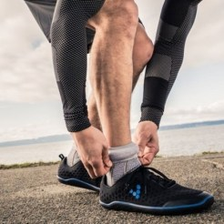

Clothing+ is a new and emerging company who specializes in wearable sensors that are embedded in clothing. The company is noted for developing the first heart beat and rate sensor for a shirt back in 1998 and then they came out with a sensor strap in 2002. Clothing+ will have all of the biometric sensors that are the norm in these types of smartclothes these days.

Adidas, Garmin, and Under Armour are just some of the major companies that Clothing+ likes to call clientile. Hosptials have also started to embrace Clothing+ as it has become a preferred way to monitor heart beat and breathing in patients. There is also the compatible app for Clothing+ which allows for the storage of data. The company is based in Finland and Hong Kong. Clothing+ can be contracted about their biometric smartclothes and the logistics about their product at [www.clothingplus.fi](http://www.clothingplus.fi/en/home.html). It is here where you can find out about pricing and also find out about their associate program where you can help sell Clothing+ products for the company.

Manufacturer MSRP: N/A
 Where to Buy: [Clothing Plus](http://www.clothingplus.fi/en/home.html)
 Product Page: [Clothing Plus](http://www.clothingplus.fi/en/home.html)

## Gymi

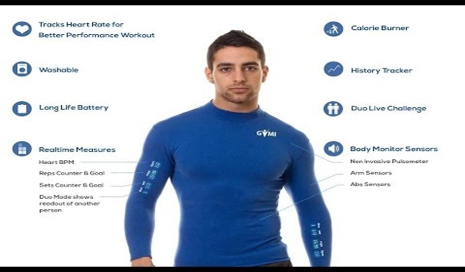

Gymi is an Australian based company and they have another very interesting smart garment. Sensors are placed throughout the shirt and it has real time sensor on the bicep and forearm of the shirt. You can see your heartbeat, reps and sets counter tool, and sensors throughout the arms and abs. There is also a duo challenge where you can go head to head in a workout with a friend and keep track of their efforts at the same time.

The Gymi shirt is washable and while it is very simple, it is very functional when it comes to fitness tracking and other internal vitals. The compatible app allows for optimal tracking of your peformances.  One thing is for certain is that this shirt should be less expensive than some of the other ones who are on this list. The Gymi and their products are ideal for all active people. You are going to do nothing but improve your workouts time and time again with Gymi.**

Manufacturer MSRP: Manufacturer Pre-Order Only
 Where to Buy: Manufacturer Pre-Order Only
 Product Page: [Gymi ](http://www.gymi.com.au/)

## Smart Sensing

Smart Sensing was a company that was first mentioned earlier about the products from Cityzen Sciences. Smart Sensing is a company that comes up with the solutions and the technology for sensors and data collecting for smartclothing. Cityzen Sciences are just one company that are part of the vast amount of companies that make the company function and do what they do. Jean Luc-Errant is the brainchild behind Smart Sensing.**

He and his engineers wanted to find a better way in order for people to measure their blood pressure and heart signs. Errant wanted a product that would stand up to extreme heat conditions and still be able to preserve the information that it collects. Smart Sensing will no doubt be one of the companies that will have the responsibility of making sure that biometric smartclothes will flourish in the next couple of years and beyond.**

Manufacturer MSRP: N/A
 Where to Buy: [Smart Sensing](http://www.smartsensing.fr/en)
 Product Page: [Smart Sensing](http://www.smartsensing.fr/en)

## Xsensio

Xsensio is a product that is geared more to the running community. There are monitors and sensors that are woven into this smartgarment that give ECG readings, core body temperature, and can also alert a runner if they are becoming dehyrated. Xsensio is known for making low powered smart technology but are able to still monitor and collect information for any kind of physical activity.**

The company is still doing extensive research when it comes to smartclothes and they are looking to be one of the major companies worldwide when it comes to that type of technology. Xsensio is partnered with the Swiss Institiute of Technology Lausanne and they have a strong force of engineers.  Product release and shipping information can be found at [www.xsensio.com](http://www.xsensio.com/). This product has the compatible apps and again is for the running type ie. marathoners and other competitive running types.

Manufacturer MSRP: N/A
 Where to Buy: [Xsensio](http://www.xsensio.com/)
 Product Page: [Xsensio](http://www.xsensio.com/)

## R-shirt

R-shirt is a French based company who uses a small waterproof chip that is sewn into the clothes.  Depending on the needs and wants of the customer, R-shirt is able to customize to any specifications.  The company is marketing their smartwear designs to people who have a vigourous office life. They market the fact that company meetings can take place from anywhere in the world.  There are various easy to use apps that comes with R-shirt technology.**

The R-shirt chip is also very good to use as a GPS locator for children. R-shirt’s iBeacon chip is compatible with both iOS and Android processing systems. This company produces their own clothes and can work with any other line of clothing. The R-shirt is just starting to be released to the public but an official launch date has yet to be found. The product should do well over in England and France but for American conumers.**

Manufacturer MSRP: N/A
 Where to Buy: [R-shirt](http://www.r-shirt.fr/en/t-shirt-connecte/)
 Product Page: [R-shirt](http://www.r-shirt.fr/en/t-shirt-connecte/)

## CancerDetectingClothing.com

CancerDetectingClothing.com is a company that certainly could be one that will make a huge name for themselves. Simply put, this is technology that will be able to detect the presence of cancer in a human body. The company currently has patent pending technology that will be able to see the early stages of cancer and then let the patient know exactly that. This product is still in its early stages but the potential is very endless.**

It is simply putting on a shirt or bra, and the sensors will be able to detect if any cancer is present.  The product has been tested on several different cancers. More information about Cancer Detecting Clothing can be found at their website. Healthcare facilities will certainly take advantage of this new technology. This product is still in its early stages and the best thing is for consumers to keep tabs on their company website.**

Manufacturer MSRP: N/A
 Where to Buy: [CancerDetectingClothing](http://cancerdetectingclothing.com/CANCERDETECTINGCLOTHING.COM/cancerdetectingclothing.com.html)
 Product Page: [CancerDetectingClothing](http://cancerdetectingclothing.com/CANCERDETECTINGCLOTHING.COM/cancerdetectingclothing.com.html)

## AIQ Smart

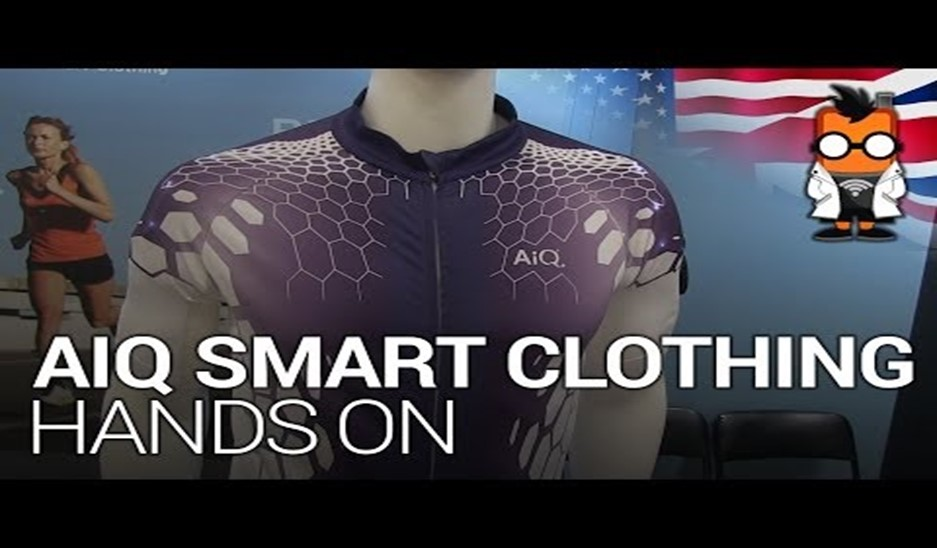

AiQ Smart Clothing is a company that has been around since 2009 working on combining textiles with smart technology. The company likes to market their product to all kinds of people from health and fitness to extreme sports to home care and health care. Their smartclothes are made of what is called Kings Metal Fiber, a company that is known for their fashion and functionality. Stainless steel yarn allows for flexibility and will stand up to any and all washing conditions.

The company has been able to win all kinds of technology industry awards since 2012. Again, this is one of those companies that like to deal in bulk orders and major companies. You can directly talk to representatives from AiQ Smart Clothing at the upcoming [WT | Wearable Technologies Conference USA](http://www.wearable-technologies.com/events/wearable-technologies-conference-2015-usa) in San Francisco on July 9-10.

Manufacturer MSRP: N/A
 Where to Buy: [AIQ Smart Clothing](http://www.aiqsmartclothing.com/)
 Product Page: [AIQ Smart Clothing](http://www.aiqsmartclothing.com/)

The smartclothes market is going to be one that will be hugely focused on the heath and fitness market and the hospital and personal care market. They will all have some type of compatible app and they will have the ability to measure vitals and other stuff such as breathing and how much exertion is coming from certain muscles.

Next will be a small look at some smart technology that is aimed for the babies of the family. These new technologies should also see a big boost during the course of 2016:**

Exmobaby by Exmovere**

The Exmobaby by Exmovere is looking to be a market leader when it comes to smart baby monitoring technology. The Exmobaby is a smart garment that goes on a baby and then with its sensor is able to tell a person if the baby is sleeping and also be able to keep up with the baby’s vital signs.  It has BlueTooth connectivity and also has 3G wireless capability. The device can be customized and have text messages and alerts sent to a parents’ smartphone so they can keep track of the baby’s status.**

The main sensor in the Exmobaby is one that measures the ECG readings and also has a FM receiver that transmits data. The device has been known to use very little power which is also a very good thing. Exmobaby is for one thing and one thing only and that is for monitoring babies. This would not be used for anything else but that but for those who have kids and want an optimal monitoring system, the Exmobaby would certainly be a good product to inquire about.**

Manufacturer MSRP: N/A
 Where to Buy: Exmobaby
 Product Page: [Exmobaby](http://exmovere.cn/?page=product_exmobaby)

## Mimo

The Mimo Smart Baby and Smart Nursery system is one that is certainly to be popular in 2016 and for some years beyond. The Mimo is a small onesie type outfit for the baby that has a small turtle looking monitor on it. That monitor is the most important and integral part of Mimo. The sensor is able to track sleep status, breathing, body position, and also allows for you to listen in on the baby.**

The compatible app will work with both iPhones and Android powered devices. It is there that you can get real time data and keep a certain eye on a baby. The Mimo Smart Baby System can be bought starting at $199 and a twins set can be purchased for $269. The shirt is machine washable and extra ones can be bought at shop.mimobaby.com for $29. This product is certainly a good investment for its price and goes out of its way to make sure that your child is protected and monitoring at all times.**

Manufacturer MSRP: $29 – $269
 Where to Buy: [Mimo Baby](http://www.mimobaby.com/)
 Product Page: [Mimo Baby ](http://www.mimobaby.com/)

[https://www.youtube.com/watch?v=6WI0QLN_hkc](https://www.youtube.com/watch?v=6WI0QLN_hkc)

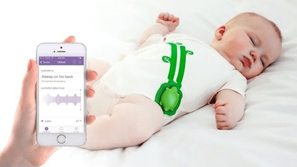

## Owlet Baby

Owlet Baby Care will have a product that should be one that consumers in the baby market should embrace big time.  It is basically a smartsock that slides over the baby’s feet. The monitor will then be able to alert someone if the baby stops breathing. A compatible app will allow for a parent to check their baby’s heart beat and heart rate and among other vital information.

If something is detected to be going wrong, the parent will get an alert through their smartphone and app. The Owlet Baby Care system can also work without the smartphone app. Through BlueTooth connectivity, a person can have a BaseStation hooked up to the smartsock in order to retrieve data and information. The sock is engineered to fit any baby up to one year of age. The only drawback to the Owlet Baby Care system is that it is only iOS compatible and it will only work with any device that is running on iOS 8.0 and higher. Still, this is a very good baby monitor.**

Manufacturer MSRP: $250
 Where to Buy: [Owlet Baby Care](https://www.owletcare.com/)
 Product Page: [Owlet Baby Care](https://www.owletcare.com/)

## My Sensible Baby.com

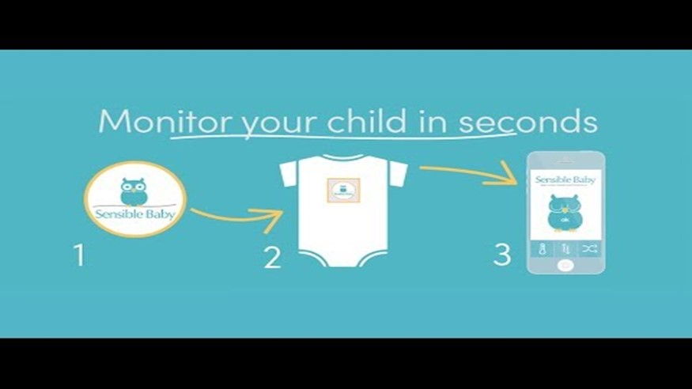

My Sensible Baby.com is a new and upstart company that is focusing on the smart monitoring of baby’s. It is a simple sensor that can be embedded into a young baby’s clothes in order to monitor if the baby is sleeping and breathing. The good thing about this product is that it emits low energy radio signals so the transmission of data should not and will not affect a young baby.

The battery for this product is low powered and it does not use much of the battery power.  A battery for one of the My Sensible Baby.com products can last for six months. This company is still in the product development stage but they can be contacted through their website at [www.mysensiblebaby.com](http://www.mysensiblebaby.com/). Again, this looks to be a versatile product that you could see in baby onesies and socks. Either way, this product will be another one of those that will help the security of babies and nurseries all around the world.

Manufacturer MSRP: At Development Stage
 Where to Buy: [My Sensible Baby](http://www.mysensiblebaby.com/)
 Product Page: [My Sensible Baby](http://www.mysensiblebaby.com/)

##  MonBaby from MonDevices

MonBaby by MonDevices is a product that recently was awarded and acknowledged at the recent Consumer Electronics Show 2016in Las Vegas back in January. The MonBaby sensor is one that is used with newborns. It has a smart button technology which is able to track the sleep patterns of young babies. The MonBaby is able to track sleep patterns, positions, and orientation and forward the information to a person or parents’ smartphone.

The MonBaby is BlueTooth 4.0 capable and has a 14 bit accelerometer. It has an antenna range of 200 feet which means that it would work very well in a large house. The smart button fits securely underneath of a child’s clothes and will work with the iPhone and any Android device. MonBaby has a data analytic team that is top notch and above most others. There are no cords which means that there is no threat of a baby choking. As MonBaby puts it, you don’t have to keep worrying about your baby and their sleeping habits.**

Manufacturer MSRP: Displayed at CES 2015
 Where to Buy: [MonBaby](https://monbaby.com/)
 Product Page: [MonBaby](https://www.monbaby.com/)

## Neopenda smart baby hat

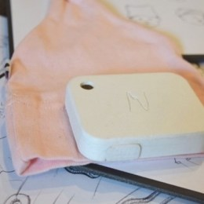

Neopenda’s vital signs monitor is fitted inside a hat for newborn babies.

It can measure temperature, heart rate, respiratory rate and blood oxygen saturation. It is being developed by a New York based health start-up of the same name, founded by Sona Shah and Teresa Cauvel, two Columbia University biomedical engineering graduates.

Up to 24 baby hats can be wirelessly synced, via Bluetooth, to one tablet which will run custom software. The idea is that doctors and nurses can check up on the vital signs of the whole room at a glance and get alerts if any changes in temperature or heart rate, say, are cause for concern. They are still at prototype stage but could cost as little as $1 each.

$TBC, ~~[~~neopenda.com~~](http://www.neopenda.com/products.html)

These new smart technologies are certainly going to be one of the biggest parts of an emerging market and economy. Smart clothes these days are engineered to make sure that people of all ages are monitored well and efficiently and that up to date and correct information is given. Diabetic patients have seen smart socks used to monitor temperature and joint angles in case there could be something wrong. There are the various shirts out there with monitors and sensors that can give real time data and if a workout is too slack or if it is too intense. There are sites such as LikeAGlove.com which can customize smartclothes for a person by just having them put their size information into their website.

The technology for smartclothes is something that will certainly jump leaps and bounds over the next couple of years. Still, with the technology that is set to be coming on to the market along with its products, smartclothes for all members of the family should get more innovative day by day and year by year. It is certainly a market that will be around for years to come.**

