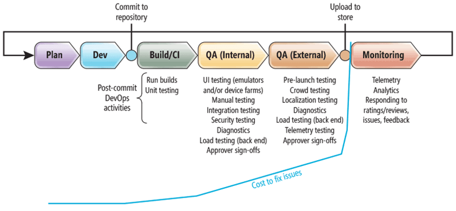
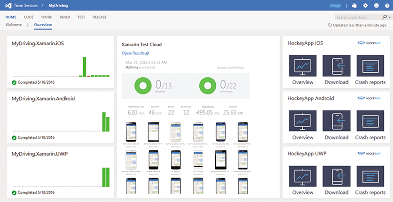
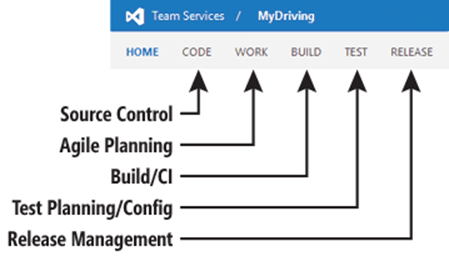
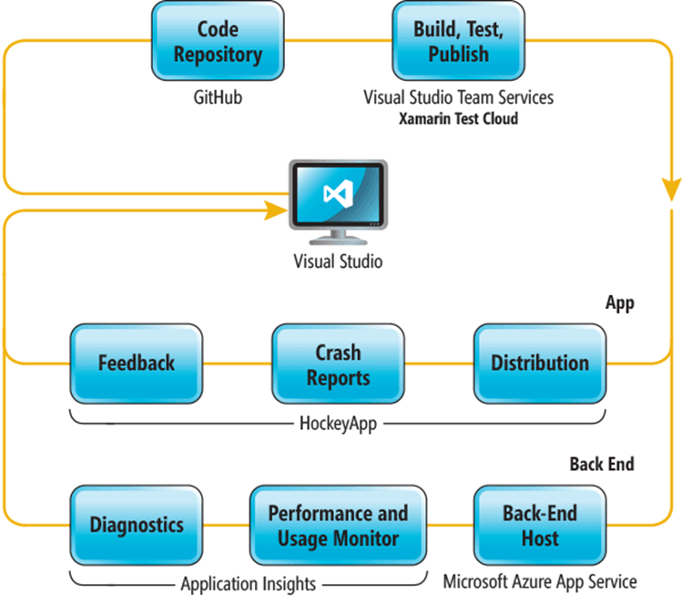
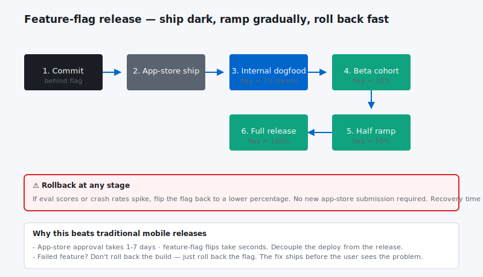
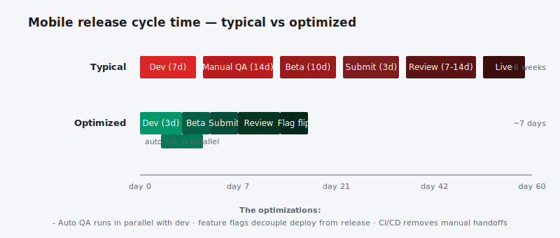

 By historical standards, writing code is easy. Today we enjoy enormously powerful tools like IntelliSense, auto-complete, syntax coloring, error highlighting and support through communities like Stack Overflow. We also enjoy an ever-growing repository of exceptionally useful libraries and tools, many of them free. But there’s a big gap—a veritable chasm, you might say—between the mere act of writing code and the development of mobile apps that deliver the highest value to customers, and do so at the lowest cost to your business.

This article is heavily geared towards Azure and Microsoft Services. My goal is to break this into a series and do more in-depth sections over the next few months that will take a look at other options in the market.**

The various practices that have come to be known collectively as DevOps are essentially what help you bridge that chasm. I say “various practices” because there are many ways to build that bridge. There are different ways to define the processes themselves, and there are many different tools to help you communicate and manage those processes with all the people involved—including ways to learn directly from your customers. As such, the whole DevOps space oftentimes seems quite chaotic, with too many choices and too little clarity.**

Fortunately, as I’ll explore in this series of articles, We now have providers that can answer: a full end-to-end stack that enables DevOps for mobile apps and their associated back ends. This stack, shown in **Figure 1**, consists of Visual Studio, Visual Studio Team Services, and Team Foundation Server, along with Xamarin Test Cloud, HockeyApp, Application Insights, and CodePush.**

**Figure 1 Primary Components of the Microsoft DevOps Stack for Mobile Apps and Back-End Services****

| ~~Tool or Service~~ | ~~Purpose with DevOps~~ |
| --- | --- |
| ~~Visual Studio ([bit.ly/25EVbAw](http://bit.ly/25EVbAw))~~ | ~~Central development tool for app, services and test code, along with diagnostics and integration with source control.~~ |
| ~~Visual Studio Team Services ([bit.ly/1srWnp9](http://bit.ly/1srWnp9))~~ | ~~Cloud-hosted Agile planning tools, source control, build services, test services and release management. (Note that planning tools will not be covered in this series.)~~ |
| ~~Team Foundation Server** ([bit.ly/1TZZo9o](http://bit.ly/1TZZo9o))~~ | ~~On-premises capabilities equivalent to Visual Studio Team Services, allowing full customizations of servers and complete control over those physical machines.~~ |
| ~~Xamarin Test Cloud** ([xamarin.com/test-cloud](http://xamarin.com/test-cloud))~~ | ~~Automated and manual testing of all mobile apps (including those not written with Xamarin) on thousands of real, physical devices accessible through a Web portal.~~ |
| ~~HockeyApp** ([hockeyapp.net](http://hockeyapp.net/))~~ | ~~Pre-launch app distribution directly to devices of test customers (not involving platform app stores). Also pre-launch and production monitoring with custom telemetry, crash analytics and user-feedback reporting.~~ |
| ~~Application Insights ([bit.ly/1Zk9Qd3](http://bit.ly/1Zk9Qd3))~~ | ~~Telemetry, diagnostics and monitoring of back-end services.~~ |
| ~~CodePush** ([bit.ly/28XO7Eb](http://bit.ly/28XO7Eb))~~ | ~~Deployment of app updates for Cordova and React Native apps directly to user devices without going through app stores.~~ |

This stack is applicable to all types of mobile apps: native apps written for a single mobile platform, hybrid apps written with Apache Cordova, and cross-platform apps written with React Native or Xamarin. Better still, DevOps is not an all-or-nothing commitment. Rather, it involves a system of loosely coupled activities and practices you can build up incrementally, to add real value to your business of producing mobile apps. It’s also possible with new projects to build the entire DevOps pipeline before a single line of code is written.

The approach I’ll take in this series is to focus on different stages of the “release pipeline” and look at what parts of the DevOps stack come into play. In this inaugural article, however, I’ll first need to establish some necessary background. I’ll begin by describing what a release pipeline is and identifying the activities involved, then discuss the overall need for DevOps and the role of tooling and automation. Next, I’ll look at the MyDriving project as an example of DevOps in action (and you can find another example in this issue, in the article “Embracing DevOps When Building a Visual Studio Team Services Extension”). Finally, I’ll review the central role that Visual Studio Team Services (and Team Foundation Server) play in the overall DevOps story, setting the stage for the follow-on articles.**

The Release Pipeline**

The idea of a pipeline is that for any particular release of an app or its back-end services, its code and other artifacts must somehow flow from the project’s source code repository to customer devices and customer-accessible servers. Once on those devices and servers, runtime issues (crashes), insights from telemetry and direct customer feedback must all flow back as learnings that drive subsequent releases.

Of course, none of this happens by magic. It happens through a sequence of distinct stages after code is committed to the repository, as shown in **Figure 2**. The stages include:**

- ~~Build/CI: Build the app and run unit tests; continuous integration (CI) means that a commit to the repository triggers a build and test run if those processes are automated.

- ~~Internal QA: Perform any number of additional tests and acquire approver sign-offs.

- ~~External or pre-launch QA: Put the app in the hands of real customers prior to public release, testing the app and services under real-world conditions and collecting feedback. This stage may also involve additional approver sign-offs.

- ~~Production monitoring and learning: Regardless of how much testing you do, customers will almost certainly encounter problems once the app is made public (that is, “released to production”). Customers will provide feedback on what works and what doesn’t, and their usage patterns are revealed by telemetry.

**
**Figure 2 The Stages of a Typical Release Pipeline with Associated DevOps Activities****

You’ll notice in **Figure 2** that I’ve labeled most DevOps activities as some form of testing. In fact, it’s not much of a stretch to think of every activity as a kind of testing. Running a build, for example, tests the structure of the repository and whether all other artifacts are where they need to be. Running diagnostics tools is a form of exploratory testing. Gathering and analyzing telemetry is a way to test your assumptions about how customers actually use the app. And what are approver sign-offs, if not a direct check by a human being that everything is as it should be?

Continuous Validation of Performance**

As different forms of testing, all activities that fall under the DevOps umbrella exist to validate the quality, reliability and value of the app being delivered. Put another way, the activities are designed to catch or identify defects, which means anything that will cause the app to deviate from fulfilling customer expectations. It almost goes without saying, then, that the more often you engage in DevOps activities—continuously, if possible—the better chance you have of finding problems prior to release.

DevOps activities are also designed to catch defects as early as possible in the pipeline when the cost of fixing them is lowest (illustrated by the blue line in **Figure 2**). Clearly, costs go much higher once the app is released and defects are out in the open, at which point the cost might include lost customers, damage to your reputation and even legal liabilities!**

Putting all this together, apps that deliver the highest value to customers, and do so at the lowest cost, are your best “performers” because of what they ultimately bring to your business. Great apps, simply said, are great performers. For this reason, I like to think of DevOps as the continuous validation of performance in the broadest sense of the term. DevOps is to software development what training, practice, rehearsals, and post-performance reviews are to professional musicians, athletes, and other performers in their respective fields. It’s how you know and trust and monitor the complete value of what you’re delivering, both for customers and for your business.**

Process First, Then Tooling and Automation**

In a series about the Microsoft tooling stack for mobile DevOps, you might think the next step is to jump right into those tools and start “doing” DevOps. But DevOps doesn’t start with tooling, or even with automating anything. The foundation of DevOps is being clear about the processes and policies that define how your apps and services move from the hands of your developers into the hands of your customers. It’s really that simple; so simple, in fact, that you can certainly define an entire release pipeline by writing down the necessary steps on paper and performing each one manually.

This is sometimes the hardest part of starting a journey to effective DevOps. Within a team environment, especially a young team that’s trying to move rapidly, a release pipeline might consist of a bunch of steps that have evolved ad hoc, that individual team members “just remember” to do. Here are some examples:**

- ~~Run a build

- ~~Run some tests

- ~~Check that the right non-code artifacts are in place

- ~~Collect feedback from test users

- ~~Post the app package to the appropriate store

- ~~Deploy service code to the appropriate server (dev, staging, production and so on)

- ~~Change an API key from dev to production

- ~~Tweet availability

- ~~Update the product page on your Web site

With short development iterations, all of these activities can easily become so enmeshed in the team’s day-to-day routine that nobody realizes that none of it is actually written down anywhere—until, of course, someone goes on vacation, gets sick or leaves the company! What’s more, if all your release processes and policies exist only in people’s minds, it’s difficult to apply them consistently. They invariably get intertwined with hundreds of other unrelated yet important tasks. This is clearly fraught with peril, especially in environments in which a single oversight can be disastrous.

By taking the time to clearly identify all the steps involved, you define a process that’s predictable, repeatable and auditable. Having it all spelled out in a place that’s accessible to everyone also makes the process easy to review and modify because all the interdependencies are visible. This, in turn, is the basis for applying tooling and automation. Otherwise it’d be like setting up a bunch of industrial machinery to build widgets without knowing what it is you’re actually trying to build in the first place.**

Let’s be very clear about this. Automation is not actually essential in any release pipeline—every step can be done manually if needed. This includes even trivial but time-consuming matters like sending notification e-mails. But manual processes are expensive to scale, prone to human error, often tedious (and therefore somewhat boring to humans), and put every step at risk of competing for the attention of your human employees with all their other work. Computers, on the other hand, are very adept at endlessly repetitive and mindlessly trivial tasks without getting bored or negligent. It’s also much simpler to add a few more machines if demands increase and to decommission them when demands go down, than it is to hire (and fire) qualified people.**

The purpose of automation, then, is to simultaneously lower the cost and increase the frequency and quality of your processes as they’re defined, separate from the tooling. That is, when your processes and policies are in place, you can then incrementally automate different parts, use tools to enforce policies, and get everything into a form that’s transparent and auditable. As you do so, you free human employees to concentrate on those areas that aren’t readily handled by a computer, such as reviewing and interpreting user feedback, designing telemetry layers, determining the most effective forms of testing, and continuously improving the quality of DevOps activities that are in place.**

An Example: the MyDriving Project**

Let’s now see how all this comes together with the Microsoft mobile DevOps stack by looking at the already-working project called MyDriving ([aka.ms/iotsampleapp](http://aka.ms/iotsampleapp)), introduced by Scott Guthrie at Microsoft Build 2016. MyDriving is a comprehensive system that gathers and processes Internet of Things (IoT) data through a sophisticated Azure back end and provides visualization of the results through both Microsoft Power BI and a mobile app written with Xamarin. It was created as a starting point for similar IoT projects and includes full source code, Azure Resource Manager deployment scripts and a complete reference guide ebook.

For my purposes, the MyDriving release pipelines are of particular interest. I use the plural here because there are four of them: one for the back-end code that’s deployed to Azure App Service, and one each for the Xamarin app on iOS, Android and Windows.

Here’s an overview of the pipeline flow, including some activities that aren’t presently implemented:**

- ~~Manage source code in a GitHub repository ([bit.ly/28YFFWg](http://bit.ly/28YFFWg)).

- ~~Run builds using the code in the repository, including the following sub-steps:~~ ~~Replace tokens with necessary keys depending on target environment (dev, test, production).

- ~~Restore necessary NuGet packages and Xamarin components.

- ~~Update version names and numbers.

- ~~Run the build (using the MacinCloud service for iOS).

- ~~(App only) Create and sign the app package as required by the mobile platform.

- ~~(Not implemented) Build any available unit test project.

- ~~(Not implemented) Run tests in the test project, failing the build if any tests fail.

- ~~For the service code:~~ ~~Copy the output of the successfully tested build to a staging server.

- ~~Deploy from the staging server to a test server, and run tests.

- ~~If that succeeds, deploy to the production server and repeat the test run.

- ~~Monitor the service and obtain diagnostic reports using Application Insights.

- ~~For the mobile app on all platforms:~~ ~~Deploy the app to Xamarin Test Cloud and run UI tests, failing the build if any UI tests fail.

- ~~If the build and UI tests are successful, copy the app package to a staging server.

- ~~Deploy the app from the staging server to alpha testers via HockeyApp.

- ~~(Not implemented) Upon approver sign-off, deploy the app to beta testers via HockeyApp.

- ~~(Not implemented) Upon additional approver sign-off, push the app to the appropriate app store.

- ~~Monitor the app with telemetry and crash reporting via HockeyApp.

As you can see, this is a straightforward list of what needs to happen for each release. But notice especially that it describes what needs to happen and identifies some of the services involved, but doesn’t specify who actually performs the steps. This is very important, because a human being can always sit down with the list and perform each step manually. In fact, that’s exactly what happened in the early days of MyDriving—we did manual builds and so forth so we could get test apps into people’s hands right away. But, simultaneously with the dev team’s coding efforts, others focused on incrementally automating different steps until the whole automated release pipeline was established.

A similar story is told in another article in this issue, “Applying DevOps to a Software Development Project.” Notice in particular how the section “Building and Publishing an Extension” does exactly what I’ve talked about here: It writes out a list of the exact steps in the release process. The rest of the article then explains, in the author’s words, “Our journey toward an automated build and release pipeline.”**

The Central Role of Visual Studio Team Services/Team Foundation Server**

In the MyDriving project, Visual Studio Team Services (Team Services for short) is the hub for managing and automating the release pipelines and the interactions with various services (see **Figure 3**). Because MyDriving was created as an open source project from the start, using a cloud-hosted service like Team Services isn’t an issue. For other scenarios, organizations may not be comfortable or permitted to use the cloud, in which case Team Foundation Server (TFS) provides the same capabilities with your own on-premises servers. In my series, I’ll work primarily within the context of Team Services, but understand that everything applies also to TFS.

**
**Figure 3 The Visual Studio Team Services Dashboard for MyDriving****

Those core capabilities are listed here (refer to **Figure 4** for placement in the Team Services UI):

- ~~Source control: Host unlimited private and public source repositories using Git or Team Foundation Version Control (TFVC), or work easily with repositories on GitHub.

- ~~Agile planning: Track work items, user stories and so on with collaboration on Kanban boards, reporting and so forth. (Note again that planning aspects aren’t covered in this series.)

- ~~Build: Create build definitions for service code and mobile apps (iOS, Android and Windows), using a wide variety of available tasks, including building and running test projects (for continuous integration) and deploying to Xamarin Test Cloud (XTC).

- ~~Release management: Define arbitrary sequences with optional manual approvals for any tasks that happen between build and release to an “environment,” such as deploying to HockeyApp, Azure or an app store. Release management is centered on whatever environments you want to define, such as staging, alpha, beta and production.

**Figure 4 Location of Features in Visual Studio Team Services****

The end of a pipeline where Team Services is concerned is the point at which an app is sent out to its final assigned environment (see **Figure 5**). After that, DevOps is primarily concerned with actively monitoring the app in those environments. This is where HockeyApp and Application Insights come into play, along with any other mechanism you establish for getting additional user feedback (also shown in **Figure 5**).

**Figure 5 Complete DevOps Flow for the MyDriving Project, Where the Code Repository Is on GitHub****

At the beginning of this article I said that the various activities and practices known as DevOps are what bridge the gap between writing code and delivering value to customers at the lowest cost to your business. You can now see that the Microsoft stack for mobile DevOps provides everything you need to manage quality, lower costs through automation, get the app and services into the hands of customers, monitor ongoing health and operations, and gather user feedback, all of which feeds back into the backlog for subsequent releases.

That's the DevOps cycle—from code commit to backlog—that I'll be exploring in more detail in the coming months.
