- **Cascading Style Sheets Operate on Inheritance**

CSS has a ancestor-descendant relationships. Anything previously defined by an ancestor will automatically be inherited by one of its children unless otherwise specified.

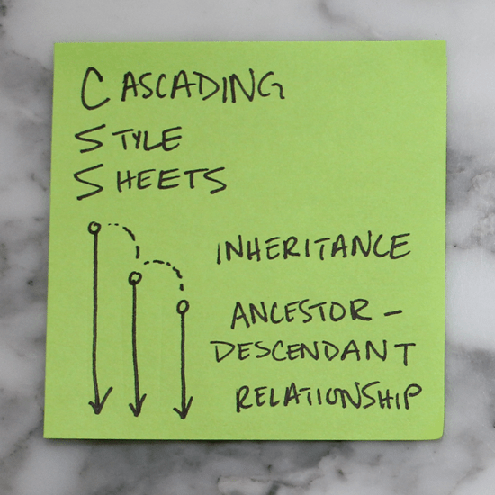

**2. Last Wins**

If an element is defined in more than one place within CSS, the last definition overrides the previous. (If these stickies represented colors we styled our h1’s, the h1 would appear pink.)

[Cascading Style Sheets Tags

" data-medium-file="https://i0.wp.com/lukeangel.co/wp-content/uploads/2016/09/1_4ijMAYWy9MHEvXfGkaSqoQ.png?fit=300%2C300&ssl=1" data-large-file="https://i0.wp.com/lukeangel.co/wp-content/uploads/2016/09/1_4ijMAYWy9MHEvXfGkaSqoQ.png?fit=550%2C550&ssl=1" class="wp-image-7075 size-full" src="https://i0.wp.com/lukeangel.co/wp-content/uploads/2016/09/1_4ijMAYWy9MHEvXfGkaSqoQ.png?resize=550%2C550" alt="h tags" width="550" height="550" srcset="https://i0.wp.com/lukeangel.co/wp-content/uploads/2016/09/1_4ijMAYWy9MHEvXfGkaSqoQ.png?w=550&ssl=1 550w, https://i0.wp.com/lukeangel.co/wp-content/uploads/2016/09/1_4ijMAYWy9MHEvXfGkaSqoQ.png?resize=150%2C150&ssl=1 150w, https://i0.wp.com/lukeangel.co/wp-content/uploads/2016/09/1_4ijMAYWy9MHEvXfGkaSqoQ.png?resize=300%2C300&ssl=1 300w" sizes="(max-width: 550px) 100vw, 550px" data-recalc-dims="1" />](https://i0.wp.com/lukeangel.co/wp-content/uploads/2016/09/1_4ijMAYWy9MHEvXfGkaSqoQ.png)

Cascading Style Sheets Tags

**3. Key Value Pairs**

For every HTML element to be styled, a corresponding CSS selector must be assigned. They always appear in key value pairs.

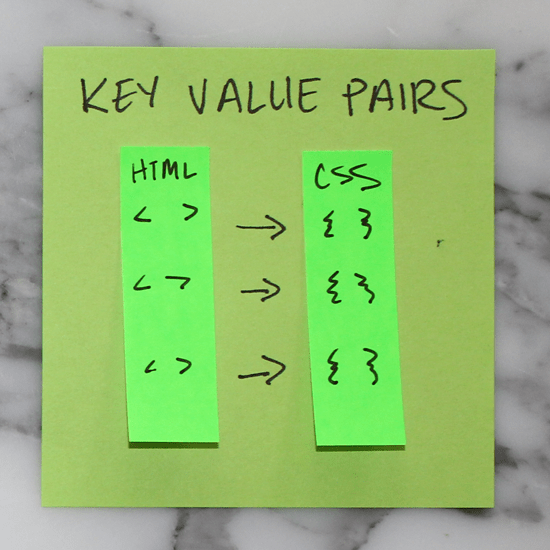

**4. Layout**

Websites can be broken down into components or divs for layouts. It is helpful to conceptualize the overall structure of a website before writing HTML or CSS.

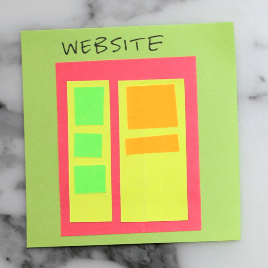

**5. Tree Structure**

Likewise, structuring a site also follows the tree methodology. This sticky illustrates the one above in tree-branch form.

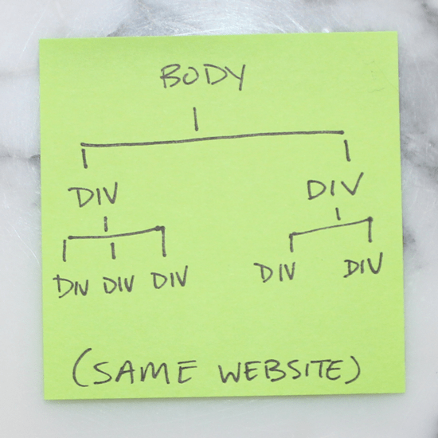

**6. Block vs. Inline**

Elements that stretch across the full width of a page are block elements. A few block elements include headers, footers, headings (h1, h2, h3, etc.), divs, paragraphs (p). Inline elements only take up as much room as they need to; span, links (a), and images are a few examples.

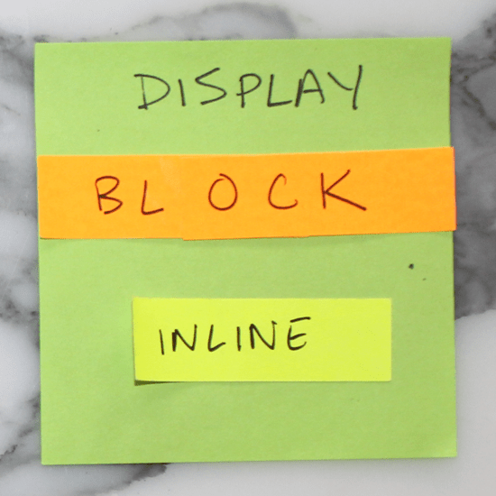

**7. Inline-block**

There is also such a thing as setting display: inline-block to create a uniform grid. Inline-block elements can have a height and width.

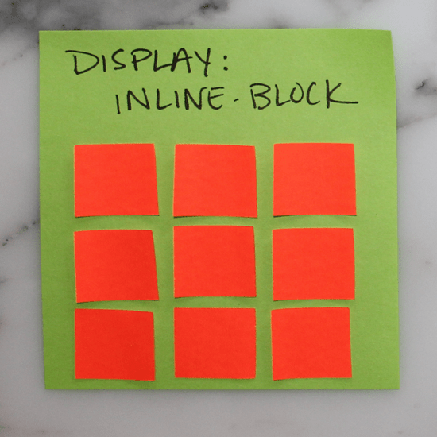

**8. Box Model**

All CSS elements are based on this model. The innermost box is content (could be anything), immediately surrounding content is its padding, then border, and finally, the outermost box–margin.

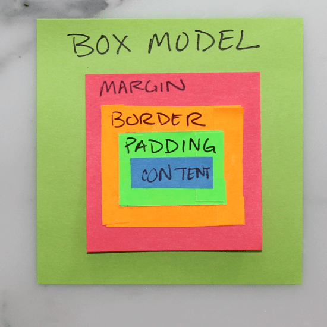

**9. Margins Outside**

Margins push out around an element. Margins are considered to be outside of the element, and margins of adjacent items will overlap.

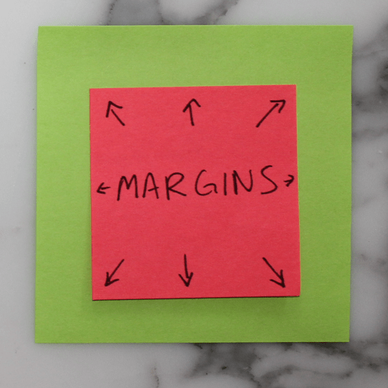

**10. Padding Inside**

Padding pushes inward on content. Use padding to move the contents away from the edges of the block.

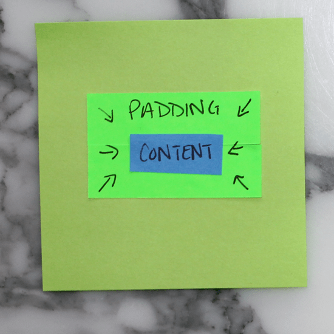

**11. Auto Margins**

Setting margins to auto for right & left is a handy way of centering.

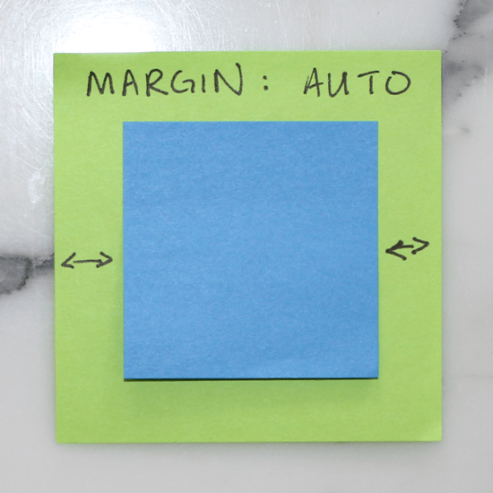

**12. Max-width**

Max-width prevents the value of the width property from becoming larger than max-width. This is especially helpful when designing for smaller screens (like mobile!)

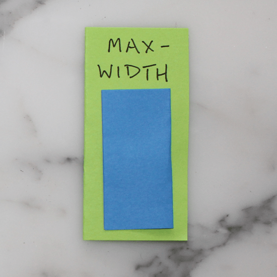

**13. Relative and Absolute**

Set a parent element to position: relative and its child to position: absolute to position the child within (or relative) to its parent. Note that the parent is always body by default.

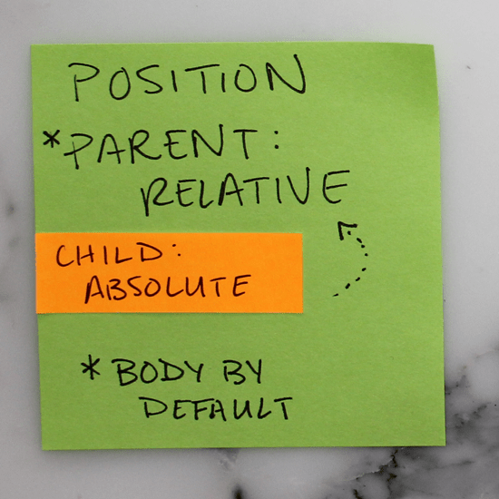

**14. Float**

Setting an element to float, like the img below for example, will allow the text to flow around it.

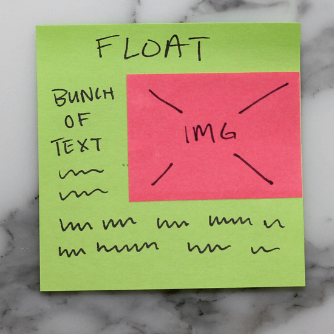[**
](http://lukeangel.co/wp-content/uploads/2016/09/1-oWCUvy2oHzi56nIzMDOR8w.png)

**15. Fixed**

Fixed elements are exactly that, they are always fixed to the same spot, regardless of page position (scroll).

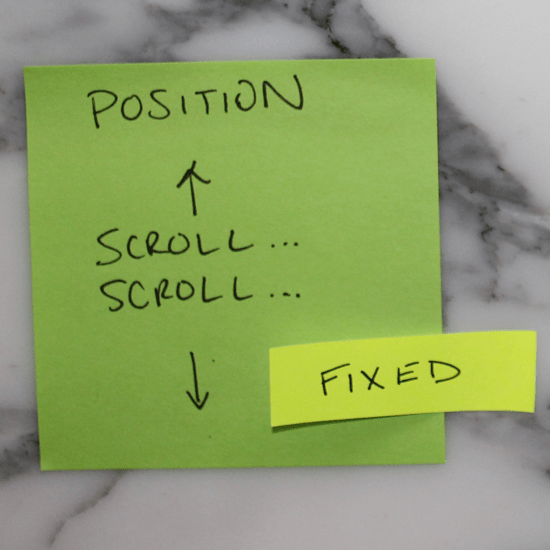

**16. Link up your style sheet!**

If you don’t link your style sheet in the header of your HTML, your website will be sad, and probably unattractive. ?

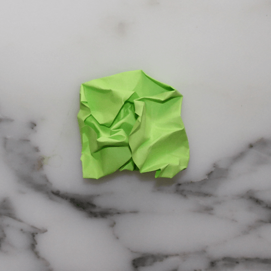

## Why the Post-it format works for learning CSS

Three reasons the 16-sticky format teaches CSS better than a 30-page tutorial:

**1. Each sticky is a single concept.** No paragraph can hide. If the concept doesn't fit on a 3×3 square, the writer didn't understand it well enough yet. Forcing yourself to compress an idea to that footprint is the best test of whether you've actually grasped it.

**2. The visual primitive matches the mental model.** CSS *is* a system of boxes containing other boxes. A sticky note *is* a box. When you draw the box model on a sticky, the sticky itself becomes a real-world demonstration of the principle. The medium is the lesson.

**3. The set is finite.** Sixteen stickies is *all of beginner CSS*. Once you've internalized these, you've crossed the cliff. The rest of CSS is composition — specificity rules, media queries, Flexbox, Grid — but it all sits on top of these primitives. Junior devs who can recite all 16 in their own words *write better CSS than seniors who can't.*

## The two stickies most people skip

Reviewing this set years later, the two stickies students underrate at first are **#8 (Box Model)** and **#10 (Padding Inside)**. They sound obvious. They aren't.

Most CSS bugs reported by junior devs trace back to a misread of the box model — margin where padding was meant, padding where margin was meant, an extra 8px coming from somewhere they can't find. Knowing the box model *and being able to draw it from memory* prevents 60% of those reports. **Spend extra time on stickies 8, 9, and 10.** They're the load-bearing ones.

## What I'd add today

Modern CSS (Flexbox, Grid, container queries, custom properties, `clamp()`, `min()`, `max()`) deserves its own sticky set. *Maybe a future post.* The 16 stickies above still teach the foundation — every modern CSS feature inherits from these primitives. Learn the primitives first, the conveniences second.

## Gratitude beat

Thanks to every front-end dev who let me sketch on a stack of stickies in a coffee shop to explain a CSS bug. The format started as a debugging hack and turned into a teaching aid. *Thank you* for being a willing audience.
