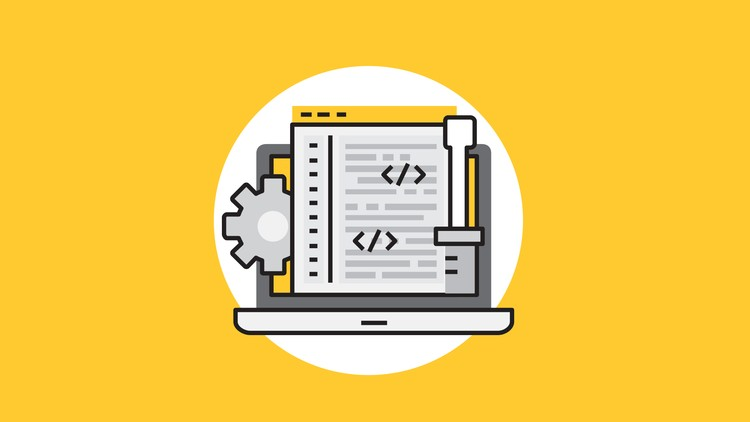

Just dropped a new course on **Agile Reporting**. Self-paced, pre-recorded, open enrollment.

Here's the thing about agile reports: most teams either ship nothing (and the rest of the org panics) or ship a slide deck with 14 charts and a sub-bullet legend (and the rest of the org silently stops opening the doc). The right answer is the postcard — light, honest, skimmable in 30 seconds, *radiates* information across the room. This course is how to build that habit.

## What's in the box

Six modules' worth of light, practical material:

- **Communicating progress** — what counts as a "status update" worth sending, and what doesn't
- **Prioritizing the backlog** — making the report a *byproduct* of the work, not a separate effort
- **The taskboard as a daily report** — the cheapest, most-ignored reporting tool every team already has
- **Sizing taskboards** — when to consolidate, when to split, when to redesign
- **Burndown charts that don't lie** — and how to spot one that does
- **Common pitfalls** — retrofitting, distributed teams, the "we'll just add another sprint" antipattern

There's a bonus chapter at the end where I answer the most common agile-mindset questions I get from students.

## Who this is for

- **New agile teams** getting asked "how's it going" who don't know how to answer at the speed business asks
- **Scrum Masters and POs** trying to graduate the team off ad-hoc Slack updates
- **Project leads** running mixed agile/waterfall portfolios who need a reporting language that travels

## What you'll be able to do after

- Run a sprint review where the leadership stakeholder doesn't ask for "more detail"
- Spot a fake burndown chart at 30 paces (the curve is the tell)
- Build a five-minute weekly artifact that *replaces* three of your team's current meetings
- Know when to escalate via a report vs in person — the math here is not what most teams think it is

## → [Take the course](/courses/agile-reporting-beginner-to-rock-star/)

Self-paced, pre-recorded, open enrollment. PMI Registered Education Provider — this course qualifies for PDUs.

---

Big thank-you to every team that let me run this material live before I recorded it. The "what does a *good* burndown chart look like" debate from one of those workshops became the entire third module. You know who you are. *Thank you.*

## The three reports the course teaches you to delete

**The 14-chart weekly slide deck.** Looks professional, gets opened by zero stakeholders, takes the PM five hours to assemble. Replace with: a one-page postcard with three numbers (committed, delivered, blocked) and one sentence on next sprint's biggest risk.

**The retro-vibes "what went well" report.** Free-form bullets, nobody owns anything, useful to no one outside the room. Replace with: action items in the format *owner, date, success signal*. If it doesn't fit that format, it isn't an action item, it's a feeling.

**The cumulative flow diagram nobody reads.** Beautiful, complex, technically correct, and exactly zero stakeholders ask follow-up questions on it. Replace with: a single sentence — *"Cycle time held at 4 days, throughput up 12%, WIP within limits"* — and the chart linked at the bottom for the one engineer who'll actually look.

## What "rock star" actually means in this title

It does not mean *fancy*. It means **you can report to a CTO, a sales lead, and an engineering team in the same week, in the same language, without translating.** That's the bar. Everything else is decoration.

## The single weekly artifact the course teaches you to ship

A one-page status postcard with: three numbers (sprint commit, delivered, blocked), one named risk for next sprint, one celebration. That's it. Five lines. The CTO opens it, the sales lead opens it, the engineering team opens it. *None of them ask for "more detail" because the right level of detail is in the link at the bottom.* The course walks the template in module 4, including the three variants — startup, enterprise, agency — so you can pick the one that fits your context.

The students who adopt that single artifact report cutting their reporting time by 60-80% within a sprint. The rest of the time gets reinvested in the team. *That's the actual return on the course.*

Self-paced, pre-recorded, open enrollment.
