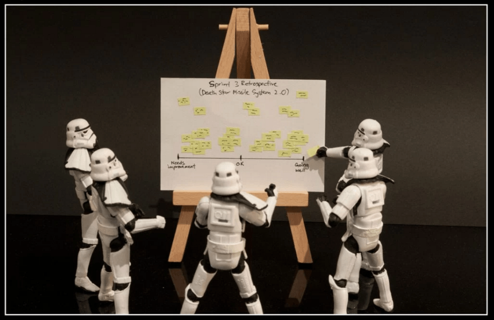

New course just dropped: **Agile Retrospectives — Make Good Teams Great**. Self-paced, pre-recorded, open enrollment.

Real talk: most retros I've sat through have been a polite 60-minute conversation about "what could we do better" followed by *zero* behavior change in the next sprint. The format is broken — too vague, too consensus-driven, and missing the part where someone actually owns a thing that happens by Tuesday. This course is the antidote.

## The five phases (and yes, one of them is called Pancake)

Every well-run retro moves through five distinct phases. Most teams do two of them well and skip the rest. The course walks through each:

1. **Set the right direction** — frame the retro before it starts, or it drifts into therapy
2. **Get all the issues on the table** — including the ones nobody wants to name in front of leadership
3. **Gather insights** — the *why* behind the issues, not just the list
4. **Make decisions** — narrow to the 1-3 changes the team will actually try
5. **Apply the changes** — own them, schedule them, re-review them next sprint

I teach two formats with goofy names that work — **Starfish** and **Pancake**. Yes, they sound ridiculous. Yes, they work. You'll use the right one for the right moment after you see them once.

## Who this is for

- **Scrum Masters** who feel like the retro is the part of agile they have to defend the hardest
- **Engineering managers** running cross-functional retros where half the room codes and half the room doesn't
- **Tech leads** trying to fix the team's "we keep raising the same issue and nothing changes" loop
- **POs** who want their teams to graduate from blame-retros to improvement-retros

## What you'll be able to do after

- Run a retro that produces 1-3 action items, owners, and re-review dates
- Spot the four common retro failure modes (consensus, vagueness, blame, churn) and unblock each
- Vary the format so the retro doesn't go stale by sprint 12
- Close the loop — *the bit nobody teaches* — so last sprint's improvements actually compound

## → [Take the course](/courses/agile-retrospectives-review-learn-prosper/)

Self-paced, pre-recorded, open enrollment.

---

Big thanks to every team that suffered through a bad retro and let me try a different format the following week. The Pancake format came from one of those sprints; the team that named it knows who they are. *Thank you.* You made the course possible.

## Why the formats have ridiculous names (and why that matters)

**Starfish** has five points: keep doing, more of, less of, stop doing, start doing. The name is the mnemonic. Six months from now you'll remember "starfish" when you'd never remember "the five-axis behavioral adjustment matrix."

**Pancake** has three layers — issue / insight / action — stacked. You write each layer on its own sticky color. The team sees the pancake on the wall and knows immediately whether the stack is balanced (good) or top-heavy with issues but no actions (bad).

The names sound silly. **They survive sprint 12.** That's the entire point.

## The retro failure modes the course explicitly diagnoses

**The blame retro.** Conversation focuses on which person broke what. Course remedy: reframe issues as *system* issues, not individual issues — the prompt is always "what part of how we work let this happen" not "who let this happen."

**The vagueness retro.** "We should communicate better." Translated to action items: nothing. Course remedy: every issue gets pushed to a concrete observable behavior change before it's allowed off the board.

**The consensus retro.** Group agrees on a soft action item that nobody hates, nobody loves, nobody owns. Six weeks later nobody can remember it. Course remedy: max 3 action items, single named owner, fixed re-review date.

**The repetition retro.** Same five issues every sprint, no progress. Course remedy: a *sprint zero* retro that resets the issue list, plus the closing-the-loop ritual that surfaces *which* historical issues have actually moved.

Self-paced, pre-recorded, open enrollment.
