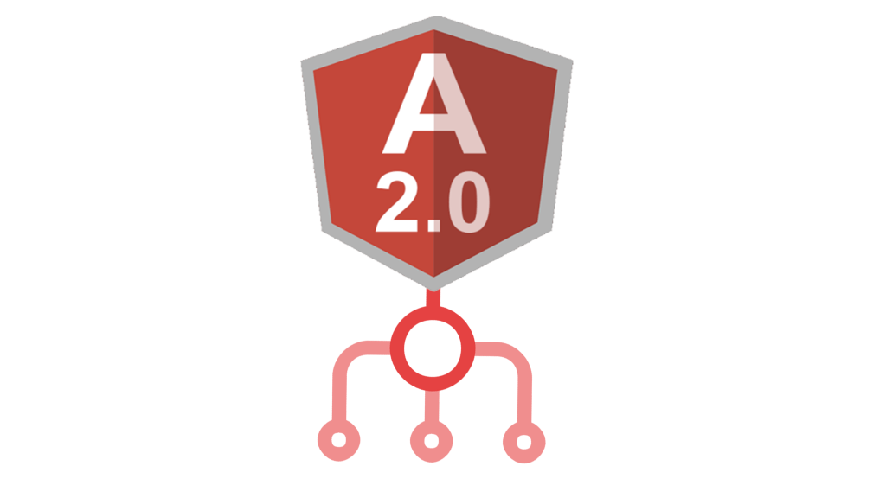

Fresh course on **the Angular Router**. Self-paced, pre-recorded, lunch-hour material.

The router is the part of Angular that 80% of devs use 90% of the time and *nobody* learns deeply. The result: apps with three pages get four route guards, lazy modules nobody actually loads lazily, and `(activatedRoute)` accessed inside `ngOnInit` for a reason that made sense one Tuesday and never again. This course fixes that — straight from "load two components" to "production guard with route resolvers" without the lecture-hall middle.

## What's in the box

Working code, working code, working code, *then* the explanation:

- **Routing by path** — the 30-second setup most tutorials take 30 minutes to get to
- **Loading components by route** — including child routes and named outlets
- **Navigation** — RouterLink, programmatic navigation, query params, fragments
- **Services & guards** — `CanActivate`, `CanDeactivate`, the resolver pattern, *when each one is actually right*
- **Lazy-loaded modules** — for when the bundle starts to hurt
- **Managing Rx subscriptions with async pipe & BehaviorSubjects** — the bit that determines whether your app leaks memory

## Who this is for

- **Working Angular devs** who've inherited a routing setup they don't fully understand
- **Devs coming from React Router** who keep tripping on Angular's different mental model
- **Tech leads** sanity-checking the routing structure on a new app
- **Anyone** who's been writing `this.router.navigate([...])` and isn't 100% sure when to use that vs `routerLink`

## What you'll be able to do after

- Stand up a new Angular app with proper routing in under five minutes
- Pick the right guard for the right job without thinking about it
- Lazy-load a feature module without breaking AOT
- Read someone else's route config and immediately spot the smell

## → [Take the course](/courses/angular-2-router-up-and-running/)

Self-paced, pre-recorded, open enrollment. Built for working developers — no info-product fluff.

---

Thanks to every Angular dev I've worked with who patiently corrected my misunderstandings of how `ChildActivationStart` actually fires. You saved future students from inheriting my bugs. *Thank you.*

## Common questions I get about this course

**"Does this still apply to current Angular?"** Yes. The router APIs covered (RouterLink, ActivatedRoute, route guards, resolvers, lazy modules) are stable across all Angular versions from 2 through 17+. The course material ages well because the router's core contract is one of the most stable parts of the framework.

**"Do I need to know NgRx or RxJS first?"** No on NgRx — the router doesn't require a state library. Yes on RxJS basics — you should be comfortable with `subscribe`, `pipe`, and the async pipe. If you're not, watch a 30-minute RxJS primer first; the rest will click.

**"What's the longest sticking point?"** Lazy-loaded modules + AOT. The course spends extra time on the loadChildren syntax change and the build-time implications because that's where I've watched the most teams trip.

**"Will this prep me for the Angular CLI / standalone components migration?"** Indirectly. The router patterns are the same; the surface around them (NgModule vs standalone components) is what's changed. Once you understand routes deeply, the migration is mostly mechanical.

Self-paced. Lunch-hour. Open enrollment.

## The four routing anti-patterns the course explicitly un-teaches

**Subscribing to `ActivatedRoute.params` in `ngOnInit` without unsubscribing.** Memory leak by month three of app life. Course remedy: the `async` pipe in the template wherever possible; `takeUntil(this.destroy$)` in TypeScript when not.

**One giant route config in `app-routing.module.ts`.** Hundreds of lines, three engineers editing it simultaneously, constant merge conflicts. Course remedy: feature-module-scoped routing with `RouterModule.forChild()`. The top-level config stays small forever.

**`CanActivate` doing data-loading.** Guards return Observables that fetch the data, then the component re-fetches the same data. Double the network calls. Course remedy: use `resolve` for *data*, `CanActivate` for *permission*. Same shape, very different intent.

**Programmatic navigation everywhere.** `this.router.navigate([...])` peppered through component code for routes that could've been `routerLink` directives in the template. Course remedy: template-first navigation; reach for `router.navigate` only when the destination depends on logic the template can't express.

## The one debugging trick that pays for the whole course

Turn on router tracing with `RouterModule.forRoot(routes, { enableTracing: true })` during local development. *Every route event prints to the console.* Within a week of using it you'll diagnose routing bugs three times faster, because you'll be able to see the `NavigationStart → GuardsCheckStart → RoutesRecognized → ActivationStart → NavigationEnd` lifecycle live instead of guessing where it stalled.

Working code, working router, lunch-hour-friendly. *Take the course.*
