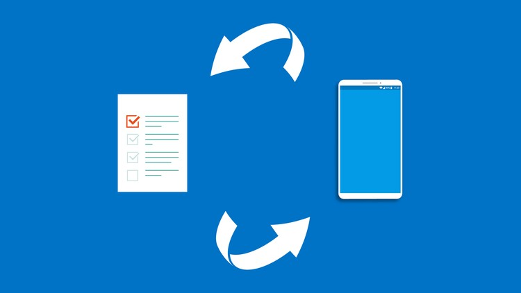

New course just dropped: **Microsoft Flow Up And Running**. Self-paced, pre-recorded, open enrollment.

(Yes, Microsoft renamed it to *Power Automate* a couple years after this course came out. The course material still teaches the same patterns. If you're a "let's just see what happens when I drag this connector here" learner, you're in the right place.)

Here's the dirty truth about no-code/low-code automation: **shipping a flow is easy. Maintaining a flow nobody else can read is the hard part.** I've walked into orgs where the previous PM left behind 47 active flows, none of them documented, half of them subtly broken, all of them load-bearing for some weekly report. This course is the antidote.

## What's in the box

- **The trigger model** — when to use `when an item is created` vs scheduled vs HTTP webhook
- **Connectors that matter** — SharePoint, OneDrive, Teams, Outlook, Approvals, plus the third-party ones you'll actually reach for
- **Conditional logic** — the conditions, switches, and parallel branches without the spaghetti
- **Approvals** — building human-in-the-loop flows that don't get stuck waiting for a director who's on PTO
- **Error handling** — the part nobody teaches (and the reason most production flows silently fail)
- **Versioning, naming, and ownership** — the *unfun* part that determines whether your flows live past your tenure

## Who this is for

- **IT pros and admins** trying to graduate users off shadow-IT scripts into governed automations
- **PMs and operations leads** who want to automate the boring 15% of their week without bothering engineering
- **Power users** who already built a flow that works and now want to build one that *stays working*

## What you'll be able to do after

- Wire up a 5-stage workflow with approvals, notifications, and error fallbacks in under an hour
- Inherit somebody else's flow without breaking it on first edit
- Run a governance review on your team's flows — keep the ones that earn their keep, retire the rest
- Talk fluently with the SharePoint/Power Apps folks down the hall (they're using the same connectors)

## → [Take the course](/courses/microsoft-flow-up-and-running-code-less-automated-workflows/)

Self-paced, pre-recorded, open enrollment.

---

Big thank-you to the IT teams I worked with who showed me what *happens* when nobody governs the flow library. I'm grateful for your war stories — they made up half the practical examples in module 5. *Thank you.*

## The five flow anti-patterns the course teaches you to fix

**The unnamed orphan.** Flow titled "Flow 17" sits in a personal account, runs daily, owned by an employee who left in 2019. When it fails, nobody knows. Course remedy: every flow gets a *descriptive name + owner + service-account run-as*. Personal-account flows are a maintenance crime.

**The silent failure.** Flow runs, hits a 500 from an upstream API, marks itself "succeeded" because there was no error branch. Reports stop updating, nobody notices for two weeks. Course remedy: every flow has a *Try-Catch-Finally* scope with a notification on Catch.

**The trigger spam.** Flow triggers on every SharePoint item modification, including its own. Recursive loop, 200,000 runs overnight, tenant throttles. Course remedy: trigger filters, the "if-modified-by-flow-skip" pattern in module 4.

**The unowned approval queue.** Flow sends approval to "the manager" but the role is unfilled. Items pile up in nobody's queue forever. Course remedy: fallback approvers + escalation timer pattern in module 6.

**The unversioned production change.** Person edits production flow, breaks it at 3pm Friday, has no undo. Course remedy: the "copy → edit → swap" pattern instead of editing live, plus the documentation habit.

## Quick rule of thumb the course beats into students

If you can't explain *what your flow does* and *who owns it* in one sentence to a stranger in the elevator, the flow is technical debt — even if it's currently working.

## The single biggest mindset shift the course pushes

Stop thinking of each flow as a *standalone script*. Start thinking of your flow library as a *distributed system* — owned, versioned, monitored, retired. The biggest jump in maintainability comes from this single reframe. Once you see the library as one system, you stop tolerating orphan flows, you start documenting them, and you start retiring the ones that don't earn their keep. The course walks the governance pattern in the final module — naming conventions, ownership tags, the quarterly review rhythm.

Self-paced, pre-recorded, open enrollment.
