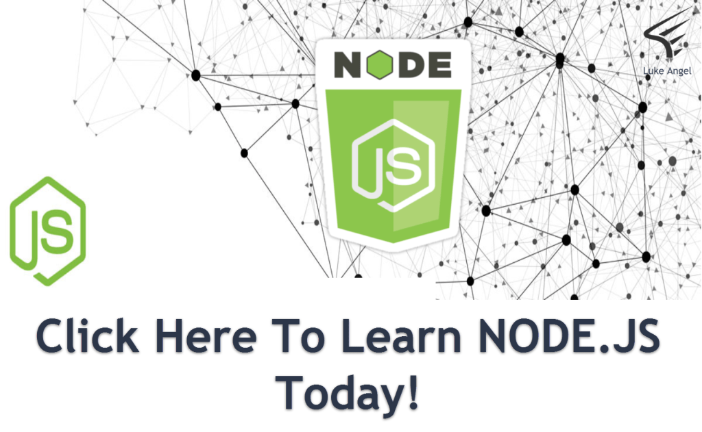

New Node.js course just dropped. Self-paced, pre-recorded, open enrollment.

The thing that bugged me about every Node tutorial I'd taken before recording this one: **they all show you a framework. None of them tell you when to pick which one.** You either get an Express tutorial and assume Express is "the" Node framework, or you get a Koa tutorial and assume Koa is "the" minimalist one, or you get a Sails tutorial and assume Sails is "the" batteries-included one. *They're all correct.* They're also all useful in different contexts, and the senior move is knowing which one fits the job you're standing in front of.

This course teaches that. The running example is a small user-auth API you can fork as the starting point for whatever you build next.

## What's in the box

- **Installing Node.js & the runtime mental model** — what Node actually is, the event loop, npm
- **JavaScript essentials for server work** — modules, packages, async patterns, ES2016+
- **Files, streams, and the standard library** — the parts of Node's built-ins you'll actually reach for
- **Express, Koa, and Sails** — each gets a chapter, including *when* each one is the right tool
- **Promises, generators, async/await** — escape from callback hell
- **Build the running example** — user-auth API tying it all together with JWT and password hashing

## Who this is for

- **Frontend devs** ready to graduate to server-side JavaScript without learning a new language
- **Devs coming from Python/Ruby/Java** who want to evaluate Node before betting a project on it
- **Working Node devs** who've only used one framework and want to broaden their tool kit
- **Tech leads** sanity-checking framework choices on a new project

## What you'll be able to do after

- Stand up a working Node + Express API in under five minutes
- Pick the right framework for the right job — and articulate *why*
- Read someone else's middleware stack and immediately spot the bug
- Build a JWT-authenticated route with proper password hashing without copy-pasting from Stack Overflow

## → [Take the course](/courses/node-js-the-essentials-api-frameworks-express-koa-sails/)

Self-paced, pre-recorded, open enrollment.

---

Big thanks to the Node developer community for keeping the ecosystem broad. The Express maintainers, the Koa team, the Sails folks — three different opinions about how a Node app should be structured, all alive and well, and the better for the disagreement. *Thank you* for the years of patient debate that made this course possible.

## Picking the right framework — the course's three-question test

The course teaches a quick decision flow you can apply on any new project:

**1. How much structure do I need on day one?** If you're building a quick API for an internal tool, **Express** — minimal, hands-off, you do the routing and middleware yourself. If you're building something that has to look like a "real" app a year from now with conventions, **Sails** — Rails-style scaffolding, ORM included.

**2. Do I need modern async patterns end-to-end?** If yes, and you're starting fresh, **Koa** — built on async/await from the ground up, no callback hell to wade through. If you have existing Express middleware you want to keep, stay on Express; the callback-to-promise wrappers are mature.

**3. Will the team grow?** Bigger teams benefit from **Sails**' conventions because they reduce the "how do we structure this" debates. Solo or small-team work benefits from **Express** or **Koa** because the conventions are *your* conventions and you don't pay tax on them.

## The auth pattern the course will not let you skip

**Hash passwords with bcrypt (cost 10-12). Never store raw. Sign JWTs with a 256-bit secret. Set a 15-minute access-token expiry plus a 30-day refresh token.** Module 8 walks the whole pattern. If you're rolling your own auth and not doing those four things, *stop, take the module, then continue.*

Self-paced, pre-recorded, open enrollment.
