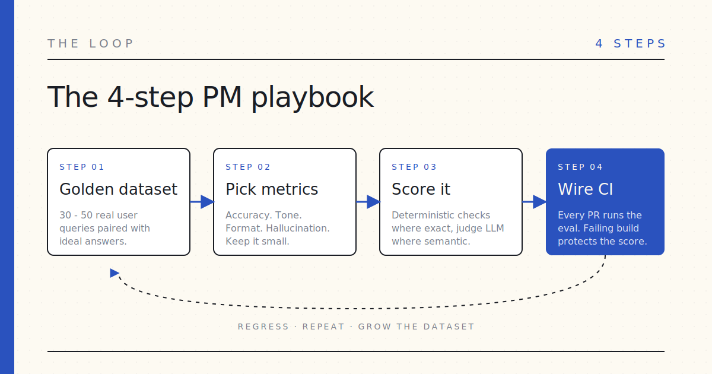

Most product teams ship LLM features on vibes. Someone tweaks a prompt at 4pm, it *feels* better in the staging window, and they merge. Three weeks later a quiet regression shows up in support tickets nobody can trace.

Vibes are a feature flag without a kill switch. The fix isn't a platform — it's an eval loop you can run on a Wednesday afternoon.

I put one in a repo. Five files, one notebook, one rubric:

→ **[github.com/drlukeangel/Eval-Starter-kit-Product-Management](https://github.com/drlukeangel/Eval-Starter-kit-Product-Management)**

You can `git clone` it and have evals running in fifteen minutes, or you can skip the keys entirely and paste the rubric template into ChatGPT or Claude to score one example at a time. Both modes are in the README.

## What's actually in there

An evaluation starter kit replaces subjective vibe checks with automated testing plus AI-driven observability. The three pieces every kit needs are:

1. **A golden dataset** — real-world inputs paired with the ideal responses.
2. **A scorer** — usually a stronger judge LLM grading on a written rubric.
3. **A runner** — to benchmark a prompt or model change end-to-end and tell you whether it got better, worse, or the same.

This repo gives you a minimal one of each:

| File                    | Job                                              |
| ----------------------- | ------------------------------------------------ |
| `golden_dataset.jsonl`  | 30 PM-flavored prompts + ideal answers           |
| `rubric.md`             | Four axes graded 1 – 5                           |
| `judge.py`              | LLM-as-judge — scores a single response          |
| `eval.py`               | The runner — model under test → judge → report   |
| `test_evals.py`         | `pytest` integration so evals run in CI          |
| `eval_walkthrough.ipynb`| Notebook walkthrough for a standup demo          |
| `prompt_template.md`    | Copy-paste mode — no API key needed              |

Stack is intentionally boring: `python`, `pytest`, `openai`. If you have an OpenAI key, `python eval.py` does the whole thing. If you don't, `prompt_template.md` is the whole rubric folded into a prompt you paste into any chat.

## The 4-step PM playbook

The repo encodes one loop. Run it on every LLM feature you own.

**1. Define the golden dataset.** Compile **30 to 50** real user queries and the responses you'd want to see. Weight the dataset toward (a) the most common scenario, (b) the failure mode that would be expensive to ship, and (c) the awkward edge cases the model always trips on. Avoid synthetic examples that sound nothing like real users.

**2. Set your metrics.** What does *good* mean for this feature? The defaults in the repo are **factual accuracy**, **tone**, **format adherence**, and **hallucination rate** — solid PM-grade axes. Keep the count small (≤ 5) so the signal stays legible.

**3. Choose your eval method.** Two flavors, and you usually want both:

- **Deterministic** — exact string match, regex, JSON-schema. Use this whenever the answer is exact ("does the JSON parse?").
- **Model-based** — a stronger model like `gpt-4o` or `claude-3.5-sonnet` grades semantic quality on a 1 – 5 scale. Use this for tone, faithfulness, and anything else where there's no single correct string.

**4. Wire it into CI/CD.** Run the eval on every prompt change or model version bump. Fail the build when the score drops below your threshold. Thirty examples through `gpt-4o-mini` plus a `gpt-4o` judge is pennies per run. Run it on every pull request without thinking about cost.

## Choosing a heavier framework once you outgrow it

This kit covers the first 80% so you can decide which 20% you actually need. When you outgrow it, four open-source frameworks worth knowing:

- **[Arize Phoenix](https://github.com/Arize-ai/phoenix)** — best for privacy-first teams that need a self-hosted observability layer. Excels at tracing multi-step agents; ships with built-in prompt management.
- **[DeepEval](https://github.com/confident-ai/deepeval)** — best for Python-native teams who want evals to feel like `pytest`. Local-first, fast, broad assertion helpers.
- **[Ragas](https://github.com/explodinggradients/ragas)** — best if your product is **RAG-based**. Scores faithfulness, context relevancy, and answer relevancy against retrieved context.
- **[Promptfoo](https://github.com/promptfoo/promptfoo)** — best for CLI-heavy, security-focused teams who want to run bulk evaluations against many LLMs at once.

The shape of the choice is product-shape and team-shape, not language. If you're a small PM team shipping your first LLM feature this quarter, start with this starter kit or DeepEval. Graduate later.

## Why I keep coming back to this

Every team I've worked with that *didn't* have a written rubric ended up arguing about taste on a Slack thread for the third time that month. Every team that *did* — even a 30-line rubric and a spreadsheet of examples — moved faster and made better calls. The kit isn't sophisticated. The discipline is.

Five files. One notebook. One rubric. Wednesday. Go.
