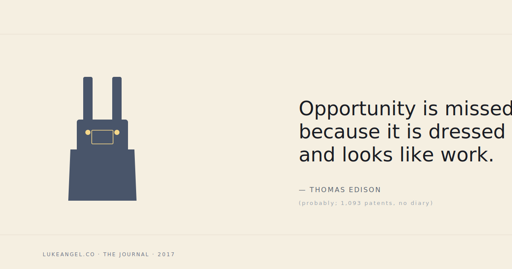

> *Opportunity is missed by most because it is dressed in overalls and looks like work.*  
> — Thomas Edison (probably; the man took out 1,093 patents and never wrote it down himself, which is a *very* Edison move)

Most career advice that comes wrapped in "find your passion" misses this. Opportunity is not a lottery ticket. It is **not a side door someone unlocks for you on a Wednesday**. It looks like:

- the unowned triage doc nobody volunteered to run
- the eval set that's been broken for three weeks
- the integration test that flakes 12% of the time
- the meeting nobody wants to facilitate
- the half-finished migration on the back burner since Q2

If you do those things, **with care**, the room notices. Not immediately. Slowly. But it compounds, because the room is full of people pattern-matching for "is this someone I want next to me when the thing is on fire."

## Three pieces of overalls I've seen pay off

**1. Owning the eval set.** Nobody wants to do this. It's not glamorous. The PR review is "looks fine, lgtm." But six months in, you are the person who knows where every model regression hid. You don't have to argue about whether things are getting better — you can pull the dashboard. That makes you *the* person in roadmap meetings. The eval kid in the corner becomes the one with the strongest voice on what to ship and what to cut.

**2. Writing the brief nobody asked for.** Three pages, well-structured, explaining the problem and three options with trade-offs. Send it to your manager Friday afternoon. Don't ask permission. Don't apologize for the length. If the brief is good, the next strategic conversation in your group will reference it. You will be referenced. Repeat.

**3. Running the meeting nobody likes.** The cross-functional sync that always runs over. The roadmap review with the angry stakeholder. The retro nobody wants to facilitate because last quarter was rough. **The opportunity hiding in that meeting is that everyone else has tapped out.** You can rebuild the format. You can decide what gets surfaced. You can make the meeting actually useful and people will quietly route the next decision through you.

## The thing they don't tell you about overalls

The overalls are uncomfortable.

The reason most people don't pick up the unowned triage doc is not that they can't see it. It's that **the costume signals "this is not my job."** The cost of putting on the overalls is psychological — *am I the kind of person who does this?* — and so the doc sits there.

The shortcut: stop running the costume check. The work is just the work. The status comes from doing it well, not from picking up only the work that comes pre-statused.

I have never regretted picking up a piece of overalls work. I have several times regretted *not* picking one up — usually a year later, when someone else picked it up and the room started routing decisions through them.

## A small caveat for the snark column

Edison was also famous for being **a relentless self-promoter** who got credit for things his employees built. The quote stands on its own; the man, like all of us, was complicated. Read your overalls heroes carefully.

## The gratitude beat

Thank you to every senior engineer who showed me, by example, that the boring work is the work. Thank you to every PM who handed me the unglamorous doc and trusted that I'd actually do it. Thank you to every manager who said *"I noticed you picked that up — let's talk about what's next."*

The next overalls-shaped opportunity is probably sitting in your inbox right now. It looks like an annoying email about a thing nobody wants to fix. Open it.
