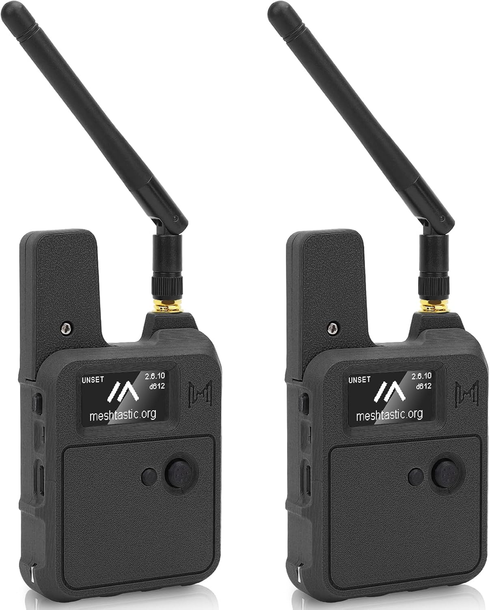
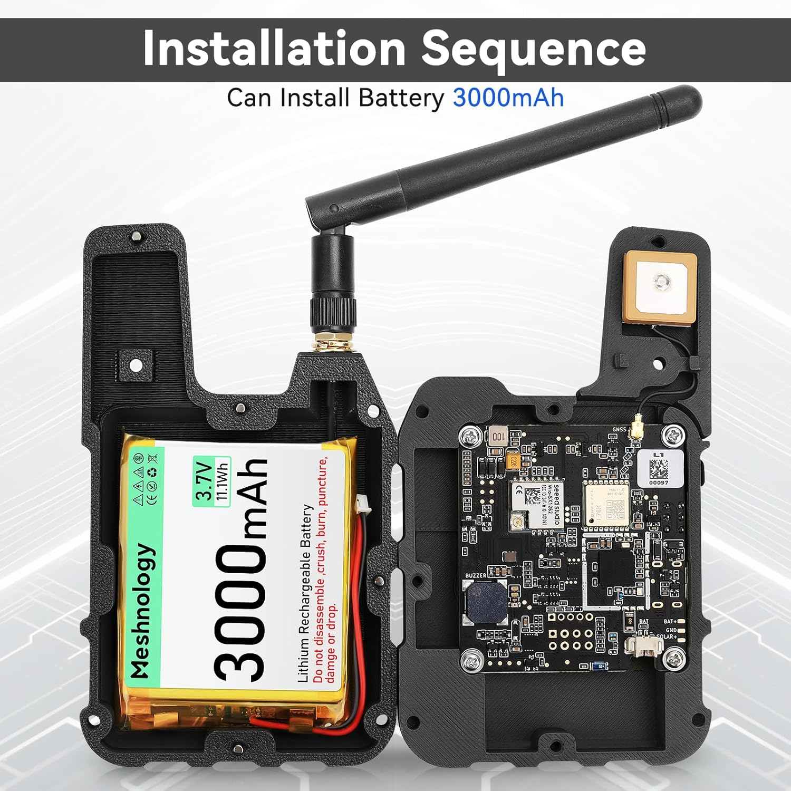
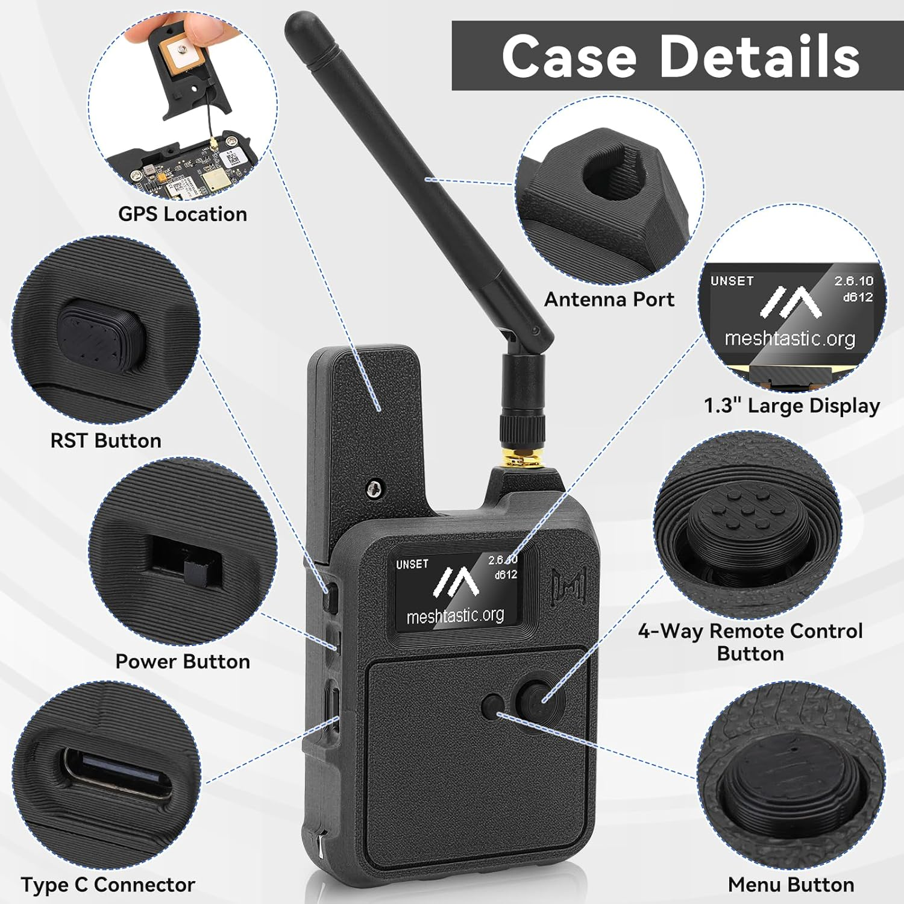

[The spec](/blog/pet-tracker-build-2-the-prd-and-the-rubric/) is done, which means today is the dangerous day: I hit *buy*. But the cart looks different from the plan — because while I was sketching the handheld base station, I found out somebody already builds it.

## The head start

The cloud is done. The [reference IoT stack I open-sourced](/blog/open-sourcing-the-connected-products-starter-kit/) — IoT Core, device-cert provisioning, ingest, DynamoDB, a dashboard — already accepts a real device with near-zero change. The collar just publishes pet telemetry (lat, lon, battery, activity) instead of tool telemetry. That's months of backend I don't have to write.

## The shortcut I didn't expect: the Wio Tracker L1

I'd specced the base station as a handheld-in-a-cradle — screen, GPS, LoRa, battery, a button or two. Turns out that's a shipping product: the **Wio Tracker L1**, sold as a ready-to-use Meshtastic handheld, pre-flashed, FCC-certified, **in a two-pack.**

The spec reads like I wrote it for myself:

- **nRF52840 + Wio-SX1262 (862–930 MHz)** — the *same chip family as the collar I'm going to build*, so one firmware codebase covers both, and the **reserved SWD pads** mean the nRF9160 DK I already ordered can debug it.
- **L76K multi-GNSS, 1.3" OLED, onboard buzzer, 3000 mAh + solar + USB-C.** Everything the base station needs, including the beeper for the "he got out" alert and the proximity search.
- **Grove + plated-through-hole I/O** — I can hang an I²C sensor off it without soldering if I want to prototype the collar's heat-risk sensing on the bench.
- **Pre-flashed with Meshtastic** — which is the whole point of starting here.

Because it's pre-flashed and comes as a pair, it isn't just the base station — it's my **entire proof-of-concept.** One on Quark, one in my hand, and I can watch him move on a phone map over Bluetooth the day it arrives. No firmware, no soldering, no waiting. That's the right first dollar.

## The order, reordered around the PoC

**1 — Proof-of-concept + base station (ordered today, arrives tomorrow):**
- **Meshnology Wio Tracker L1, 2-pack** (Amazon) — base unit + test node, pre-flashed Meshtastic.

**2 — The collar build kit (RAK — this was the original plan; I'll revisit it once the PoC proves the range is real):**

| Qty | Part | Price |
| --- | --- | --- |
| 2 | WisBlock Meshtastic Starter Kit, US915 (SKU 116016 — base + RAK4631 core) | ~$64 (buy-2 −8%) |
| 2 | RAK12500 GNSS — u-blox ZOE-M8Q | $51.24 (buy-2 −5%) |
| 1 | RAK1904 3-axis accelerometer — ST LIS3DH | $7.97 |
| 2 | RAK1901 temp/humidity — Sensirion SHTC3 | $14.36 (buy-2 −20%) |

Plus a passive piezo buzzer (Amazon) and LiPos (Adafruit). The RAK4631 inside that starter kit is the *same* nRF52840 + SX1262 as the Wio L1 — so whatever firmware I prove on the PoC carries straight to a custom collar.

**3 — Cellular (already ordered, for phase 2):**
- **Nordic Thingy:91 + nRF9160 DK** (~$295, DigiKey). The DK doubles as my debugger for everything above.

## The phases, and what each one has to prove

1. **Location — BLE + LoRa.** Presence at home, the geofence flip to findable mode, collar → base over LoRa, data into the existing cloud, beep + proximity search. The hard part, first.
2. **Cellular.** Swap in the nRF9160 path for the "anywhere" collar. Lower risk — a well-documented road.
3. **Health.** Resting heart rate and respiratory rate off the accelerometer the collar already carries. Only after the dot is boringly reliable.

## The honest timeline

Six months, evenings and weekends, shipping delays included. Phase 1 only — cellular and health are next year's problem.

| Month | Goal |
| --- | --- |
| 1 | Wio L1 two-pack PoC — one on Quark, range tests around the neighborhood and on a trail, GPS → phone map |
| 2 | RAK4631 collar publishing GPS + battery into the existing IoT Core stack |
| 3 | BLE home-presence + geofence-exit flip to findable mode; the power budget that makes "months" real |
| 4 | Base station behaviors: home listener, grab-and-go gateway, RSSI proximity beep |
| 5 | Enclosure + collar mount + charging; survive a wet Lab |
| 6 | Field test on Quark; write up what broke |

**Step one isn't a product.** It's a proof-of-concept that earns the rest of the spend — before I commit to building a collar, I want to know the range and the GPS-to-phone loop actually hold up in *my* yard and on *my* trails.

## Next: a scorecard, not a vibe

Which is exactly why the next post won't be "look, a dot moved." It'll be a **test plan with a scorecard** — range, time-to-first-fix, battery drain, in-house presence reliability — so the decision to build the real collar is made on numbers, not excitement. The boxes land tomorrow. The [notebook](/notebooks/iot-pet-health-tracker-build/) turns into a real build log from here — the parts that work, and the parts that don't.
