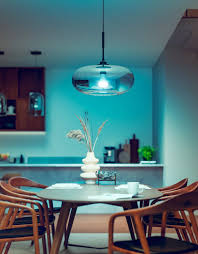

Picked up the Hue starter kit at the Apple Store this morning. Philips and Apple did an exclusive launch — $199 for three A19 bulbs and a small white bridge. Apparently broader retail rollout is a few weeks out.

I am sitting at the dining table. The pendant above me is deep ocean blue. The teal light is bouncing off the kitchen cabinets behind me. I am going to keep cycling colors for a while.

## What's in the box

Three E26 (US screw-base) bulbs labeled "Hue," roughly the shape and weight of a normal LED bulb but heavier — the heatsink is real. A small white plastic disc about the size of a hockey puck — the **bridge**. An Ethernet cable. A power adapter for the bridge. That's it.

No CD-ROM. No printed manual beyond a quickstart card with a single URL. 2012-Apple-aesthetic product.

## Install — ten minutes

1. Screwed bulbs into the dining-room pendant, the kitchen pendant, and a floor lamp in the living room.
2. Plugged the bridge into the router with the Ethernet cable.
3. Downloaded the Hue iOS app, ran setup. The app found the bridge automatically — looked like mDNS / Bonjour but I'm guessing.
4. Pressed the physical "link" button on the bridge when the app told me to.
5. App reported three bulbs found.

Ten minutes elapsed. The bulbs were already turned on (light switches up) when I started; as soon as the bridge claimed them, each flashed once to confirm.

## The dining pendant is the showstopper

I knew before I bought it that the dining pendant was going to be the killer placement. It hangs in the middle of the great room — kitchen on one side, dining table directly under it, living room visible from the other side. *One bulb* shifts the color temperature of the entire shared space.

The blue scene in the photo is what I made first. Hit a deep ocean blue and the entire room turns into something that doesn't look like my kitchen anymore. The walls go teal. The white cabinets pick up a faint cyan cast. Dinner is going to feel like a different room every night.

Made three more presets in the first hour:

- **Warm dinner**: dining pendant at 60% brightness, ~2200K warm orange. Felt like candlelight. Kitchen recedes; the table is the center.
- **Kitchen prep**: dining and kitchen pendants both at 100%, cool white ~5000K. Bright, clean, work-the-recipe energy.
- **Reading**: living-room floor lamp at warm yellow, dining pendant off, kitchen pendant at low blue ambient. Two-room lighting from one app.

## What you can do, in the app

- **Color**: tap a point on a color wheel, the bulb changes in maybe 200 ms. *Fast*.
- **Brightness**: slider. Dims smoothly down to about 1% before turning fully off.
- **Whites**: a separate mode for warm-to-cool white. The bulbs have a dedicated white LED on top of the RGB channels, so the whites look genuinely good — not the slightly green-tinted white you get from pure RGB mixing.
- **Scenes**: presets like Reading, Concentrate, Energize, Relax. Each is a saved state across all bulbs in a "group."
- **Per-bulb control**: each bulb has its own ID; you can target them independently or as a group.

I am going to be obnoxious about this for a while.

## How it works (the part I'm guessing about, before reading deeper)

The bridge has only Ethernet — no WiFi on the device itself. It's plugged into the router. The router has my phone on WiFi. The app on the phone talks to the bridge over the local network. So far so normal.

The interesting question: **how does the bridge talk to the bulbs?** The bulbs are mains-powered but they have no Ethernet, no visible WiFi, no obvious antenna. The bridge has a tiny antenna visible through the plastic.

Reading the support docs: it's **Zigbee**. Specifically a profile called Zigbee Light Link, which Philips is one of the launch partners for. Zigbee runs at 2.4 GHz like WiFi but is a different physical-layer protocol designed for low-power mesh networking. Each bulb is a node in the mesh — so as I add more bulbs, the coverage extends.

The mesh part means: if I add a fourth bulb far from the bridge but near one of my existing three, the new bulb routes its traffic through the existing one. So I don't need the bridge to be physically central; I need *bulbs* to be distributed.

Interesting that Philips picked a hub-plus-mesh approach instead of WiFi-only. There's a Kickstarter called **LIFX** that just closed a couple of weeks ago (October 18, $1.3M raised) — doing WiFi-only color bulbs, no hub, every bulb on the home WiFi directly. Their bulbs aren't shipping until well into next year. I can see arguments either way: WiFi-only is simpler for the customer (no extra box), but every device is on the WiFi taking an IP, drawing more power, and dependent on the router being healthy. Mesh-plus-hub uses a separate radio so the bulbs don't fight with the laptop for airtime, and the bridge is the single thing that integrates with the network.

I'm using Hue today. I'll see what LIFX delivers when it ships.

## What I'm wondering about

A few things I can't tell from the app yet:

- **Can I write my own schedules?** The app has timers, but expressing "twenty minutes before sunset" requires me to recalculate every couple of weeks manually. There are murmurs on a couple of forums about the bridge having some kind of local HTTP API. Going to poke at it with `nmap` this weekend.
- **What's the actual color quality?** The blue looks great. The reds look slightly orange. Is that a limitation of the LED phosphors or just my eyes adjusting?
- **What happens if the bridge dies?** Bulbs go back to bright white at full power, I think. The scenes seem to live on the bridge.
- **Cost at scale**: $60/bulb. Doing my whole house (14 fixtures) would be $840 in bulbs plus the bridge. I'll do high-impact rooms first and add over time — the porch light is the next one I want, but only if I can script it.
- **Anyone on my LAN can control the bulbs.** Once the app paired with the bridge, no further authentication seemed to happen. If someone else hops on my WiFi, they can probably pair their own device. Fine for now — the LAN is full of trusted people — but a thing to know.

## Where I'm headed

Three bulbs in is enough to want more. Bedroom side lamps, the front porch, the basement workshop. The porch light is the manually-annoying one — flipping it on at dusk and off at midnight every single night. If the bridge has a scriptable local API, that's the first thing I'm building.

If the bridge has a local API, I'll find it.
