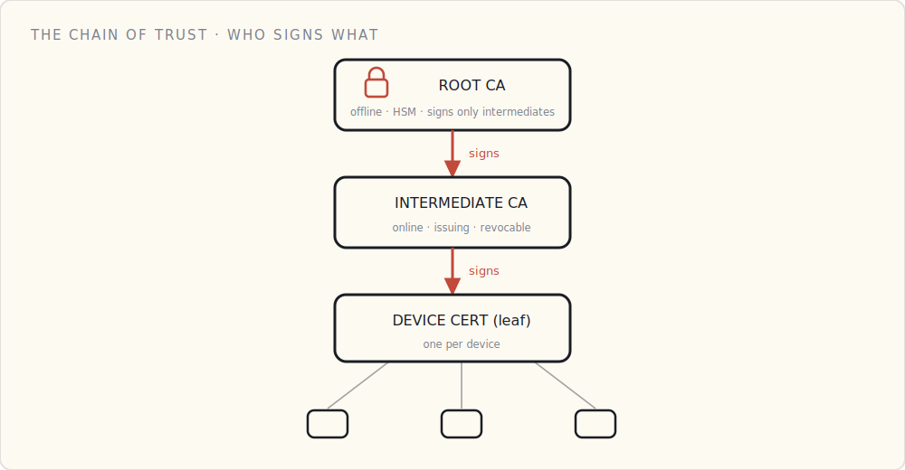

By the time a device opens a connection, two things from the [last post](/blog/secure-boot-trusting-your-own-code/) are already true: it's running firmware it cryptographically verified, and its identity keys are sitting in its secure element. What *hasn't* happened yet is the part the rest of the stack depends on — the device and the cloud have never met, and neither has any reason to trust the other.

So this post is really two questions answered in a single handshake: *can the cloud trust this device?* and *can the device trust this cloud?* Get both right and you have the thing you were actually after — not a proof, but a **trusted channel** the two can talk over safely. (Punchline up front: that handshake is identical whether the device is a Philips bulb off an assembly line or an Arduino on your desk.)

## The certificate is a chain, not a file

A device certificate is never trusted on its own. It's trusted because something trusted *signed* it, and something trusted signed *that*. Three links:

- **Root CA** — the anchor. One keypair, kept offline (an HSM, or a locked-down private CA). It signs exactly one thing: intermediate CAs. It never goes online, and most days it does nothing — which is the point.
- **Intermediate (issuing) CA** — the workhorse that actually signs device certs. If it's ever compromised you revoke *it*, stand up a new one off the still-safe root, and the damage stops at the certs it issued.
- **Device (leaf) cert** — one per device, carrying the device's public key and identity, signed by the intermediate.

The reason for the hierarchy is blast radius. A flat model — root signs every device directly — puts the root key in play constantly, and a root compromise is an extinction event with nothing above it to re-anchor trust to. The hierarchy buys you a layer you can afford to lose.

On AWS you register your CA with IoT Core (or use AWS Private CA). Azure trusts your root/intermediate through its Device Provisioning Service. On GCP you roll your own — Google's managed IoT Core was retired in August 2023.

## What's actually in it

An X.509 certificate is a small, signed document:

- **Subject** — who this is. A device serial, *not* anything that identifies a person. Don't put customer PII in a cert; it's effectively permanent and shows up in every log.
- **Public key** — the device's public key, partner to the private key locked in the secure element.
- **Issuer, validity, extensions** — who signed it, when it's good for, and what it's allowed to do (client authentication).
- **Signature** — the issuing CA's signature over everything above. Change one byte and it's invalid.

Use elliptic-curve keys — **ECDSA on P-256** — not RSA. The reason is the device, not the math: P-256 gives RSA-3072-grade security with far smaller keys and signatures and far less compute to sign, which on a battery device is power you don't spend. Every mainstream secure element does P-256 in hardware.

## Where a single device's cert comes from

This is where a real product and a weekend project diverge — and it's worth seeing both, because they end in the exact same place.

**The factory.** On the assembly line, the chip generates its own keypair *inside* the secure element. The factory's CA signs the public key, and the finished certificate is flashed onto the device before it's boxed. The private key never left the chip; the factory's CA vouched for it. The cloud is pre-loaded with that factory CA's public key, so later it can verify any unit the factory ever made — it's a customs officer checking a passport, not the office that issues them.

**The hand-rolled build.** You click "create Thing" in the AWS console and it hands you three files: the Amazon root CA, your device's certificate, and its private key. You paste them into the firmware and flash. AWS already has that certificate registered, so it works in minutes — but notice what happened: the private key was generated *off* the device and downloaded to your laptop. Fine for a board on your bench; it's exactly the key-escrow risk a production line avoids by generating on-chip and never letting the key exist anywhere else.

Both paths end identically: the device has a certificate and its matching private key on board, ready to connect. (Doing this for *thousands* of units at once — claim certificates, just-in-time registration — is a fleet-operations problem of its own, and it gets its own post later in this series.)

## Why the secure element is load-bearing

Strip it all back and the whole scheme reduces to one sentence: **the certificate is only as trustworthy as the unextractability of its private key.**

A certificate proves identity because only the holder of the matching private key can complete the handshake (next section). If that key can be read off the board with a logic analyzer and an afternoon, the cert proves nothing — anyone with the stolen key can *be* that device. The CA hierarchy, the X.509 fields, the handshake: all of it is scaffolding around the assumption that the leaf's private key is a hardware secret. That's why the secure element isn't optional. Spec it in v1 — you can't retrofit unextractability in software.

## The handshake — proving it, every single connection

Having a certificate isn't proof. A certificate is *public* — anyone can copy one. The proof is showing you hold the private key that matches the public key inside it, *without ever revealing that key.* Here's the exchange, and it runs every single time the device connects:

1. **The device checks the cloud first.** The cloud presents *its* certificate; the device verifies it against the root CAs baked into its trust store — signed by a CA it trusts, right domain, not expired. This is what stops a man-in-the-middle from impersonating your cloud. (It's mutual — both sides prove themselves.)
2. **The device presents its certificate.** The cloud reads the public key and identity out of it and confirms the cert chains up to a CA it trusts. Now the cloud believes that public key belongs to this device.
3. **The cloud issues a challenge** — a random nonce, something fresh the device couldn't have prepared in advance.
4. **The device signs the challenge** with its private key, inside the secure element. That signed challenge *is* the device's signature. It sends the **signature** back — never the key.
5. **The cloud verifies the signature** using the public key from the certificate. Only the holder of the matching private key could have produced it.

Two separate things had to check out, and the cloud verified both: the **certificate** (it chains to a CA the cloud trusts) and the **signature** (it matches the public key, and it's fresh). The private key never crossed the wire — only a signature did. And because the challenge is new every time, a signature captured off the wire is worthless on the next connection.

And the instant both checks pass — in *both* directions — the two have what they were really after: a mutually authenticated, encrypted channel. Not a one-time proof, but a line they can each trust for everything that follows.

## The math is identical, however the keys got there

Here's the part worth sitting with. A factory-provisioned bulb and a hand-rolled Arduino run *the exact same handshake.* The cloud has no idea — and no reason to care — whether the certificate was minted on an assembly line or downloaded from a console. It only cares that the cert chains to a CA it trusts and the device can prove it holds the key.

So all the messy divergence — factory vs. desk, a million units vs. one — happens *before* the connection ever opens. From the handshake onward, a $5 light and an industrial gateway speak byte-for-byte the same language. That convergence is the whole reason this scales: you can reason about the connection without knowing a single thing about how the device was born.

## What I'd tell a team

- **Generate the keypair on the device.** Then the private key never exists anywhere you'd have to protect — not a laptop, not a provisioning database, not a contract manufacturer's inbox.
- **Keep the root CA offline; issue from an intermediate.** A compromise should be recoverable without re-anchoring the universe.
- **ECC P-256**, unless someone makes you do otherwise on paper.
- **Pin the cloud's CA in the device's trust store.** Don't trust the system trust store — trust *exactly* the CA you expect, so a rogue or mis-issued cert can't slip in.
- **No PII in the certificate.** It's effectively permanent and it shows up in every log.

## What's next

The device has proven who it is, and the connection is up. But authenticated isn't authorized — proving your identity is not the same as being allowed to do whatever you want. What a connected device is *permitted* to do, and how to scope that down to almost nothing, is the next post.
