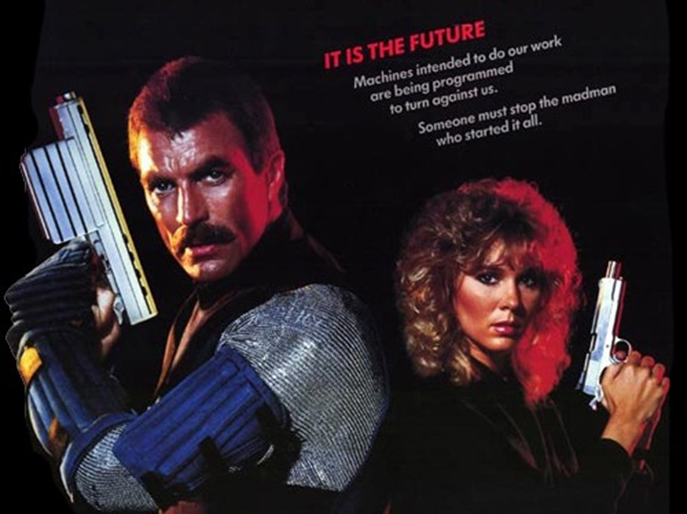
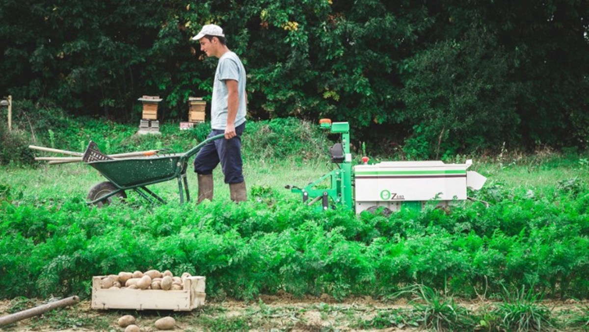
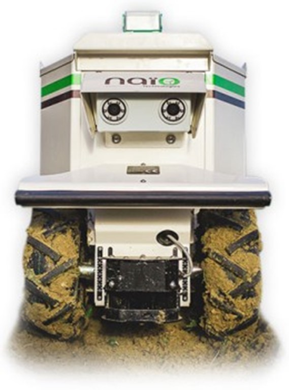
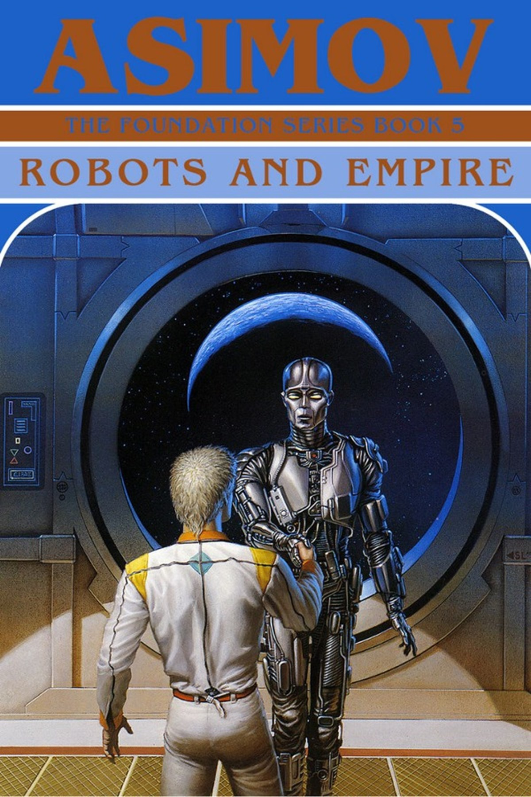

I recently stumbled upon cool small farm robots. I was super impressed so I decided to dig a little deeper and this is what I found. 

Oz, made by Naio Technologies in France and shown here on French television, can weed big fields of fava beans, like these above, as well as an expert weeding by hand, and 10x better than a tractor pulled plow.

### ~~To assist. Not to disrupt.

Earlier this summer, I took a dive into[ the world of small farm machines](https://medium.com/food-is-the-new-internet/the-rise-of-small-farm-robots-365e76dbdac1) that will soon be crawling farm fields near you. In the sort of thoughtful, enthusiastic reaction that makes any storyteller smile, I was inundated with tips from robot builders, imaginers, investors and watchers from around the world.

Most important, I now know that the global farm robot space is bigger, more intelligent and closer-to-commercialization that I realized. We are perhaps a few short years from a day when you will drive past a farm or walk past a community garden and see a robot working the ground.

[[In the 1984 action thriller “Runaway,” Tom Selleck and company battle against office robots gone made, including some little “spider bots” that look not unlike Prospero, the 2011 bot I wrote about last time.]]

These visions are not unprecedented. As I learned from the robot geeks who came out of the woodwork, one of C3P0’s first lines in StarWars is an uptight comment about irrigation when he first meets the young moisture farmer Skywalker. Gaze into the background of the shop where Skywalker tries to hack into R2D2’s memory and you’ll see other bots used by farmers on Tatoine, some of which look not unlike Rowbot and Agribotix powered drones and HelloTractors. In Asimov’s 1985 novel “Robots and Empire,” which takes place several millenia in the future, every planet in the galaxy, including the ailing Earth, grows its food entirely with the help of robots: many planets are stewarded by agricultural robots for the benefits of humans elsewhere.

I’ll admit occasional visions of a dystopic digital dirtscape. But I’m happy to report that the robots already working on farms around the world, so far, are delivering a different narrative. These bots, like the loyal R2D2 and BB8, are more concerned with assisting their human masters, than disrupting them.

[[The image of a young farmer working alongside a farm robot was a turning point in this narrative.]]

In the middle of this back and forth volley with commenters in the robots space that I stumbled upon the above picture. It was a turning point since this image defines for me the great promise of farm robots. A young happy a bearded 30-something farmer in a trucker hat wheeling a barrow between rows of carrot tops. And behind him, working in symbiosis, rolls a robot.Developed by Naio Technologies, a France-based robot builder, Oz, is a farmer’s helper, if it’s anything. It’s just that sort of farm that Naio is targeting, remarkably. That’s the transformative power of bots. Not to replace but to aid.

[[Award for cutest robot I came across goes to Little Oz, the smaller version of Oz, made by Naio Technologies.]]

Models like their[ Oz, Cozy, Dino, Straddle, and Little Oz](http://www.naio-technologies.com/machines-agricoles/) could weed veggies, move 100 pound weights (bags of compost, for instance), and collect all sorts of data on the state of the farm. Even better, they could do it continuously, day or night. There are models that plant seeds while they mulch. And there are primitive soft fruit harvesters that are not yet widely commercialized.

But it’s not hard to imagine that some major features breakthrough or price drop or increasing cost of employing human farmers, that farm robots might be seen wheeling into town to buy some odds and ends that the farmer (or farmwife) needs.

Watch Oz take care of a greenhouse, all by itself. Not really, but almost.

Oz is known as a hoeing robot. It drags a metal implement or rotor through the soil, targeting weeds, and also turning the soil.

Oz uses laser-based guidance technology to determine the best weeding depth, and can maneuver between fields with different crops, without inadvertently mowing over the plants. The developers are proud to say that Naio’s spirit animal of sorts is “a Hawaiian plant, having the ability to adapt to its environment.”

[[In Asimov’s 1985 novel “Robots and Empire,: all the farming on all planets is done by autonomous robots. Even on Earth, the planet in the galaxy most resistant to robots taking over, the farm work, the hoeing, the planting, the harvesting is done by robots.]]

In[ one interview from 2014](http://wikiagri.fr/articles/oz-le-robot-qui-ne-se-plante-jamais/1255) Naio engineers noted that “the purchase of a robot, which costs at least 250 Euros per month, is profitable over a hectare of surface.” But Oz can also carry a payload, work at any hour of the night, and work autonomously once it’s programmed for a task, like weeding a few acres of densely planted vegetables. Oz knows exactly which plants are Swiss chard and which are Green Globe turnips. Oz knows what the weather is and will be. It’s tied into the local weather station and connected to all the other devices and platforms being used on the farm, from Salesforce to Granular, from smart irrigation pumps and soil sensors. As the sell sheet proudly declares, “Oz works perfectly alone but you can also guide it to your needs.”

From vineyards to walnut groves, and from sugar cane to sugar beet, the buyers of Naio bots have been diverse. One buyer sought to “tropicalize” the robot with a test in Indian sugar cane plantations.

### ~~Looking beyond Oz and Robots that Hoe.

The farm robot world is really so much bigger and all around us than we realize, with robots that are playing the role of farm dogs, pruning fruit orchards (picture Edward Scissorhands) and even planning small urban gardens.

A one-minute Facebook post by New Scientist has garnered nearly 7 million views, and thousands of comments, including some from makers of robots at universities, research facilities and companies around the world. But until my friend Brian Frank shared this video with me, I had not seen ANY of these robots, or heard of these companies. (I hadn’t even yet thought of looking for farm robots on Facebook.)

This one minute video shows current state of the the art for farm robots.

That is partly because most of these robots are still in the experimentation phase. But more and more are moving towards commercialization, like Naio and Prospero, built in 2011, than ever before. But total available market is large and potentially increasing. Worldwide, the global “weed control” market is approaching $30 billion. And the global farm machinery market is estimated to hit[ $74 billion by 2020](http://www.technavio.com/report/global-general-retail-goods-and-services-agricultural-machinery-market). Roughly half of that is “tractors.” But the global impact grows when we add in the time of farmers and farm workers around the world that weed fields and greenhouses.

And while Rowbot, the Midwest based small farm robot maker, is designed for corn and soybean farmers, Naio Technologies, and many of the other startups in this space, are laser focused on small vegetable farms, vineyards, orchards and generally more diverse farms than an Iowa corn fields. And if decades of agricultural technologies have criticized small diverse farms as too complicated inefficient, and labor intensive, then small farm robots can help turn that calculus on its head and be relevant to much more than the world’s commodity growers. They could be relevant to the hundreds of millions of farm families around the world who could never make use of a big machine. But for whom a small farming machine could be like a hired hand around the farm, what allows them to put in another crop, or manage the farm while also holding down a job off the farm — as most farmers around the world do.

[[Sacramento based Blue River Technology is targetting California row crop growers with smart attachments for tractors that can reduce pesticide use by 90% and save billions in chemical use and crop loss. Decidedly anti-chemicals, they offer a downloadably pdf called “Chemical AG Dead Man Walking.” ]]

What else is out there right now? Pretty much everything you can imagine. Bots designed to crawl up steeply sloped vineyards, seedling-sensing hoovers from[ Blue River Technology](http://www.bluerivert.com/) designed to thin, moisturize and take extra special care of every head of lettuce (while reducing agrochemical use by 90% through targeted microdosing), Kubota has developed pruning bots for fruit trees and is reportedly designing cybernetic suits that will help elderly farmers climb trees and carry large amounts of fruit.

Through my contacts at Naio I also learned about SwagBot designed to find and herd ruminants 0n Australian ranches.

It’s not inconceivable that robots like the pack mule type developed by Boston Dynamics (and parodied in[ Season 3 premiere of Silicon Valley](https://www.youtube.com/watch?v=iDB5-_EwxNw)) could be employed in “herds” to roam over the world’s grasslands, helping in restoration efforts, dropping seeds, mimicking the pasture-building impact of livestock, with a very different ecological footprint.

And where do self driving tractors and harvesters fit into all this? I took a close look at the CNH Industrial “Autonomous Tractor Concept” that[ got so much attention on Gizmodo](http://gizmodo.com/this-robotic-tractor-looks-seriously-badass-1786051858?utm_campaign=socialflow_gizmodo_facebook&utm_source=gizmodo_facebook&utm_medium=socialflow) recently. Love the promotional video. The farmer gets a scary looking weather alert on his tablet. He pulls over to the side of the road, does some mental calculus and decides to fire up the planter in anticipation of coming rain (assumption mine).

Hands-down, super cool. Although perhaps a bit too Porche Cayenne to really penetrate the farm set. Yet I see that conept as transition tech, at best, as the largest farmers decide that a fleet of self driving tractors will do the job better than a bunch of human drivers. But apart from disrupting the farm driver market, there’s nothing truly revolutionary that this concept vehicle can do. It’s still a huge tractor, made to pull big machinery over monocultural fields.

Cool concept tractor, but there’s nothing really disruptive about how this self-guiding tractor helps farmers tend the land.

The explosive drone market, in contrast, segues neatly with the rise of small farm robots. Remotely piloted drones (of the smaller variety) are really just flying farm robots. Farmers are already the dominant commercial user of drones in America. And with more remote spaces to experiment in, it’s conceivable that farmers can be drone powerusers.

The investment bellweather Jason Calacanis just launched the “[Inside Drones](http://drones.inside.com/)” newsletter. The United States just released drone ownership and usage guidelines, and industry analysts are saying that drones will figure large in the the 2016 Christmas season, according to[ a recent NPR interview](http://www.npr.org/sections/thetwo-way/2016/08/29/491818988/faa-expects-600-000-commercial-drones-in-the-air-within-a-year) with the chair of the Federal Aviation Association.

Small farm machines come onto the scene at a key crossroads for global agriculture. Advances in tech (sensors, robots, cloud based AI) are crushing into harsh demographic reality of farming. In US alone, farmers number just 2% of population. By some estimates, more prisoners than farmers. The rest of the world doesn’t fare much better. At a time when the countryside is being emptied, there bots are additional eyes on the ground, which can trod the rows, help optimise farm operations and better manage the land.

Not to mention the fact, that many robot builders see farming as simply dangerous and back breaking. In[ a recent interview on Recode](http://www.recode.net/2016/6/24/12016088/roomba-maker-irobot-may-make-robots-that-talk-to-your-smart-home-devices), the chief technology officer of iRobot, the marker of Roomba, the household cleaning bot, noted that the “drudgery of cooking and farming,” makes robots in the food chain inevitable.

### ~~Five Near-Term Predictions on Small Farm Robots

So, here are some predictions of what we will see in farm robots in the next 5–10 years.

- ~~Small farm robots will steal increasing market share from traditional farm machine makers like John Deere and Caterpillar. Small farm robots will also blow open wide a whole new market for farms that didn’t exist or could never have made use of a large tractor or combine. Naiotech’s smallest model, the Little Oz is available for as little as $300 per month, with rent to own financing. It’s being promoted especially to ag colleges and farm vocation schools in Europe for classes to buy, use, and give feedback on. Companies like AGCO, CLAAS, CNH Industrial, John Deere, and Kubota, which dominate the global tractor market are eyeing their play in this space, with a potentially bifurcated food system, which still includes huge industrial farms and a growing number of diverse smaller farms. But couldn’t the small farm bots still do it better?

- ~~Helping farms collect data and make sense of it will be an increasing role of small farm robots. These will not just be dull beasts of burden. They will remind the farmer when to shut off irrigation pumps, sound the alarm on early disease signs and collect phytochemical information to tell the farmer when to fertilize or harvest. As[ Tom Tomich](http://desp.ucdavis.edu/people/tom-tomich), the head of the Agricultural Sustainability Institute at UC Davis, notes, we’re moving from a dearth of farm data to a flood of farm data. Just as devices like Nest or Roomba are helping tie the various components of a smart home together, the small farm robot will be the mobile brain of the smart farm.

- ~~A farm bot for every garden. With multi-colored Ball Jars and an expanded veggie patch at the White House, edible landscaping is already trending. Add small farm robots to the mix and watch out world! Consider the devoted home gardener, like me. Would I consider paying $300 per month for a companion farm bot who would weed the beds that I can’t seem to get to? How about $150 per month? It could prepare the soil before I scatter a fall lettuce mix. It could watch my chickens and tell me (or better yet, my[ Racchio smart irrigation module](http://racchio.io/)) when I need to water. It could probably also mow my lawn. All of the sudden, it seems like a great investment. And the avid home gardener is a strong growing market, in urban, suburban and rural areas alike.

- ~~A human-scale vertical farm unit is sorta like a farm machine that you can walk into. Advances in relatively small scale indoor agriculture, a la[ Local Roots Farms](http://localrootsfarms.com/) and[ Freight Farms](http://freightfarms.com/), are not so different in function than a small farm robot. They are not mobile. But they can provide a huge machine-learning boost to an individual, small scale food grower. Platforms like Square Roots the vertical farming incubator recently launched in Brooklyn allow food entrepreneurs an entry level piece of hardware that can turn them into a food grower overnight. Think of it like Iron Man’s bionic suit, but for a Milennial farmer.

- ~~These machines will move beyond farms to help with ecological restoration, preserve enforcement and conservation stewardship. Machine tricking that it’s cow. They might even be important parts of the collective consciousness of a rural community, with one robot allerting whole groups of ranchers, farmers or fishers, when a crop is coming into season or pests are on the way. It’s not hard to imagine one of these robots rolling along a farm town’s Main Street.

