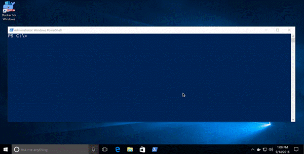
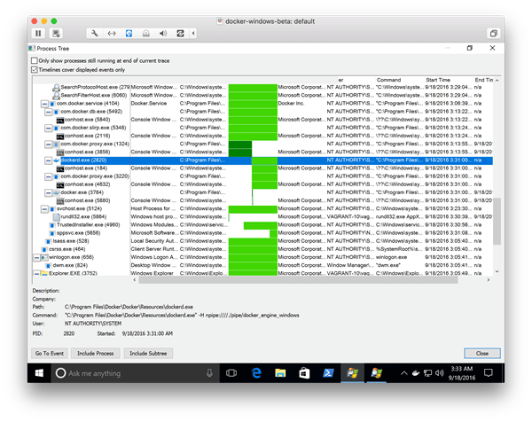
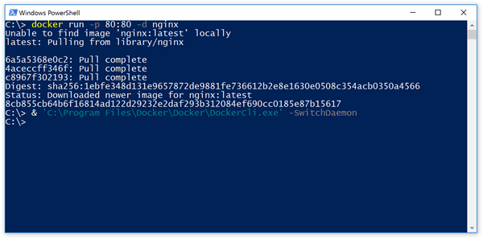
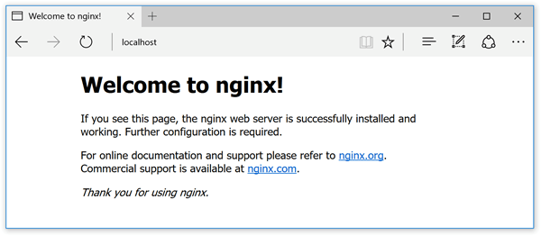
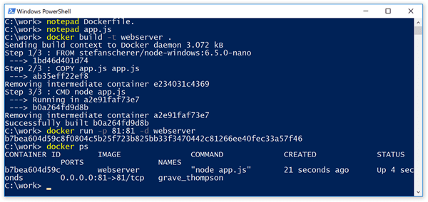
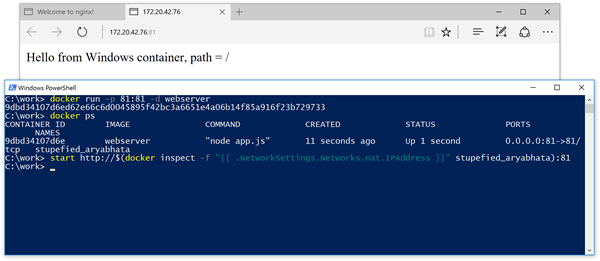
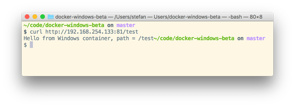

At DockerCon 2016 in Seattle Docker announced the public beta of **Docker for Windows**. With this you can work with Docker running **Linux containers** in a very easy way on Windows 10 Pro with Hyper-V installed. In the meantime there is a [stable version and a beta channel](https://docs.docker.com/docker-for-windows/) to retrieve newer versions.

And Microsoft has added the **Containers feature** in the Windows 10 Anniversary Update. With some [installation steps](https://msdn.microsoft.com/en-us/virtualization/windowscontainers/quick_start/quick_start_windows_10) you are able to run **Windows Hyper-V Containers** on your Windows 10 machine.

But there is a little bit of confusion which sort of containers can be started with each of the two installations. And you can’t run both Docker Engines side-by-side without some adjustments.

This is because each of the installations use the same default named pipe ~~//./pipe/docker_engine~~ causing one of the engines to fail to start.

**Beta 26 to rule them all****

Beginning with the Docker for Windows Beta 26 there is a very easy approach to solve this confusion. You only have to install Docker for Windows with the MSI installer. There is a new menu item in the Docker tray icon to switch between Linux and Windows containers.

As you can see in the video you don’t have to change environment variables or use the ~~-H~~ option of the Docker client to talk to the other Docker engine.

So if you download [Docker for Windows beta](https://docs.docker.com/docker-for-windows/) or switch to the beta channel in your installation you can try this out yourself.

The installer will activate the **Containers** feature if you haven’t done that yet. A reboot is required for this to add this feature.

From now on you can easily switch with the menu item in the tray icon.

There also is a command line tool to switch the engine. In a PowerShell windows you can type

& ‘C:\Program Files\Docker\Docker\DockerCli.exe’ -SwitchDaemon

and it switches from Linux to Windows or vice versa. Take care and type the option as shown here as the option is case sensitive.

**Proxy for the rescue****

But how does the switching work without the need to use another named pipe or socket from the Docker client?

The answer is that there is running a Proxy process ~~com.docker.proxy.exe~~ which listens on the default named pipe ~~//./pipe/docker_engine~~.

If you switch from Linux to Windows the Windows Docker engine ~~dockerd.exe~~will be started for you which is listening on another named pipe ~~//./pipe/docker_engine_windows~~ and a new started Proxy process redirects to this.

**Under the hood****

I have installed the [Sysinternals Process Monitor](https://technet.microsoft.com/sysinternals/bb896645) tool to learn what happens while switching from Linux to Windows containers. With the Process Tree function you can see a timeline with green bars when each process has started or exited.

The following screenshot shows the processes before and after the switch. I have switched about in the middle of the green bar.

The current ~~com.docker.proxy.exe~~ (above ~~dockerd.exe~~ in the list) that talked to the MobyLinuxVM exits as the dark green bar highlights that.

The ~~dockerd.exe~~ Windows Docker engine is started, as well as a new ~~com.docker.proxy.exe~~ (below ~~dockerd.exe~~) which talks to the Windows Docker engine.

So just after the switch you still can use the ~~docker.exe~~ Client or your Docker integration in your favorite editor or IDE without any environment changes.

**Running both container worlds in parallel****

The proxy process just switches the connection to the Docker engine. After such a switch both the Linux and Windows Docker engine are running.

**Run a Linux web server****

To try this out we first switch back to the Linux containers. Now we run the default nginx web server on port 80

docker run -p 80:80 -d nginx 

then switch to the Windows containers with

& ‘C:\Program Files\Docker\Docker\DockerCli.exe’ -SwitchDaemon

Now let’s run some Windows containers. But first we try if the Linux container is still running and reachable with

start [http://localhost](http://localhost)**

With the ~~start~~ command you open Edge with the welcome page of the nginx running in a Linux container

Yes, the Linux container is still running.

**Build a Windows web server****

On Windows 10 you only can run Nanoserver containers. There is no IIS docker image for Nanoserver. **Ignite update**: You can run Nanoserver **AND**windowsservercore containers on Windows 10.

But to demo how simple nanoserver containers could be I’ll keep the following sample as it is. So we create our own small Node.js web server. First we write the simple web server app

notepad app.js 

Enter this code as the mini web server in the file ~~app.js~~ and save the file.

var http = require(‘http’);**
var port = 81;

function handleRequest(req, res) {**
res.end(‘Hello from Windows container, path = ‘ + req.url);**
}

var server = http.createServer(handleRequest);

server.listen(port); 

Now we build a Windows Docker image with that application. We open another editor to create the ~~Dockerfile~~ with this command

notepad Dockerfile. 

Enter this as the ~~Dockerfile~~. As you can see only the ~~FROM~~ line is different from a typical Linux Dockerfile. This one uses a Windows base image from the Docker Hub.

FROM stefanscherer/node-windows:6.7.0-nano

COPY app.js app.js

CMD [ “node”, “app.js” ] 

Save the file and build the Docker image with the usual command

docker build -t webserver . 

Run the Windows web server as a Docker container with

docker run -p 81:81 -d webserver 

At the moment you can’t connect directly with 127.0.0.1 to the container. But it is possible to use the IP address of the container. We need the ID or name of the container, so list the containers running with

docker ps 

Then open the browser with the container’s IP address:

start [http://$(docker](http://$(docker) inspect -f “{{ .NetworkSettings.Networks.nat.IPAddress }}” grave_thompson):81 

Additionally the port forwarding from the host to the container allows you to contact the web server on port 81 from another machine.

And yes, the Windows container is also handling requests.

**Conclusion****

The new Docker for Windows beta combines the two container worlds and simplifies building Docker images for both Linux and Windows, making a Windows 10 machine a good development platform for both.

And with a little awareness when to switch to the right Docker engine, both Linux and Windows containers can run side-by-side.

Please leave a comment if you have questions or improvements or want to share your thoughts. You can follow me on Twitter @drlukeangel
