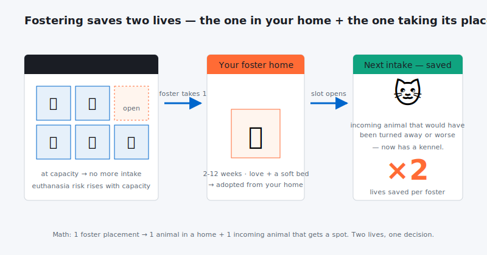

## 

By being a pet foster parent, you provide a temporary home for an animal prior to adoption. Fostering animals is a wonderful and personal way to contribute to saving homeless pets. Dogs and cats are the most common pets needing foster homes, but some organizations may also need help with rabbits, birds, or even farm animals. By fostering at your home the shelter is allowed to bring another pet saving it plus your own pet at once.

## **Why do animals need foster care?**

There are several possible reasons:

- Foster care can help save an animal’s life when a shelter is full.

- Some animals don’t do well in a shelter environment because they are frightened or need a little extra care.

- Newborn animals that need to be nursed or bottle-fed usually need foster care.

- Some animals need time to recover from an illness or injury before adoption.

Whatever the reason, these animals need some extra love and care before they can be adopted. Providing foster care for a few days, weeks, or months can be a lifesaving gift for an animal.

## **Would I be a good pet foster parent?**

If you want to do something to help the animals, fostering can be a flexible, fun and rewarding volunteer job. Here’s why:

- It’s more flexible than volunteer jobs that require you to show up at a specific time for a certain number of hours.

- It’s a great way to enjoy a pet if you are not in a position to make that lifetime commitment right now. Fostering can be an excellent option for college students or military families.

- Would you like to add a dog or cat to your household, but you’re not sure? Fostering can be a great way to find out.

Taking animals into your home, loving them, and then letting them go requires a special kind of person. Your role as a foster parent is to prepare the animal for adoption into a loving home.

## **How much time will it take?**

The specific needs of the animal will determine how much time is involved. Newborn orphaned puppies and kittens, for instance, must be fed every few hours. A frightened animal who needs socialization or training will also require some extra time. You can discuss your availability with the shelter or rescue group to determine what kinds of animals you’ll be best suited to foster.

## **What skills are needed?**

It’s best to have some knowledge about companion animal behavior and health. Many groups will provide training for you.

Some of the animals most in need of foster care are those that require a little extra help or some training. Shy cats often need time to learn to trust and the quiet of a home environment. Dogs often benefit from a little obedience training, so if you familiarize yourself with some basic training techniques, you can be a big help in preparing your foster dog for a new home.

Just by getting to know the animal, you’ll help the shelter or rescue group learn more about her personality prior to adoption.

## **What else is required?**

Each humane organization will have their own policies, and specific requirements will vary depending upon the animal you are fostering. For example, some animals will need fenced yards, medications, or isolation from your personal pets.

## **What about food and medical care?**

Many groups provide foster parents with all the necessary food and medication. Most foster programs will have you sign a contract that explains what they will cover by way of food and medical care, and they may request that you use a specific veterinary clinic for treatment of your foster animal.

## **What about my own pets?**

You’ll want to consider how the animals in your household will adjust to having a foster pet. Some animals do very well with a temporary friend and can help socialize the foster animal. Other pets have a harder time with new animals being added to or leaving the family. You’re the best judge of your pet’s personality.

For the safety of your pets and the foster animal, it’s important to keep your pets up-to-date on vaccinations. In many cases, the foster pet will need to be isolated from your own pets, either temporarily or throughout the foster period. Talk with the group you’re working with to determine what’s best in each situation.

## **Will I have to find a home for the animal myself?**

Most groups will take full responsibility for finding a new home, though you can help by telling friends, family and co-workers about your foster pet. You’ll want to discuss with the group how adoption will be handled.

## **What about when it’s time to say good-bye?**

Giving up an animal you’ve fostered, even to a wonderful new home, can be difficult emotionally. Some people like to be there when the pet goes home with the new family. Seeing your foster animal ride off into the sunset will help you remember that he has found a lovely new home.

A lot of foster families get photos and updates of their old charges enjoying their new homes. Knowing you were part of saving a life and helping the animal find a loving home is tremendously rewarding.

Sometimes a foster home turns into a permanent home. That’s why rescue, shelter, and humane organizations are always on the lookout for new foster homes!

## **But is it fair to the animals?**

Some people are reluctant to foster animals because they are concerned that it is unfair to take in a dog or cat, establish a bond, and then allow the animal to be adopted out into another home. Isn’t that a second abandonment?

Not at all! Being in a foster home can be a lifesaving bridge for a stray or frightened pet. It gives the animal a chance to get used to life in a house, and an opportunity to learn that people can be kind, food is available, and there is a warm, secure place to sleep.

Foster care can help prepare a dog or cat for a new life in a permanent home. There’s no shortage of animals who need this preparation time before finding their own people.

## **How do I give fostering a try?**

When you are ready, contact your local animal shelter or rescue group and talk to them about it. There may be some training involved and some papers to sign, but you should be able to go home soon with a new foster animal.

Foster parents make an enormous difference in the number of animals euthanized each year because shelters don’t have space for them. It is important, valuable work and, best of all, it saves lives.

## **I can’t provide foster care, but are there other ways I can help?**

Many groups can use volunteer help at adoption events, transporting animals to and from the vet, returning phone calls, or doing office work. They might need someone to photograph pets and promote them online and through the local media. You could support a foster care program by raising funds for medical care, food and supplies.
