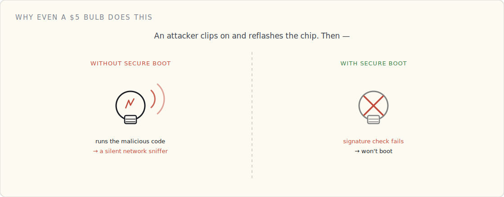

Underneath every other layer in this series is an assumption nobody states out loud: that the device is running the code you actually wrote. Strip that away and none of the rest holds — a flawless certificate and a perfect mutual-TLS handshake are worthless if the firmware performing them was quietly swapped out by someone else.

So before identity, before the cloud, before the network even comes up, a connected device has to answer a more basic question: **is the code I'm about to run mine?** That's Secure Boot, and it's the literal first thing that happens every time the device powers on. It's the floor the whole stack stands on.

## The root has to be something software can't touch

The job is to verify a signature: the manufacturer signs the firmware with a private key, and the device checks that signature with the matching public key before running anything. Standard asymmetric crypto — the same shape we'll use for device certificates in the next post, but pointed *inward* at the device's own code instead of outward at the cloud.

The catch is the obvious one: *where does the device keep the public key it checks against, and where does the checking code live?* If either sits in rewritable flash, an attacker with physical access just rewrites the check to "always pass" and flashes whatever they like.

So the root of trust has to be **immutable** — physically unchangeable by any software:

- A **Boot ROM** — a tiny piece of code mask-programmed into the silicon at manufacture. It cannot be updated, ever. It holds the trusted public key, or a hash of it.
- **eFuses** — one-time-programmable fuses on the chip. A high-voltage pulse "blows" them during manufacturing to write the key (or its hash) permanently. Once blown, no software can rewrite them.

That immutability is the entire point. The first link in the chain is trusted not because it's signed, but because it physically cannot be altered.

## The chain, stage by stage

On a richer device — a Linux gateway, say — Secure Boot is a relay race where each runner checks the next one's credentials before handing over the baton:

1. The **Boot ROM** wakes, reads the second-stage bootloader from flash, and verifies its signature against the burned-in key. Match → run it. No match → stop.
2. The **bootloader**, now trusted, verifies the signature of the **OS kernel** before launching it.
3. The **kernel**, now trusted, verifies the application image and any modules it loads.

Each stage extends trust to the next, anchored all the way down to the fused key. Flip a single bit of any image — inject one line of malware — and that image's hash changes, its signature no longer matches, and the stage checking it refuses to continue. A tampered device doesn't boot a compromised OS; it halts, or drops into a locked recovery mode.

## The same idea in a $5 smart bulb

You might think this is overkill for a lightbulb. It isn't, and the bulb does the same thing in miniature.

The bulb's microcontroller has the manufacturer's public key (or its hash) burned into eFuses. Every time you flip the switch, before the Wi-Fi radio even comes up, the boot ROM reads that fused key, checks the signature on the firmware sitting in flash, and runs it only if the math clears.

Why bother? Because without it, someone with ten minutes and a $20 clip-on programmer can erase the factory firmware and flash their own. A smart bulb with no Secure Boot is a foothold: reflash it and your ceiling light becomes a device on your home network — logging traffic, scanning for other targets — sitting there looking exactly like a bulb. Secure Boot is what makes "just reflash the chip" fail: the bulb won't run code the manufacturer didn't sign.

## Factory vs. hand-rolled: who holds the signing key

This is the first place the two worlds — a Philips production line and you at your desk — visibly diverge, and both are worth seeing.

**The factory.** The manufacturer runs real signing infrastructure: the firmware-signing private key lives in an HSM, access is gated to a handful of people, and every release is signed through it. The matching public key is fused into millions of chips on the assembly line. That private key is a crown jewel — leak it and an attacker can sign malicious firmware that *every device you ever shipped* will happily trust. It's a single point of catastrophic, fleet-wide failure, which is exactly why it lives in hardware behind an audit log and never on a laptop.

**The hand-rolled build.** On an ESP32, Secure Boot is a feature you opt into, and most hobby projects skip it. If you turn it on: you generate a signing key on your laptop, burn its hash into the chip's eFuses (irreversibly — fuse the wrong thing and the chip is a paperweight), and sign your firmware before flashing. The trade-offs are real — you now own a key you can't lose (lose it and you can't ship an update the device will accept), and you've spent one-way fuses. For a single board on your bench the threat model rarely justifies it; for anything you put in someone else's house, it does.

Different scale, same destination: code verified against a hardware-rooted key before it runs.

## This is a different key from the device's identity

The most common confusion I see, said flatly: **the Secure Boot key is not the device-identity key.** Two separate keypairs doing two separate jobs.

- **Secure Boot** uses the *manufacturer's* firmware-signing key. The manufacturer signs; the device verifies. It answers *"is this code authentic?"*
- **Identity** (the next post) uses the *device's own* keypair, wrapped in a CA-signed certificate. It answers *"is this device who it claims to be?"* when it talks to the cloud.

Both live behind the secure hardware, and people smear them together — but they're as distinct as the lock on your front door and the ID in your wallet. Conflate them and you'll design something that's wrong in subtle, expensive ways.

## What I'd tell a team

- **Fuse the root of trust in v1.** Immutability is the one property you can't add in software later. A board that shipped without a hardware root of trust can't grow one in an update.
- **Treat the firmware-signing key like the crown jewel it is.** HSM, strict access, audit log. It's the one key whose leak compromises the entire fleet at once.
- **Fuse off the debug ports (JTAG/SWD) in production.** An open debug interface is a side door that walks straight past the whole chain of trust.
- **Secure Boot and signed OTA are one feature, not two.** If updates aren't signed by the same chain that boot verifies, you've built a verified front door next to an unlocked back one. (Securing those updates — signing, blast radius, key rotation — is [its own post](/blog/securing-ota-updates/).)
- **Have a recovery path.** Verification fails for honest reasons too — corrupt flash, a botched update. A device that bricks on every failed check is its own outage; A/B slots plus a recovery mode are the answer.

## What's next

Secure Boot gets you a device running code you can trust — and, sitting in its secure hardware, the keys it will use to prove *who* it is. That's the next question: the device has verified its own code and its identity is on the chip. Now it connects.
