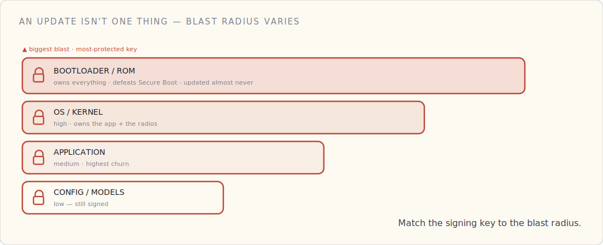
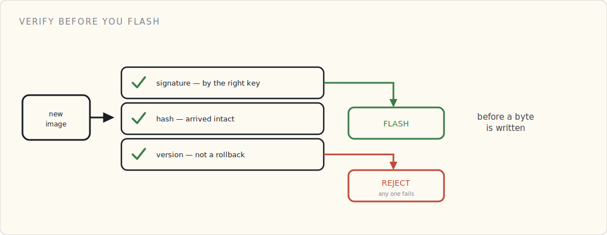

OTA is the most powerful thing you ship. It can change the code running on every device in the field, at once. That also makes it the single highest-value target in the stack: get into the update path and you don't compromise *a* device, you compromise *all* of them, with code they'll run as gladly as the real firmware.

The *operations* of rolling an update out without bricking anyone — A/B slots, canaries, staged rollout, automatic rollback — is its own discipline, and it's [a post of its own](/blog/ota-firmware-without-bricking-the-fleet/). This one is about the part that comes before any of that: deciding whether the thing you're about to flash is one you can trust. And that's not one question, because "an update" isn't one thing.

## What you're flashing isn't one thing

People say "OTA" like it's a single artifact. It isn't. What you push falls into tiers, and each tier has a wildly different **blast radius** — and therefore deserves a different signing authority and a different level of paranoia.

- **Bootloader / ROM** — the [root of trust](/blog/secure-boot-trusting-your-own-code/) itself. A malicious bootloader defeats Secure Boot and owns everything above it forever. Catastrophic blast radius; signed by the most-protected key you have; updated almost never.
- **OS / kernel** — high blast radius. Owns the application and the radios.
- **Application firmware** — what you actually update most often. Medium blast radius, high churn.
- **Drivers / modules** — narrower, but they run privileged; a compromised driver is a compromised kernel.
- **Config, schemas, ML models** — the lowest blast radius, and the tier people forget to sign at all. A poisoned model or a tampered config doesn't own the device, but it can make it misbehave in the field — and "it's just config" is exactly how an unsigned update path sneaks in.

The rule that falls out of this: **match the signing authority to the blast radius.** The key that signs application updates must not be *able* to sign a bootloader. That's least privilege, applied to update authority — the same instinct as [per-device cloud policies](/blog/authenticated-isnt-authorized/), pointed at your own release pipeline.

## Every image is signed — and verified *before* it's flashed

This is Secure Boot extended over the air. Before the device writes a single byte of a new image to flash, it checks three things:

1. **Signature** — was this signed by the right key for this layer? (Not *a* key you trust — the *specific* key allowed to sign *this* tier.)
2. **Hash / integrity** — did it arrive intact, bit for bit?
3. **Version / anti-rollback** — is this *not* an old, legitimately-signed-but-since-patched image that an attacker is replaying to reopen a fixed hole? Anti-rollback means the device refuses to install a version below a monotonic floor (often backed by a fuse or a secure counter), so a valid signature on a stale build isn't enough.

Fail any one → reject, don't flash. Verification happens *first*; the A/B-and-rollback machinery from the [operations post](/blog/ota-firmware-without-bricking-the-fleet/) is what runs *after* you've decided the image is trustworthy. People conflate the two and end up with a beautiful rollback story protecting an unsigned image.

## Where the updates live is an attack surface

The artifacts have to be stored and served somewhere, and that somewhere is a target. The shape that holds up:

- Signed images sit in object storage; the **job document** the device receives carries the artifact URL and the **expected SHA-256**, and the job document itself is authenticated.
- Short-lived, scoped URLs for the download; TLS for every hop.
- And the load-bearing point: **the signing keys are not on the update server.** Signing happens offline, in an HSM. So even if an attacker fully owns your artifact store and your delivery path, they still can't push code your devices will run — because the delivery path *delivers*; it does not *authorize*. Compromising the CDN gets them a denial-of-service, not a fleet.

If your build server can both sign *and* serve, you've collapsed that separation, and the server is now a single box that can take the whole fleet.

![The signed OTA path end to end: a build produces an unsigned image, an offline HSM signs it with a key matched to that tier's blast radius, the signed image lands in an artifact store and CDN that can only serve, and the device verifies signature, hash against the job document's SHA-256, and anti-rollback version before it flashes. Because the signing key never touches the delivery path, an attacker who owns the store and CDN gets only a denial-of-service, not a fleet — trust travels with the signature, not the server it came from.](../../assets/blog/securing-ota-updates-fig-1.svg)

## Rotating the update-signing key

The update-signing key is a crown jewel, exactly like the firmware-signing key behind Secure Boot — and like any key, you will eventually need to rotate it: it's nearing end-of-life, you suspect it leaked, or the person who had access to it left.

Rotating without bricking the fleet is the same two-trust-anchor trick the [cert side](/blog/pki-behind-a-device-cert/) uses: ship devices that trust **both** the current and the next signing key through an overlap window, sign with the new one, then retire the old. The nightmare case is a *leak*: now you have to revoke the key and re-sign the fleet onto a new one — and any device that can't receive the new trusted key over a channel it can *still validate* is stranded. Which is the whole argument for keeping that key offline and treating it like the most dangerous object in the building. Because it is.

## What I'd tell a team

- **Tier your updates by blast radius** and sign each tier with a separate, least-privileged key.
- **Verify signature + hash + anti-rollback before flash** — every image, every tier, including config and models.
- **Keep signing keys offline (HSM) and out of the delivery path.** The server that serves updates must not be able to sign them.
- **Plan signing-key rotation before you ship** — a dual-trust window is cheap up front and impossible to retrofit during an incident.
- The rollout mechanics — A/B, canary, staged, halt gates — are [their own post](/blog/ota-firmware-without-bricking-the-fleet/). Get *those* right too, but get *this* right first.

The operations post keeps the fleet from bricking itself. This one keeps the fleet from quietly becoming someone else's. An update pipeline you can't fully trust is a backdoor you built, signed, and shipped on purpose.

## What's next

The device boots trusted code, proves who it is, talks only over a trusted channel, sends protected data, is watched for anomalies, and updates without opening a hole. The last move is to stop thinking about one device and manage all of them at once — provisioning, rotation, and revocation at fleet scale.
