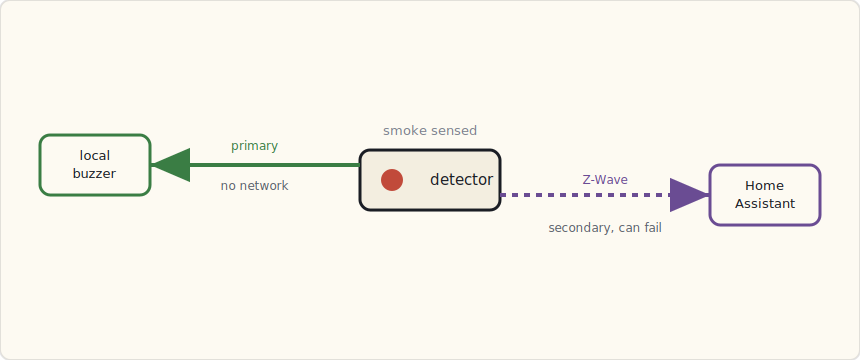

Three First Alert ZCOMBO smoke + CO detectors went up last weekend. They replace the dumb battery-only Kidde units that had spent years chirping at 3 AM on dying 9V batteries — the single most reliable way our house had of waking everyone for no reason. I wanted the events in Home Assistant. I was not willing to make the alarm itself depend on HA to do it. That tension is the whole post.

## The hardware

**First Alert ZCOMBO (Z-Wave Plus):**

- Ionization smoke + electrochemical CO sensing in one head.
- A **standalone alarm** — the local buzzer sounds on smoke or CO with zero radio involvement. The Z-Wave Plus radio is a *second* path that reports the event; it is not how the thing screams.
- 2× AA batteries, ~3-year battery life; the sensor head itself is rated for the usual 10-year replace-the-whole-unit window.
- UL 217 (smoke) + UL 2034 (CO) listed — meets US residential code.

$45 each, $135 for three. One in the upstairs hall, one in the living room, one in the basement near the furnace.

## The design rule: standalone first, network second

There's exactly one architectural decision that matters here, and it's not a clever one:

**The local alarm cannot depend on the network.**

If the Wi-Fi is down, the Z-Wave mesh has a dead node, the Pi running HA is mid-reboot — the detector still has to sound when there's smoke. UL 217 requires it. Code requires it. The 2 AM version of me, half-asleep and counting children, requires it.

The ZCOMBO gets this right: its onboard sensor drives the buzzer directly. The Z-Wave radio fires a *separate* event to HA, and everything I build — lights, push notifications, HVAC — hangs off that secondary path. If the radio path fails, I lose the automation. I do not lose the alarm. That ordering is non-negotiable, and it's the reason I bought a detector that is a *real* UL-listed alarm with a radio bolted on, rather than a "smart" alarm whose smartness is load-bearing.



That's also why I skipped the cloud-first options. The Nest Protect is a genuinely good detector, but a chunk of its connected behavior rides on Wi-Fi and Google's cloud, and I've watched that cloud have bad days. First Alert's own OneLink is Wi-Fi for the connected features. Neither is *wrong* — but both put the network closer to the alarm than I wanted it. Z-Wave Plus plus a dumb local buzzer keeps the radio firmly in the "bonus" column.

## The Home Assistant automation

Smoke fires, HA does the rest. Lights to full white for evacuation, critical push to both phones, HVAC fan off so the air handler stops moving smoke around the house, and a logbook entry so I can reconstruct what happened afterward.

```yaml
- alias: "Smoke detected — full response"
  trigger:
    - platform: state
      entity_id:
        - binary_sensor.smoke_living_room
        - binary_sensor.smoke_upstairs_hall
        - binary_sensor.smoke_basement
      to: "on"
  action:
    # lights to max, white, everywhere — for getting out
    - service: light.turn_on
      data:
        entity_id: group.all_lights
        brightness: 255
        rgb_color: [255, 255, 255]
        transition: 0
    # critical push that bypasses Do Not Disturb (iOS 12)
    - service: notify.mobile_app_luke_iphone
      data:
        title: "SMOKE: {{ trigger.to_state.attributes.friendly_name }}"
        message: "{{ now().strftime('%H:%M') }} — evacuate."
        data:
          push:
            sound:
              name: "default"
              critical: 1
              volume: 1.0
    - service: notify.mobile_app_wife_iphone
      data:
        title: "SMOKE: {{ trigger.to_state.attributes.friendly_name }}"
        message: "{{ now().strftime('%H:%M') }} — evacuate."
        data:
          push:
            sound:
              name: "default"
              critical: 1
              volume: 1.0
    # stop the air handler from spreading smoke
    - service: climate.set_fan_mode
      data:
        entity_id: climate.ecobee_main_floor
        fan_mode: "off"
    - service: logbook.log
      data:
        name: "Fire"
        message: "Smoke: {{ trigger.to_state.attributes.friendly_name }}. Full response."
```

The piece that makes this worth doing is the **critical alert** flag. iOS 12 shipped a critical-alerts entitlement in September: a notification marked `critical: 1` bypasses Do Not Disturb and the ringer switch, and plays at a volume *you* set, not the phone's. It's gated — Apple makes you request the entitlement and the user has to grant it per-app — and I granted it to the Companion app for exactly this. A smoke alert that gets silenced because the phone was on Do Not Disturb is not an alert.

## CO is a different problem than smoke

Smoke you can see and smell; the instinct ("get out") is already correct. Carbon monoxide is invisible, odorless, and slow, and by the time you feel it — headache, drowsiness — it's already degrading the judgment you'd use to react. So I gave it a visibly different response.


```yaml
- alias: "CO detected — evacuate"
  trigger:
    - platform: state
      entity_id:
        - binary_sensor.co_living_room
        - binary_sensor.co_upstairs_hall
        - binary_sensor.co_basement
      to: "on"
  action:
    - service: light.turn_on
      data:
        entity_id: group.all_lights
        brightness: 255
        rgb_color: [255, 100, 0]   # orange — not the white of a smoke event
        transition: 0
    - service: notify.mobile_app_luke_iphone
      data:
        title: "CARBON MONOXIDE"
        message: >
          {{ trigger.to_state.attributes.friendly_name }}. Get out, then call
          the gas company.
        data:
          push:
            sound:
              name: "default"
              critical: 1
```

White means smoke, orange means CO. Anyone standing in the house knows which protocol applies from the color of the lights alone, without reading their phone — which matters when the phone is the thing you grab on the way out the door.

## Interconnect — and where the network creeps back in

The Kidde units I tore out were hardwired-interconnected: the three-conductor run that residential code wants, so the basement alarm makes the upstairs alarms sound too. The ZCOMBOs are standalone buzzers with no interconnect wire between them. To get "one fires, all sound," I had to fake it in HA — and this is the one place I knowingly let the network back into the safety path.

```yaml
- alias: "Smoke interconnect — one fires, sound the others"
  trigger:
    - platform: state
      entity_id:
        - binary_sensor.smoke_living_room
        - binary_sensor.smoke_upstairs_hall
        - binary_sensor.smoke_basement
      to: "on"
  action:
    - service: switch.turn_on
      data:
        entity_id:
          - switch.smoke_living_room_test  # Z-Wave "test alarm" command
          - switch.smoke_upstairs_hall_test
          - switch.smoke_basement_test
```

The ZCOMBO exposes its "test alarm" over Z-Wave, so HA can sound the other two when any one of them sees smoke. It works — and I want to be honest about its limit. This is fully network-dependent. If the mesh or HA is down, the two detectors that *didn't* see the smoke stay quiet. The one that actually saw it still screams locally, because that path never needed the network. So the failure mode degrades the right way: I lose the house-wide chorus, never the alarm at the source.


## What bit me, and what I'd do differently

- **Nuisance trips.** Searing a steak under the broiler set off the (kitchen-adjacent) living-room detector twice. The fix you reach for — a debounce — is the wrong instinct for smoke; a five-second "is it really smoke" delay is five seconds you don't have in a real fire, so I left smoke un-debounced and ate the false alarms. The better answer, which I haven't built yet, is *correlation*: treat it as real only when smoke AND a nearby temperature sensor shows a fast rise. Smoke alone is a maybe; smoke plus a climbing thermometer is a fire.
- **No central siren.** The ZCOMBO buzzers are loud but localized. "Smoke in the basement, family asleep upstairs" is exactly the case where the local buzzer is least likely to wake anyone. An Aeotec Siren in the upstairs hall, fired by the same automation, is on order.
- **No camera correlation.** When smoke fires I'd like the indoor cameras to start recording to off-site storage automatically — useful for an insurance claim and for ruling out a false alarm remotely. The Reolink-to-Synology Surveillance Station handoff is more of an ffmpeg wrestling match than it should be; it's on the list, not done.

## What I'd tell a team

Buy a detector that is a *real* UL-listed alarm first and a smart device second. If the spec sheet describes the connected features before it describes the local alarm, that's the tell — walk away. The integration is where the value is, but it has to sit downstream of a buzzer that doesn't know or care whether your hub is alive. Standalone first, network second. Everything good I built here only works because I never let that order flip.

## What's next

Heat sensors for the attic and garage, where dust and fumes make smoke detection a false-alarm machine and rate-of-rise heat detection is the code-preferred answer. And the central siren, so a basement fire is something the whole house hears at once — without trusting the network to make that happen.
