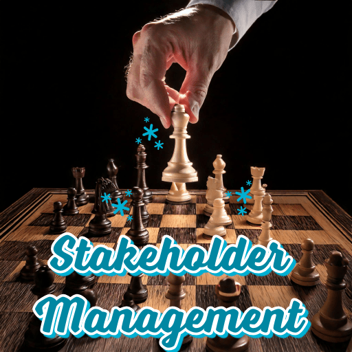
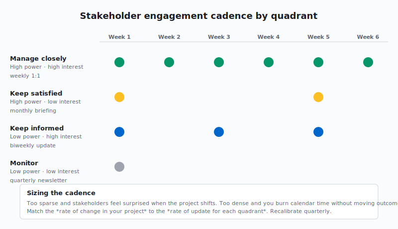

## **What is Stakeholder Management?**

You’re a project, program, or product manager. So, you have a lot on your plate. You’re dealing with deadlines, resources, and many different priorities. However, there’s one thing that can truly determine your success. That thing is stakeholder management. In today’s world, managing stakeholders well is a must-have skill. It’s your secret weapon.

First, stakeholder management is all about people. It’s about figuring out who cares about your project, program, or product. Then, it’s about understanding them. Finally, it’s about engaging with them effectively. These people, or stakeholders, can be inside your company. For example, they might be your team or your boss. Also, they can be outside your company. For instance, they could be customers, partners, or even regulators.

**Why Does it Matter to You?**

Think of stakeholder management as a bridge. It connects your project to its success. Here’s why it’s so important:

- **Fewer Risks:** You can understand what stakeholders need early on. As a result, you can spot and solve problems before they grow.

- **More Support:** When stakeholders are involved, they’re more likely to support you. They’ll give you resources and help you.

- **Better Decisions:** Stakeholders have different views. Therefore, listening to them helps you make better choices.

- **Clearer Communication:** A good plan means everyone gets the right information. Consequently, this leads to fewer misunderstandings.

- **Everyone on the Same Page:** It helps ensure all stakeholders and team members share common goals. As a result, this creates a more harmonious work environment.

- **Higher Success Rates:** In the end, good stakeholder management means better results. Your project or product is more likely to succeed.

## **Real-World Example: The Unhappy Customer**

Imagine you’re launching a new software feature. You plan it carefully. But, you forget about a group of important users. These users like the old way of doing things. The new feature messes that up. After the launch, they complain a lot. This could hurt your company’s image.

This shows what happens when you don’t manage stakeholders well. What if you talked to these users earlier? Then, you could have changed the feature. Or, at least, you could have been ready to handle their complaints.

**Simple Steps for Great Stakeholder Management:**

**1. Find and Understand Your Stakeholders:**

- **Brainstorm:** First, make a list of everyone who might care about your project.

- **Power/Interest Matrix:** Next, figure out how much power and interest each stakeholder has. This helps you know who to focus on.

- **Stakeholder Register:** Finally, make a document about each stakeholder. Include their needs, expectations, and how much influence they have.

**2. Make an Engagement Plan:**

- **Different Strokes for Different Folks:** Some stakeholders need more attention than others. So, plan your approach accordingly.

- **Choose Communication Channels:** How will you talk to them? Emails? Meetings? Newsletters? Pick what works best for each stakeholder.

- **Set Goals:** What do you want to achieve with each stakeholder? Decide if you need their feedback, support, or something else.

**3. Engage, Communicate, and Influence:**

- **Listen Actively:** First, pay attention to what stakeholders say. Show them you care about their opinions.

- **Be Transparent:** Next, be open about the project. Share the good and the bad.

- **Build Relationships:** Also, be reliable and responsive. Build trust with your stakeholders.

- **Negotiate and Solve Problems:** Finally, be ready to talk things out. Find solutions that work for everyone.

**4. Monitor and Adjust:**

- **Review Regularly:** Check your plan often. Is it working? Do you need to change anything?

- **Get Feedback:** Ask stakeholders how you’re doing. Use their feedback to improve.

## **Real-World Example: Working Together Across Teams**

You’re managing a big system upgrade. It affects many departments. IT, Operations, and Marketing are all key stakeholders.

You use a power/interest matrix. IT has high power and interest. They’re doing the work. Operations has high interest but less power. The upgrade changes their work. Marketing has some interest and power. They need to tell customers about the changes.

You make a plan. It includes regular meetings with IT. You also plan workshops with Operations. Finally, you add bi-weekly updates for Marketing. This keeps everyone in the loop. The result? A smoother upgrade.

## **Conclusion:**

Stakeholder management isn’t one-size-fits-all. Also, it takes effort. It needs flexibility. And, it requires real relationship building. But, when you master this skill, you can handle any project. You’ll build agreement, reduce risks, and drive success. Start working on your stakeholder management strategy today. It’s an investment that will really pay off!

---

## Free Example Stakeholder Engagement Plan

Thanks for reading this far. Please subscribe to this feed and here is a example plan 

---

**Project:** Implementation of a New Customer Relationship Management (CRM) System

**Project Goal:** To implement a new CRM system that improves sales efficiency, enhances customer service, and provides better data analytics capabilities.

**Stakeholder Engagement Plan**

**1. Introduction**

This plan outlines the strategy for engaging with stakeholders throughout the implementation of the new CRM system. The goal is to ensure all stakeholders are informed, engaged, and supportive of the project, leading to a successful implementation and adoption of the new system.

**2. Stakeholder Identification and Analysis**

| Stakeholder Group | Key Stakeholders/Roles | Interest Level | Influence Level | Key Concerns/Needs | Communication Needs |
| --- | --- | --- | --- | --- | --- |
| **Internal** |  |  |  |  |  |
| Executive Leadership | CEO, CFO, CIO | High | High | ROI, strategic alignment, minimal business disruption | Monthly progress reports, steering committee meetings |
| Sales Team | Sales Director, Sales Managers, Sales Representatives | High | Medium | Ease of use, improved lead management, accurate sales forecasting | Training, demos, weekly updates |
| Marketing Team | Marketing Director, Marketing Managers | Medium | Medium | Lead quality, campaign tracking, customer segmentation | Bi-weekly meetings, training |
| Customer Service Team | Customer Service Director, Customer Service Reps | High | Medium | Access to customer history, efficient issue resolution, integrated communication tools | Training, demos, weekly updates |
| IT Team | IT Director, System Admins, Developers | High | High | System integration, data migration, security, ongoing maintenance | Daily stand-ups, technical meetings |
| Training Department | Training Manager, Trainers | Medium | Medium | Development of training materials, delivery of training sessions | Bi-weekly meetings, access to the system |
| **External** |  |  |  |  |  |
| Customers (Indirect) | Key Accounts, General Customer Base | Low | Low | Minimal disruption to service, potential improvements in customer experience | Email announcements, website updates |
| CRM Vendor | Account Manager, Technical Support | High | High | Successful implementation, ongoing support contract | Weekly project meetings, as-needed communication |
| regulatory bodies | Data protection and privacy authorities | low | high | data protection and privacy and any industry-specific regulations | Compliance reports as needed |

**3. Stakeholder Engagement Matrix**

This is similar to the power/interest grid.

| Stakeholder Group | Engagement Strategy | Frequency | Channels | Owner |
| --- | --- | --- | --- | --- |
| Executive Leadership | Consult and seek approval for key decisions. Keep informed of major milestones and potential risks. | Monthly | Steering committee meetings, executive summaries, email updates | Project Manager |
| Sales Team | Involve in requirements gathering, testing, and training. Provide regular updates and address concerns promptly. | Weekly | Team meetings, email updates, demos, training sessions | Project Manager, Sales Director |
| Marketing Team | Collaborate on lead management and campaign tracking processes. Gather feedback on system usability and functionality. | Bi-weekly | Project meetings, email updates, training sessions | Project Manager, Marketing Director |
| Customer Service Team | Involve in requirements gathering, testing, and training. Address concerns about workflow changes and system integration. | Weekly | Team meetings, email updates, demos, training sessions | Project Manager, Customer Service Director |
| IT Team | Close collaboration on all technical aspects of the project, including data migration, system integration, and security. | Daily/As needed | Daily stand-ups, technical meetings, issue tracking system | Project Manager, IT Director |
| Training Department | Collaborate on the development and delivery of training materials. Provide access to the system for training purposes. | Bi-weekly | Project meetings, access to staging environment | Project Manager, Training Manager |
| Customers (Indirect) | Inform about the upcoming changes and potential benefits. Minimize any disruption to service during the transition. | As needed | Email announcements, website updates, social media posts | Marketing Team |
| CRM Vendor | Regular communication regarding project progress, technical issues, and support requirements. Manage the vendor relationship to ensure project success. | Weekly/As needed | Project meetings, email, phone calls | Project Manager |
| Regulatory Bodies | maintain compliance and keep updated with reports. | As needed | compliance and audit reports | Project Sponsor, Legal Team |

**4. Communication Plan**

A detailed communication plan will be developed and maintained separately. It will include:

- **Communication Objectives:** What we aim to achieve with each communication.

- **Key Messages:** The core information to be communicated to each stakeholder group.

- **Communication Methods:** The specific channels and tools to be used.

- **Timeline:** A schedule for communication activities.

- **Responsibility:** Who is responsible for each communication task.

**5. Risk Management**

Potential risks to stakeholder engagement include:

- Resistance to change from internal teams.

- Lack of buy-in from key stakeholders.

- Miscommunication or misunderstandings.

- Vendor-related issues (e.g., delays, technical problems).

Mitigation strategies:

- Proactive communication and engagement to address concerns and build support.

- Clear and transparent decision-making processes.

- Regular risk assessments and contingency planning.

- Strong vendor management practices.

**6. Monitoring and Evaluation**

The effectiveness of the stakeholder engagement plan will be monitored through:

- **Stakeholder Feedback:** Surveys, feedback sessions, and informal conversations.

- **Project Progress:** Tracking project milestones and identifying any delays or issues related to stakeholder engagement.

- **Risk Log:** Monitoring and managing identified risks.

The plan will be reviewed and updated at least monthly or more frequently as needed.

**7. Project Sponsor Approval**

The project sponsor will review and approve this plan.

---

This stakeholder engagement plan provides a framework for managing stakeholder relationships throughout the CRM implementation project. By implementing this plan, the project team can increase the likelihood of a successful project that meets the needs of all stakeholders. Remember to adapt and modify this template to fit the unique requirements of your own project and stakeholders. Good luck!
