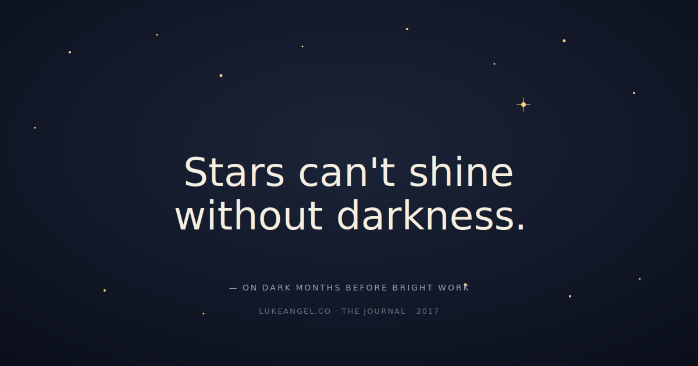

> *Stars can't shine without darkness.*

The quote gets attributed to everyone from Khalil Gibran to a YA novelist. The truth is nobody knows who said it first. The truth doesn't care. What matters is that **every bright launch I can name had a quiet, embarrassing, low-confidence month right before it.**

The temptation when you're in the dark is to assume you're lost. You're usually not. You're just in the part of the work where the camera isn't on you.

## The five dark months I remember best

- **The week before the eval started passing.** Two weeks of "the prompt is fine, the model is fine, my expectations are wrong." Then we changed one fixture and the score jumped 11 points. We almost stopped two days early.
- **The month before we shipped the bigger redesign.** The team was tired, the design was 70% right, and stakeholders kept pointing at the 30% that wasn't. We pushed through. Three weeks post-launch the NPS jumped six points.
- **The quarter before I left my last big company.** I felt useless, slow, and quietly bored. Two months later I was building something I cared about and I was neither slow nor bored. *I was the same engineer. The context had shifted underneath me.*
- **The week before the team finally clicked.** New hire, new tooling, awkward pull requests, three retros in a row that said "we're not gelling." Two sprints later we shipped twice as much as the quarter before.
- **The dark patch before I started writing again.** Six months of "I have nothing useful to say." Then I wrote one paragraph that took ninety seconds and the post wrote itself.

The pattern: in each case, the dark stretch was the *expensive*, unfun, unphotogenic part of the work that the bright launch can't exist without.

## How to tell you're in the dark — not lost

A few honest signals:

1. **The metrics aren't moving but the inputs are improving.** You're shipping fewer obvious bugs. You're answering harder support tickets faster. The trailing indicators just haven't caught up.
2. **Your one-on-ones are quieter, not noisier.** When people are confused they ask. When they're in the grind, they execute. Quiet is a tell.
3. **You're learning something specific every week.** Not "I learned a lot today" — *I learned that batching judge calls cuts our eval cost 40%.* Specific. Boring. Real.
4. **The grumble is logistical, not existential.** "I'm tired" and "the tooling is annoying" are the dark. "I don't believe in this anymore" is the wrong-place signal. Honor the difference.

If three of those four are true, the lights are on, you just can't see them yet. Hold the line.

## The actual work in the dark

You don't grind your way to brightness on willpower. You **shorten the cycle until you can see motion again**:

- One small, shippable thing each day. Not heroic. Just shippable.
- A daily note — three sentences — of what changed.
- A re-review date on the calendar so the dark has a *terminus*. Two weeks. Four weeks. If it's still dark on that date, *then* you reassess.
- A trusted human you can text "is this thing still alive" and trust the answer.

Most dark stretches end inside the four-week window. The ones that don't are signaling something real — and the calendar gives you a clean trigger to act on it.

## The gratitude part

Every dark month I've made it through had a person in it. The teammate who reviewed the unglamorous PR. The friend who texted "you sound burnt — what's the smallest next step." The partner who didn't ask me how the work was going on the bad nights.

The stars don't actually need the darkness. They just need to be the kind of thing that's still visible when the surrounding noise drops out. If you're in the dark right now — quiet, slow, unphotogenic, doing the small daily thing — **you're doing it right.** Send the next PR. Write the next paragraph. Text the friend. The brightness comes back.

And when it does, thank the people who held the line in the dark with you. It's the cheapest, kindest, most undervalued ritual in our field.
