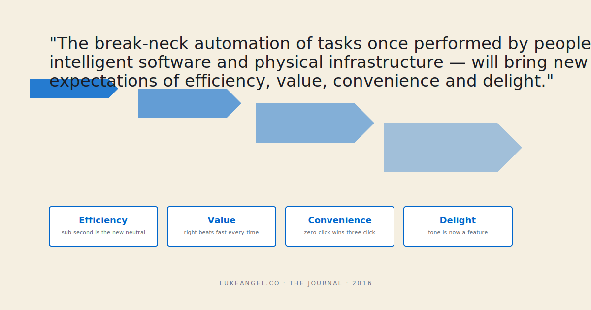

> *The break-neck automation of tasks once performed by people — by intelligent software and physical infrastructure — will bring new expectations of efficiency, value, convenience and delight.*

I copied that line into a notebook in 2016. It read like *speculation* at the time. It reads like **a receipt** now.

Eight years later, every product team I work with is paying the bill the quote predicted. Users don't just want faster — they want **fast, right, free, *and* obvious**, and they want it without phrasing the question carefully.

## The four-dimensional ask

The old product bar was one-dimensional: *is this fast.*

The new bar is four:

1. **Fast.** Sub-second. The "loading" spinner is now a UX failure, not a UX detail.
2. **Right.** Not "mostly right" — *right*. Hallucinations are the new 500 errors. Users will quietly stop trusting the product after one bad answer and they will not tell you they stopped.
3. **Free.** Or feel free. The willingness-to-pay for an AI-assisted feature is lower than the willingness-to-pay for the human-assisted equivalent, *even when the AI version is more useful*. (Don't argue with this; price your roadmap around it.)
4. **Obvious.** "How do I use this" should be answerable in zero clicks. If your AI feature needs a tooltip explaining the prompt format, **the feature is wrong, not the user.**

Hit three of four and your retention is fine. Hit two of four and your churn graph looks like a slide.

## What's actually breaking under the bar

Three things, in my experience:

**1. The price floor for *any* manual work is collapsing.** Tasks that used to be billable at $40/hour are now expected to happen for free as a side-effect of opening the app. Customers who paid $400 to onboard a new tool now expect onboarding to be a 90-second AI walk-through. *You can be mad about that or you can build for it.*

**2. The bar for tone is rising.** Robotic copy used to be neutral — boring but acceptable. Now it reads as **cheap**. Users assume that if your product can't be charming, your product also can't be smart. Tone is a feature now. Plan a tone budget the way you plan an infra budget.

**3. The fallback ladder is getting longer.** Five years ago, "let me find that for you" was a great support response. Today the user has already asked ChatGPT, asked your competitor, scrolled through Reddit, *and* opened a ticket. Your support flow is the *fourth* attempt, not the first. Design for that position in the queue.

## What this means for PMs right now

The implication isn't "use more AI." That's the surface read. The implication is harder:

- **The slack you used to plan around is gone.** Users used to forgive lag because they had nothing to compare it to. Now they have everything to compare it to and the comparison is happening every fifteen seconds.
- **Trust is the new latency budget.** A wrong answer costs more than a slow one. Build your eval discipline around that ranking. (Yes, [evals before vibes](/blog/evals-before-vibes/) again. I'll keep saying it.)
- **Your team's writing quality is now an SLO.** Every error message, empty state, and confirmation dialog is part of the user's "is this product smart" calculation. The release process needs a copywriting gate the way it has a security gate.
- **"Convenience" is a moat now.** Two products with the same answer quality — the one that requires zero clicks beats the one that requires three. *Every time.* Tool-builders, this is where the daylight is.

## The cheerful bit

It's not actually a doom essay. **The new expectations also mean the gap between great products and mediocre products is wider than it's been in a decade.** When the bar is one-dimensional, everyone clusters at the bar. When the bar is four-dimensional, the great products pull away. If you're a team that can move on all four axes, the market has never been more legible to you.

So: do the work. Set the four-axis bar. Hit three of four on every release. Charge what the convenience is worth.

And — gratitude beat — thank you to every engineer, designer, and PM I work with who's *raised* their bar over the last eight years instead of resenting that the user's bar moved. We're on the right side of the curve.
