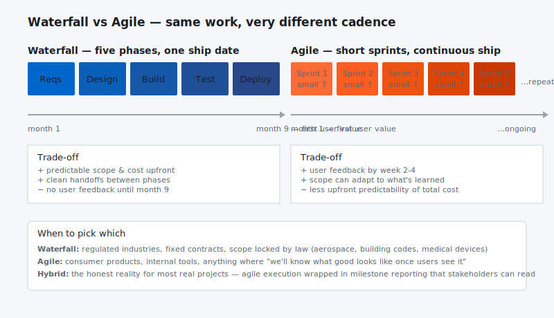
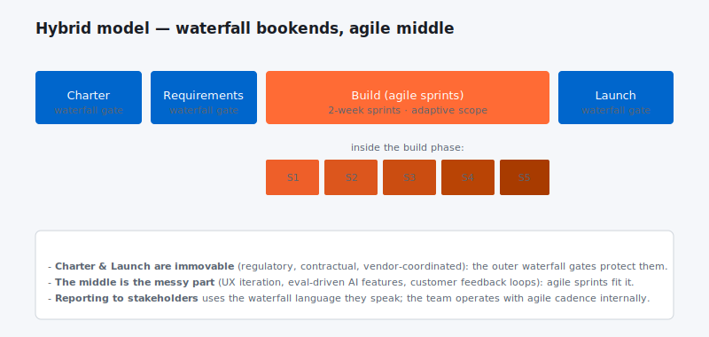

I often get asked the question on which is the superior approach to project management, Waterfall or Agile? That’s a good question but its not the right question. Instead, you should ask…

“Which tool is best for this project?”**

It might be Agile, Waterfall, a customized combination of both tools, or something else. Further, Waterfall and Agile and just specific forms of approaches that fit into broader categories that are *planned-driven* or *adaptive*.**

They are both important tools for innovators and we have choices. I often hear Agile practitioners talk about the evils of more planned methodologies, like Waterfall and Stage-Gate. Like most things, these areas are not so black and white and the nuances are important.

In this article I am going to cover the following.**

- ~~How to compare Waterfall and Agile approaches,

- ~~The problems Agile project management strives to solve,

- ~~Why both planned and adaptive approaches need to be used, and

- ~~Common issues encountered when adopting Agile project management.

## ~~Waterfall vs Agile**

To start with, Waterfall and Agile are widely misused terms. In a strict sense, Waterfall was developed by Winston Royce in the 1970s. It means a Phase-gate approach with approvals between phases. In today’s world when people say Waterfall, the word is used loosely and generally it means anything that’s plan-driven and not Agile. The term “Agile” also has many different meanings to different people. Many people talk about Agile as if it were a specific methodology. For example, Scrum is very widely used and when people say Agile they typically mean Scrum. So the word Agile has some broad meanings as well. Many people see the choice between plan-driven and Agile as mutually exclusive and that’s not accurate. It’s more like a continuous spectrum of alternatives from heavily plan-driven at one extreme to heavily adaptive at the other extreme. It’s more a matter of fitting the methodology to the project and to the business rather than force-fitting a project and a business to one of those extremes.

## ~~Plan-driven Approaches**

A plan-driven approach works in situations that have low levels of uncertainty, like building a bridge across a river. If you have a situation that is relatively straight-forward, it’s well-defined, it’s repeatable, a plan-driven approach is a good choice as you can take the lessons you’ve learned on one project and do better on the next project because it’s similar and follows the same model.

## ~~Agile**

Agile works best in environments with high levels of uncertainty. An example is finding a cure for cancer. If you were to develop a project plan for finding a cure for cancer, it would be ridiculous to try to develop a detailed plan with schedule and cost information. There’s just too much uncertainty. It’s a wasted effort to try to develop a detailed plan. In that kind of situation, people are more concerned about the goal of finding a cure for cancer than they are about having a detailed cost and schedule breakdown of what it’s going to take to get there. It’s based on an empirical process control model. The word empirical means based on observation, meaning that as you go through the project, you’re continuously adjusting both the product and the process to complete the product.

## ~~Is Agile Better?**

No, it's not. Saying Agile is better than Waterfall is like saying a car is better than a boat. They are two different things, and each has advantages or disadvantages based on the environment that you're in. So Agile is not inherently good and Waterfall is not inherently bad. It's more a matter of fitting the right approach to the right problem.

## ~~Moving to Agile**

There’s a lot of companies that just want to jump on the Agile bandwagon and many times it’s a superficial kind of thing. It might be just a brute-force approach to get it done because they see it as a way of getting products to market quicker and they wind up working people overtime and weekends to get things done quicker, and call that Agile. That’s not the right approach, obviously. Agile is heavily dependent on training and coaching to do it right. You can’t just take a cookbook approach like Waterfall and do step 1, 2, 3, 4, etc. It really requires some good intelligence among everyone on the team–developers, Scrum masters, etc. Everyone has to be intelligent enough to figure out how to do things and adapt the process and the product as they go along, so it requires a lot more skill. At a corporate level, it could require some corporate change, because there’s significant cultural changes that may be required. Agile requires breaking down walls and barriers and developing more of a collaboration.

There are issues companies encounter as they try to incorporate Agile practices into their project management. I like to say it’s a journey, not a destination. There’s an on-going learning effort and there are stages of learning associated with getting into Agile. It can take years for a complete transformation of a major company. You might start out small, you might start out with just a pilot effort on one or two projects, and expand it.**

 Let me know your thoughts below.**
