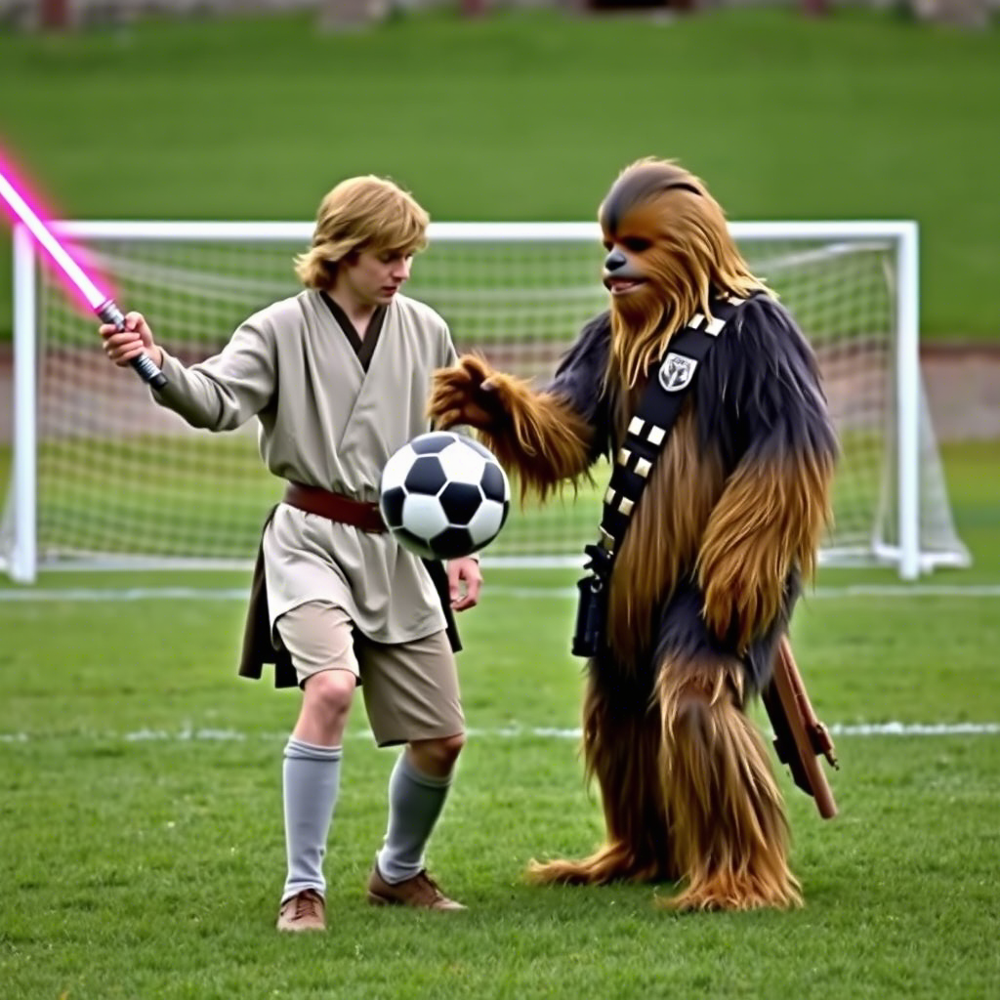

## Beyond the Gantt Chart: Why Soft Skills Rule the Project Realm

Alright, project people, let’s get real. You can wield a mean WBS and juggle dependencies like a circus pro. But, if your soft skills are softer than a marshmallow in a microwave, your projects might just go up in flames. Technical know-how is cool, but it’s the *human* stuff that separates the project MVPs from the “meeting could’ve been an email” crowd.

### Communication: More Than Just Talking (Duh)

Think communication is just about spouting off status updates? Wrong again. Truly effective communication is a two-way street, baby! This means actively *listening* to your team, stakeholders, and even that one grumpy developer who only speaks in code.

Additionally, master the art of clear, concise messaging. Nobody wants to wade through a novel-length email to find the one crucial action item. Keep it snappy, keep it relevant, and for the love of all that is holy, use bullet points! Also, understand your audience. Technical jargon might fly with your dev team, but your CEO probably wants the high-level, “Are we gonna make money?” version.

### Collaboration: Teamwork Makes the Dream Work (So Cheesy, But True)

Projects are rarely a solo act. You’re going to have to, dare I say, *collaborate*. This means building trust, respecting diverse perspectives, and knowing when to lead and when to follow.

Similarly, learn to delegate effectively. You’re not a superhero (probably), so don’t try to do everything yourself. Another aspect of good collaboration is providing and receiving feedback. When you give feedback, you want to focus on behavior, not the person.

### Problem-Solving: Embrace the Chaos, Don’t Run From It

Spoiler alert: things will go wrong. Projects are messy, unpredictable beasts. Instead of panicking when the inevitable hiccup occurs, put on your problem-solving hat.

Furthermore, a great way to approach problems is to define the issue, brainstorm solutions, pick the best one, and then, *do something about it*. Don’t just sit there staring at the problem like it’s a particularly ugly PowerPoint slide.

### Conflict Resolution: From “Fight Club” to “Kumbaya”

Let’s be honest, people are weird. They have different opinions, working styles, and levels of tolerance for your questionable taste in office snacks. Conflict is inevitable.

Now, your job isn’t to avoid conflict altogether (good luck with that), but to manage it constructively. Learn to mediate, find common ground, and help your team navigate disagreements without resorting to passive-aggressive sticky notes. For example, a good strategy to start with is to get the conflicting parties together and have them state their perspectives. Then, move towards a win-win solution.

### Emotional Intelligence: It’s Not Just for Robots Anymore

Emotional intelligence (EQ) is your ability to understand and manage your own emotions, and those of others. In the pressure-cooker environment of project management, high EQ is like a superpower.

A good way to increase your EQ is to practice self-awareness, empathy, and social skills. This will allow you to build stronger relationships, navigate difficult situations, and keep your cool when things get heated.

### Conclusion: Level Up Your Soft Skills, Dominate Your Projects

So, there you have it. Soft skills aren't some fluffy, optional add-on. **These are essential tools in your project management arsenal.** Mastering them will not just make your projects successful — you'll become a more effective, respected, and all-around awesome leader.

## How to actually develop these (because "just practice" is bad advice)

Soft skills are deceptively easy to talk about and surprisingly hard to develop. Three things that have worked for me and for the PMs I've coached:

- **Find a critic you trust.** Someone who'll tell you, after the meeting, *"you cut Jamie off three times when they were trying to make a point."* Not your manager. Not your friend. A peer who has nothing to lose by being honest. Buy them lunch quarterly.
- **Record yourself.** Watch a recording of one of your own meetings. *Painful, transformative, and free.* You'll spot more about your communication style in one playback than from a dozen workshops.
- **Pick one skill, run it for a quarter.** "I will work on all five soft skills" is how nothing improves. "This quarter I'm specifically working on giving feedback without softening it past the point of being actionable" is how growth happens.

## A note for the technical PMs reading this

If you came from engineering, this stuff probably sounds like *vibes wrapped in a self-help book.* I get it. I came from engineering too. Here's the engineering reframe: **soft skills are an order-of-magnitude leverage multiplier on your hard skills.** A senior engineer with poor communication ships maybe 1.5× what a junior ships. A senior engineer with great communication ships 5×. Same engineering chops. Different return on the chops.

Treat soft skills as a leverage discipline, not a personality trait, and they get a lot easier to invest in.

## Gratitude beat

Big thanks to every team member who's gently corrected my soft skills over the years — the one who said "you talk for too long in standup," the one who pointed out I was reading texts during 1:1s, the one who told me my "feedback" was just a complaint with extra steps. Each of those moments was a free upgrade I didn't pay for. *Thank you.*

Now go forth, hone those skills, and conquer your project goals.
