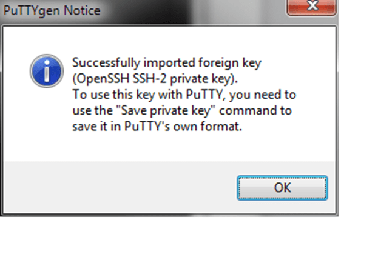
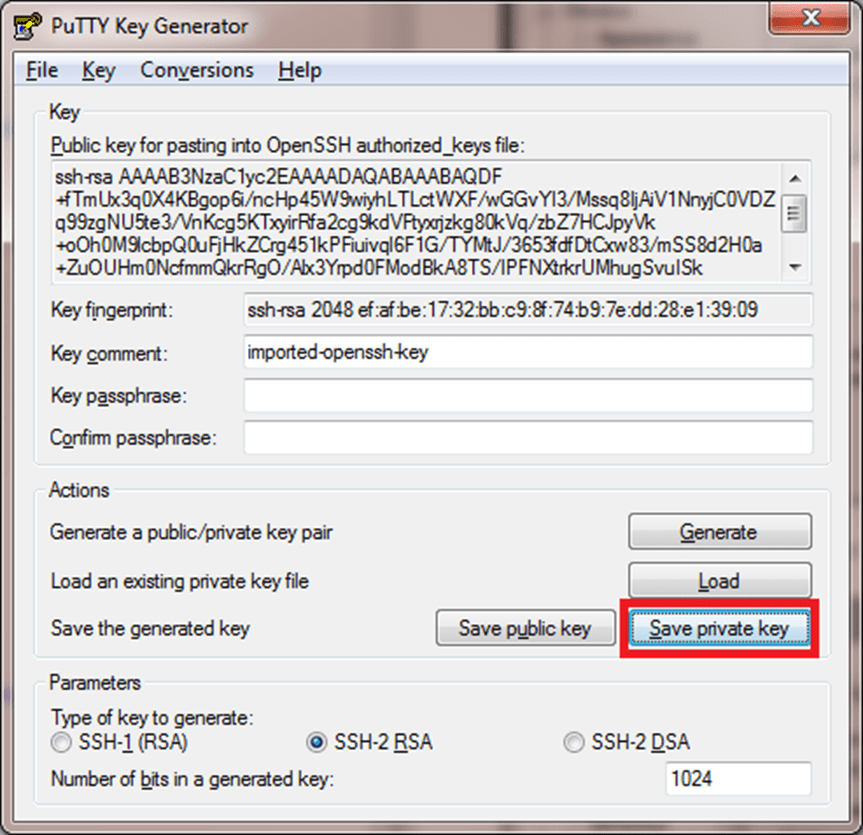
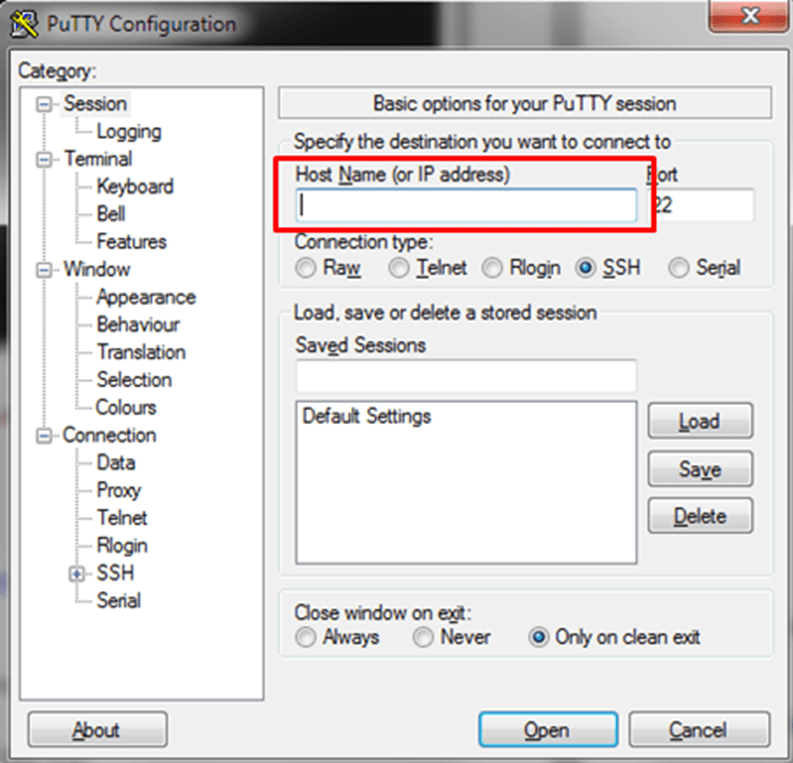
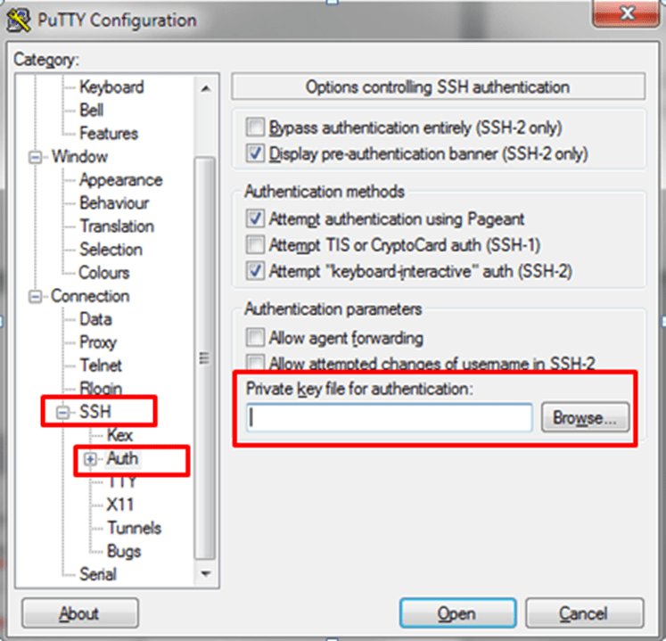

In this post I am going to describe how to create and use **ssh-rsa** and **.pem** format public and private key files on Windows that you can use to connect to your Linux VMs on Azure with the **ssh** command. If you already have **.pem** files created, you can use those to create Linux VMs to which you can connect using **ssh**. Several other commands use the **SSH** protocol and key files to perform work securely, notably **scp** or [Secure Copy](https://en.wikipedia.org/wiki/Secure_copy), which can securely copy files to and from computers that support **SSH** connections. 

## ~~What SSH and key-creation programs do you need?

**SSH** — or [secure shell](https://en.wikipedia.org/wiki/Secure_Shell) — is an encrypted connection protocol that allows secure logins over unsecured connections. It is the default connection protocol for Linux VMs hosted in Azure unless you configure your Linux VMs to enable some other connection mechanism. Windows users can also connect to and manage Linux VMs in Azure using an **ssh** client implementation, but Windows computers do not typically come with an **ssh** client, so you will need to choose one. 

Common clients you can install include:

- [~~puTTY and puTTYgen~~](http://www.chiark.greenend.org.uk/~sgtatham/putty/)

- [~~MobaXterm~~](http://mobaxterm.mobatek.net/)

- [~~Cygwin~~](https://cygwin.com/)

- [~~Git For Windows~~](https://git-for-windows.github.io/)~~, which comes with the environment and tools

If you’re feeling especially geeky, you can also try out the [new port of the **OpenSSH** toolset to Windows](http://blogs.msdn.com/b/powershell/archive/2015/10/19/openssh-for-windows-update.aspx). Be aware, however, that this is code that is currently in development, and you should review the codebase before you use it for production systems.

##### ~~Note:

Azure has two different deployment models for creating and working with resources: [Resource Manager and classic](https://azure.microsoft.com/en-us/documentation/articles/resource-manager-deployment-model/). This article covers using both models, but Microsoft recommends that most new deployments use the Resource Manager model.

## ~~Which key files do you need to create?

A basic SSH setup for Azure includes an **ssh-rsa** public and private key pair of 2048 bits (by default, **ssh-keygen** stores these files as **~/.ssh/id_rsa** and **~/.ssh/id-rsa.pub** unless you change the defaults) as well as a .pem file generated from the **id_rsa** private key file for use with the classic deployment model of the classic portal. 

Here are the deployment scenarios, and the types of files you use in each:

- ~~**ssh-rsa** keys are required for any deployment using the [Azure portal](https://portal.azure.com/), regardless of the deployment model.

- ~~.pem file are required to create VMs using the [classic portal](https://manage.windowsazure.com/). .pem files are also supported in classic deployments that use the [Azure CLI](https://azure.microsoft.com/en-us/documentation/articles/xplat-cli-install/).

##### ~~Note:

If you plan to manage service deployed with the classic deployment model, you may also want to create a **.cer** format file to upload to the portal — although this doesn’t involve **ssh** or connecting to Linux VMS, which is the subject of this article. To create those files on Windows, type: 

```
openssl.exe x509 -outform der -in myCert.pem -out myCert.cer
```

Get ssh-keygen and openssl on Windows

[~~This section~~](https://azure.microsoft.com/en-us/documentation/articles/virtual-machines-linux-ssh-from-windows/)~~ above listed several utilities that include an ssh-keygen and openssl for Windows. A couple of examples are listed below:

### ~~Use Git for Windows

- ~~Download and install Git for Windows from the following location: [https://git-for-windows.github.io/](https://git-for-windows.github.io/)

- ~~Run Git Bash from the Start Menu > All Apps > Git Shell

##### ~~Note:

You may encounter the following error when running the openssl commands above:

Unable to load config info from /usr/local/ssl/openssl.cnf

The easiest way to resolve this is to set the OPENSSL_CONF environment variable. The process for setting this variable will vary depending on the shell that you have configured in Github:

**Powershell:**

```
$Env:OPENSSL_CONF="$Env:GITHUB_GIT\ssl\openssl.cnf"
```

**CMD:**

```
set OPENSSL_CONF=%GITHUB_GIT%\ssl\openssl.cnf
```

**Git Bash:**

```
export OPENSSL_CONF=$GITHUB_GIT/ssl/openssl.cnf
```

Use Cygwin

- ~~Download and install Cygwin from the following location: [http://cygwin.com/](http://cygwin.com/)

- ~~Ensure that the OpenSSL package and all of its dependencies are installed.

- ~~Run cygwin

## ~~Create a Private Key

- ~~Follow one of the set of instructions above to be able to run openssl.exe

- ~~Type in the following command:

```
openssl.exe req -x509 -nodes -days 365 -newkey rsa:2048 -keyout myPrivateKey.key -out myCert.pem
```

Your screen should look like the following:

```
openssl.exe req -x509 -nodes -days 365 -newkey rsa:2048 -keyout myPrivateKey.key -out myCert.pem
```

>>> ~~Generating a 2048 bit RSA private key …………………………………+++ …………………..+++ writing new private key to ‘myPrivateKey.key’ —–

You are about to be asked to enter information that will be incorporated into your certificate request. What you are about to enter is what is called a Distinguished Name or a DN. There are quite a few fields but you can leave some blank For some fields there will be a default value, If you enter ‘.’, the field will be left blank. —– Country Name (2 letter code) [AU]:

- ~~Answer the questions that are asked.

- ~~It would have created two files: myPrivateKey.key and myCert.pem.

- ~~If you are going to use the API directly, and not use the Management Portal, convert the myCert.pem to myCert.cer (DER encoded X509 certificate) using the following command:

```
openssl.exe x509 -outform der -in myCert.pem -out myCert.cer
```

Create a PPK for Putty

- ~~Download and install Puttygen from the following location: [http://www.chiark.greenend.org.uk/~sgtatham/putty/download.html](http://www.chiark.greenend.org.uk/~sgtatham/putty/download.html)

- ~~Puttygen may not be able to read the private key that was created earlier (myPrivateKey.key). Run the following command to translate it into an RSA private key that Puttygen can understand:~~ ``` openssl rsa -in ./myPrivateKey.key -out myPrivateKey_rsa # chmod 600 ./myPrivateKey_rsa ``` 

The command above should produce a new private key called myPrivateKey_rsa.** 

- ~~Run puttygen.exe

- ~~Click the menu: File > Load a Private Key

- ~~Find your private key, which we named myPrivateKey_rsa above. You will need to change the file filter to show **All Files (*.*)

- ~~Click **Open**. You will receive a prompt which should look like this:



- ~~Click **OK

- ~~Click **Save Private Key**, which is highlighted in the screenshot below:



- ~~Save the file as a PPK

## ~~Use Putty to Connect to a Linux Machine

- ~~Download and install putty from the following location: [http://www.chiark.greenend.org.uk/~sgtatham/putty/download.html](http://www.chiark.greenend.org.uk/~sgtatham/putty/download.html)

- ~~Run putty.exe

- ~~Fill in the host name using the IP from the Management Portal:



- ~~Before selecting **Open**, click the Connection > SSH > Auth tab to choose your private key. See the screenshot below for the field to fill in:



- ~~Click **Open** to connect to your virtual machine
