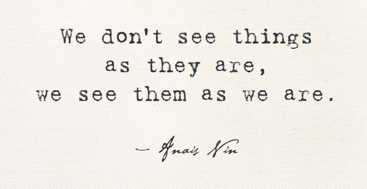

> *We don't see things as they are. We see them as we are.*

The quote gets pinned to Anaïs Nin in half the LinkedIn posts that share it. The other half claim it's from the Talmud. The honest answer is **everyone has been quietly reinventing this idea for two thousand years** because it keeps being true.

For product work, it's the central hazard.

## Every roadmap is partly an X-ray of you

Every roadmap I've ever written is partly an X-ray of me — what I'm scared of, what I think is cool, who I want to impress, what I had a bad meeting about three weeks ago. The features that get bigger fonts on the slide are the ones I'm secretly excited to build. The ones in the smaller font are the ones I keep meaning to think harder about and don't.

If you stare at a roadmap long enough, **you can guess who wrote it before you check the doc owner.** The PM with the security background writes audit and access control into every theme. The PM who's been burned by a bad migration writes "stability work" three quarters in a row. The PM fresh out of a model-eval rabbit hole writes evals into every theme regardless of whether the feature has a model in it.

This isn't bad. It *is* the work. Roadmaps are partly judgement calls and judgement is partly autobiography. The risk is forgetting that.

## Three places projection shows up in product work

**1. User research notes.** You did six calls. You wrote up the themes. Of course you did — that's the job. But the themes you wrote up are the ones that *resonated with you*. The ones that didn't resonate are not in your notes. The user research process literally selects for confirmation of what you already half-believed. Read your notes back as if your *predecessor* wrote them and notice what's missing.

**2. Eval rubric design.** Every rubric I've helped design tilts toward what the designer thinks is broken right now. If the team just had a hallucination incident, hallucination becomes the heaviest axis. If they just had a tone backlash, tone becomes the heaviest axis. **Recency bias wearing the costume of objectivity.**

**3. Hiring scorecards.** What you call "high bar" is mostly *the thing I needed in my last job*. The PM who got burned by a flaky technical lead writes "deep technical depth" into the rubric. The PM who got burned by a non-collaborative one writes "high empathy" into the rubric. Same job, different scar tissue, different scorecard.

## Three small habits that help

I haven't beaten this — nobody beats this — but I've gotten better at catching it:

- **Show your work to one person who is not you.** Not "what do you think?" Specifically: *what's missing here that I would not notice was missing?* That question, in that order, gets the actual signal.
- **Read your old work.** Six months later your roadmap looks like an artifact. The themes you fought for that didn't pan out? They were autobiography. Note which ones.
- **Track your "I knew it" reactions.** When research surprises you, that's a calibration data point. When research confirms you, that's *also* a calibration data point — your priors were right *or* you flinched and only saw what you wanted. Be honest about which.

## The thing about anonymous quotes

The reason "We don't see things as they are, we see them as we are" gets attributed to so many people is that **almost everyone independently arrives at it eventually.** It's not a clever insight. It's the floor of how perception works. Anybody paying attention to themselves for more than a few years writes some version of it down.

Which means the trick isn't to remember the quote. The trick is to keep checking whether the thing you just decided was a judgement about the world or a judgement about you. Most of the time it's both, and the percentages are not the percentages you think they are.

I'm grateful to every colleague who's ever told me "I think you're projecting" without making me feel small about it. That's a senior move. Steal it.
