Set aside thoughts of mince pies and look ahead to what’s in store for wearable tech in 2016.

**50. Gran Turismo Sport**

The [upcoming 2016 VR explosion](http://www.wareable.com/sony/best-playstation-vr-games-2016) needs games and games don’t get much bigger than Gran Turismo. Set to hit PlayStation VR in 2016, the iconic racer will feature three different modes and both online and offline gameplay.

**49. Frog**

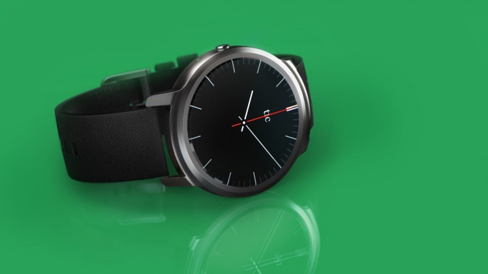

Striving to touch hearts and move markets, Frog has worked with [Unicef in the Wearables for Good](http://www.wareable.com/saves-the-day/necklace-khushi-baby-unicefs-wearables-for-good-challenge-1938) challenge as well as designing the hit Chinese smartwatch, [Ticwatch](http://www.wareable.com/smartwatches/ticwatch-all-chinese-smartwatch-frog-design-2015). With clear ideas about the role wearables can play in society, expect big things from this ethical design and strategy firm which should be the hot company to work with next year.

**Opinion: Meng Li**

“Actionable guidance from wearables will make the way we interact with technology more human in 2016. Wearables can learn so much about us, the way we move, and the way we live our lives. Without using this data to give actionable guidance, it won’t make us better and we will just continue what we’ve been doing in the past. Artificial intelligence allows our interactions with wearables to become a dialogue that tells us how to live better.”

**48. Meng Li**

Co-founder and CEO of Moov, Li has zipped from crowdfunded success to start-up superstar in less than two years. With her company now as firmly established as her reputation thanks to the fantastic [Moov Now](http://www.wareable.com/sport/moov-now-review), the company is one of the hottest properties in fitness tech, and we’d be surprised if a huge sports brand doesn’t swoop this year.

**47. Kokoon**

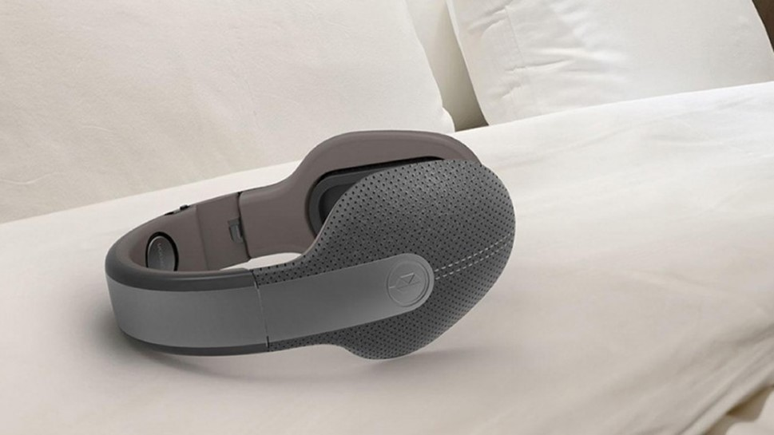

There are lots of wearables to measure sleep but none so far that will actually improve it. The [Kokoon in-ear sleep headphones](http://www.wareable.com/headphones/kokoon-eeg-headphones-shipping-delay-2016) are designed to improve sleep quality and will finally launch in late 2016.

**46. TomTom**

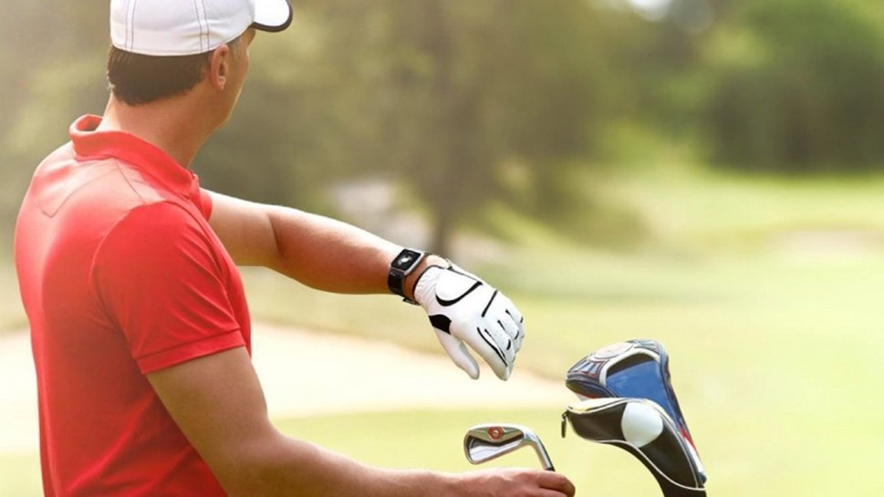

GPS is integral to proper sports tracking, and TomTom is set to transform itself into a sports brand in 2016. With 10 different sports products across running, fitness and golf, TomTom has the stripes it deserves. It’s already worked for Garmin; 2016 is TomTom time.

**45. Saschka Unseld**

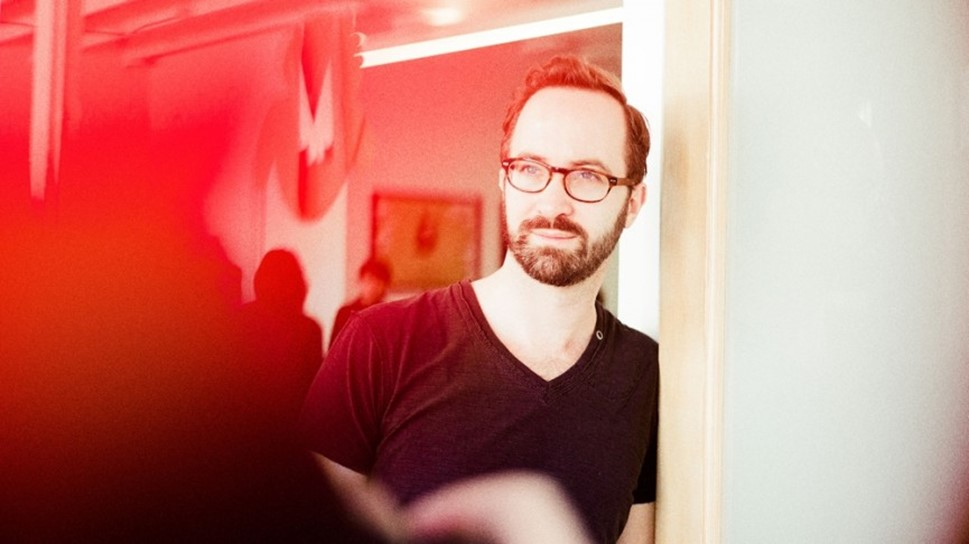

Facebook’s [Oculus Story Studio](http://www.wareable.com/oculus-rift/oculus-launches-story-studio-lab-to-make-vr-movies-754) is stuffed full of the movie industry’s finest minds and Pixar veteran [Saschka Unseld](http://www.wareable.com/vr/social-solitary-virtual-reality-oculus-sony) is in charge of the lot. With the consumer Oculus Rift set to hit the shelves in 2016, Unseld is masterminding an entire new kind of entertainment with shorts like *Lost* and *Henry*. No pressure, then.

**44. Amazon Echo**

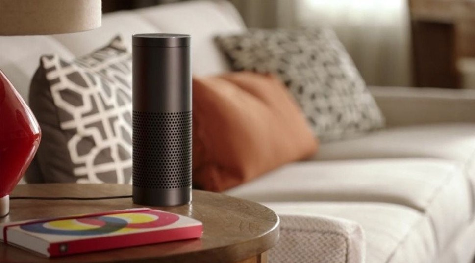

The [Amazon Echo](http://www.wareable.com/amazon/amazon-echo-review) may be a 2015 product, but next year will surely see it expand outside the US. But beyond that, 2016 is set to be the year of the smart virtual assistant. With Google Now, Siri and Microsoft’s Cortana already on the warpath, prepare to make some new digital friends.

**43. Nuzzle**

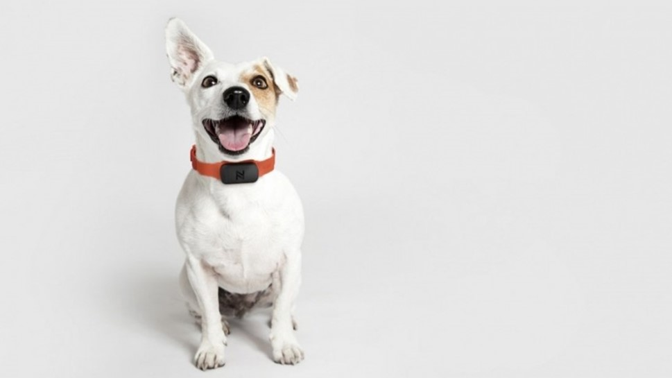

Part pet tracker, part insurance company; [Nuzzle](http://www.wareable.com/internet-of-things/nuzzle-gps-collar-tells-you-when-your-pup-has-flown-the-coop-1869) is the GPS collar that goes the extra mile when it comes to looking after your furry friends. Activity monitoring and GPS mapping feature alongside data on favourite walks and wellness stats in the companion app. Fetch.

**42. Hive**

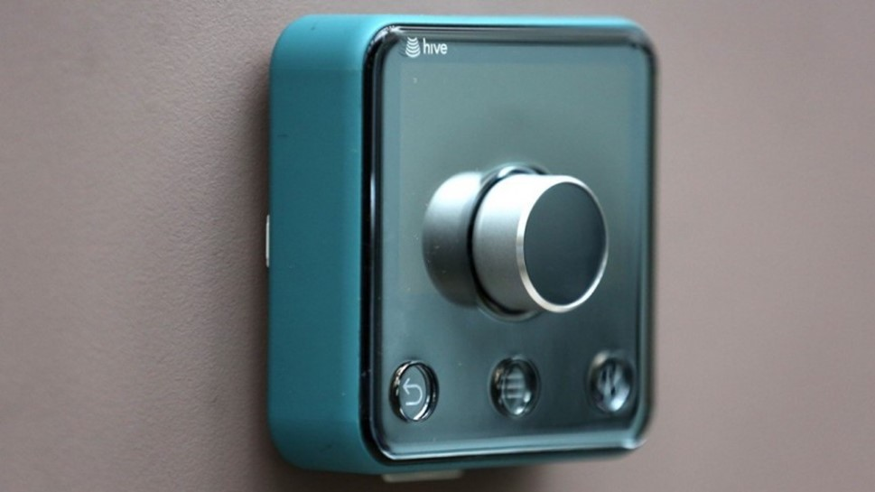

More than just a thermostat; British Gas is going full steam ahead in smart home tech for 2016. Smart bulbs, connected sockets, motion detectors and door sensors are on their way. What’s more, [the company is set to take on Nest by launching Stateside](http://www.wareable.com/meet-the-boss/the-british-are-coming-why-nest-should-be-worried-about-hives-plans-for-the-us), and it has already shown in the UK that having a service business makes it easier to get its tech into people’s homes.

**41. Project Jacquard**

When it comes to connected clothing, there isn’t a bigger partnership than Levi’s and Google. The two giants teamed up in May to develop a way to take the physical interface away from your devices and onto your clothes, and the fruits of the marriage should be seen in 2016.

**40. Xmetrics**

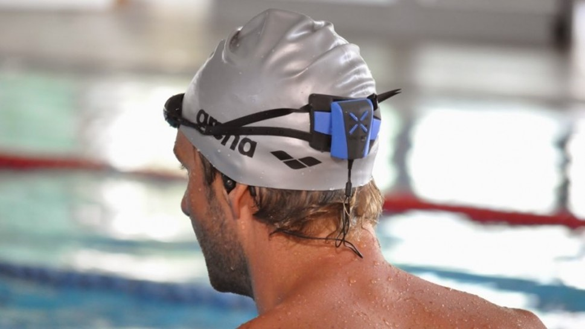

Xmetrics is the hottest swimming wearable in what is otherwise a fairly tepid pool. Designed for pros and enthusiasts, it sits on the back of your head to minimise drag and measures a broader set of bio-mechanics than any other[swimming wearable](http://www.wareable.com/fitness-trackers/best-trackers-swimming-mp3). Between kick-turn times, breath counts, stroke efficiency – plus all the usuals – all fed back to you in real time audio; it’s a far more detailed and complete platform than anyone’s made before. It should sell big.

**39. The Void**

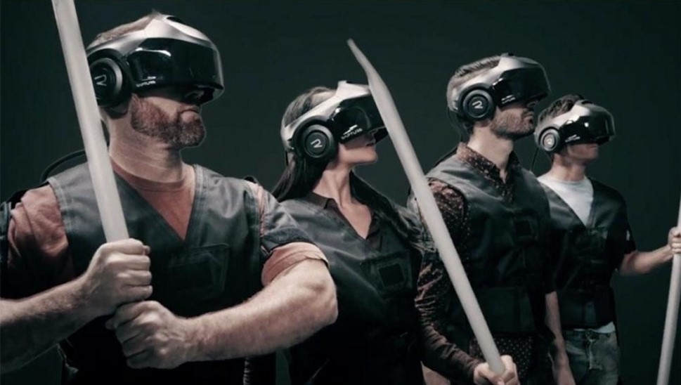

If gaming were any more real, then it would no longer be a game. [The Void](http://www.wareable.com/vr/run-around-physical-arenas-in-virtual-reality-games-with-the-void-1119) is a real-life VR theme park built in Salt Lake City. In beta phase at the moment but opening soon, it’s virtual gaming experiences are superimposed onto a blank maze-like space. The upshot is that all your other senses buy into the vision of your adventure as well as just your eyes.

**38. Wearable data in sports coverage**

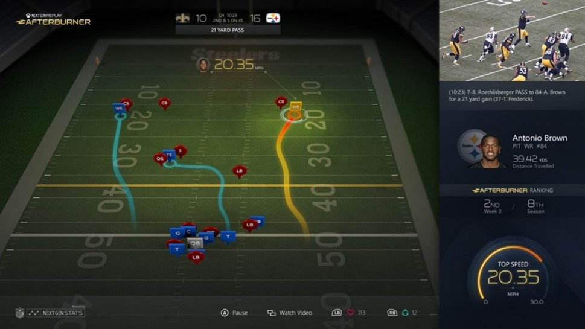

The [2015 NFL season](http://www.wareable.com/sport/the-nfl-outfits-its-players-with-real-time-motion-tracking-chips-1642) kicked off with all 1,696 players fitted with a set of RFID chips capable of sending back stats on position, pace, distance travelled and acceleration in real time. While it’s great for sports scientists, 2016 will see TV networks wake up to the entertainment potential of the data. The NBA are supposedly keen and the right kind of kit is already in place in cycling and motorsports. The only question is whether the teams choose to grant access.

**Opinion: Christina Mercando d’Avignon**

“Wearable technology will evolve in 2016 to have a stronger focus on aesthetics and design. We believe people will be shopping for electronic devices the way they shop for clothing. You’ll want to wear the piece that fits your personal style – as well as the functionality that fits your lifestyle. We also want people to own a multitude of devices – much like clothing, your tech accessories should have variety and you shouldn’t have to wear the same design every day.”

**37. Christina Mercando d’Avignon**

[~~Ringly CEO Mercando d’Avignon~~](http://www.wareable.com/meet-the-boss/ringly-ceo-christina-mercando-smart-jewellery-2016)~~ is set for a storming 2016, after securing a fresh $5m in investment for her smart ring. With MasterCard mobile payment tech incoming along with new form factors, it looks like this lady’s the diamond of smart jewellery.

**36. Moto 360 Sport**

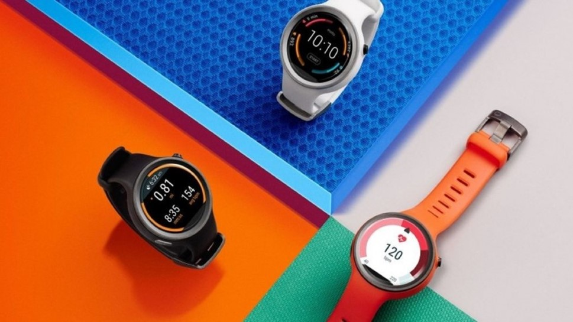

The New Year starts with this new sports watch on sale from December in Europe and January in the States. Only the second Android Wear watch to come with GPS, the [Moto 360 Sport](http://www.wareable.com/android-wear/new-moto-360-sport-2-price-release-date-specs) has a reasonable price tag, heart rate monitoring and, of course, also comes with all the usual smartwatch features.

**35. Life-saving wearables**

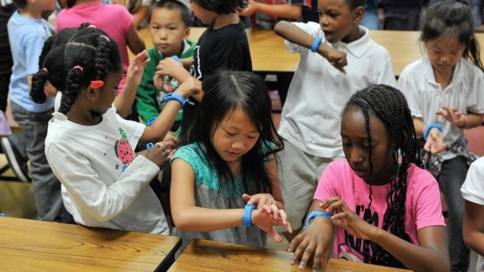

Wearables’ unique position on the body make them more personal than ever before, and offer the chance for them to become real life savers. Crowdfunded[Athena](http://www.wareable.com/saves-the-day/athena-aims-to-keep-women-safe-after-dark-1847) smashed its goal thanks to its promise to protect women via an alarm and GPS alerts. Cheaper sensors also help tech companies build for the developing world. From [storing medical records](http://www.wareable.com/saves-the-day/necklace-khushi-baby-unicefs-wearables-for-good-challenge-1938) or even warning people about [floods and earthquakes](http://www.wareable.com/wearable-tech/londons-csm-show-two-connected-tech-1318), wearables are set to make a difference in 2016.

**34. Eunjoo Kim**

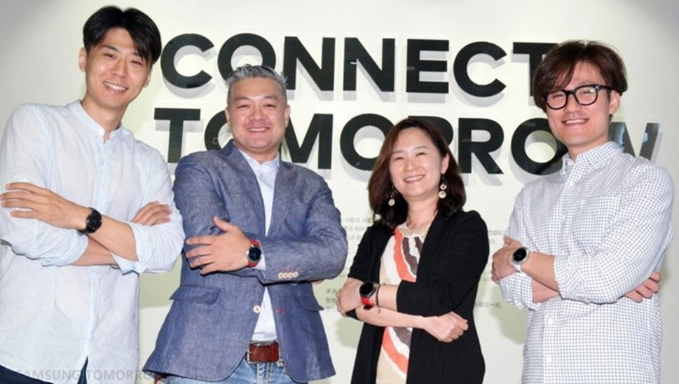

Principal designer on the [Samsung Gear S2](http://www.wareable.com/samsung/samsung-gear-s2-review), Eunjoo Kim can be credited with that rotating bezel that’s made it so successful. With 18 years of UX and tech industry experience – including time at Motorola and Qualcomm – Samsung would be crazy not to let her run with more wearables ideas given she’s finally got the company the kind of foothold it wanted.

**33. Smart coaching**

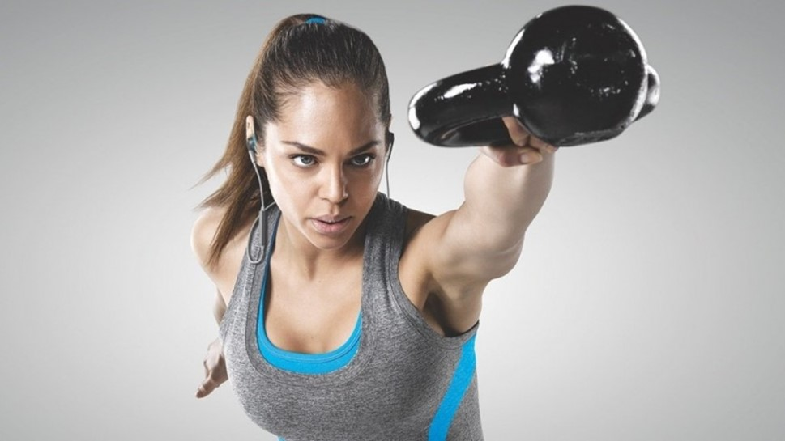

The big frustration with fitness platforms is that those programs they assign to us are far too general and wearables in 2015 have begun to clue up to this.[Moov](http://www.wareable.com/sport/moov-now-review) has already tackled the problem and Fitbit has promised a bigger emphasis on coaching, too.

**32. Verily**

The newly rebranded Google Life Sciences already has some ambitious projects including its glucose-detecting contact lens. Google’s also set to use tech to target cardiovascular disease, cancer and mental health problems too.

**31. Kids’ wearable toys**

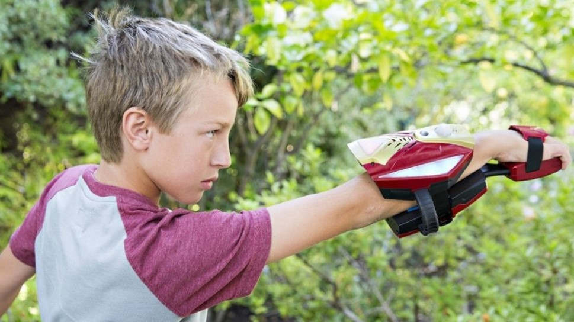

Disney is leading the line with making children’s wearables and its Playmation wearable toys are set to be hot for [2016 with Iron Man](http://www.wareable.com/wearable-tech/disney-playmation-wearable-toys-aim-to-get-kids-active-1205http:/www.wareable.com/wearable-tech/disney-playmation-wearable-toys-aim-to-get-kids-active-1205) first out of the blocks. The idea, much like The Void, is to turn everyday place spaces like homes and gardens into virtual game environments that you can change with every update and purchase.

**30. Intel’s wearable tech reality show**

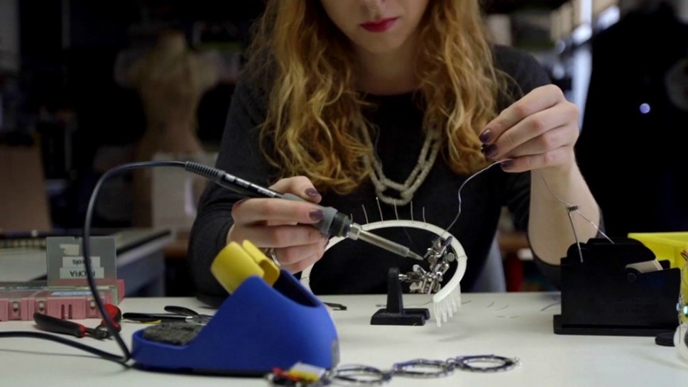

Under the working title of America’s Greatest Makers, and set to air in 2016, is the rather bonkers sounding concept of [Intel’s reality TV show](http://www.wareable.com/intel/intels-1-million-wearable-tech-prize-reality-tv-show-americas-greatest-makers-1550) where the contestants are inventors and their turns are their wearable tech innovations. There’s a $1m prize at stake and a format that seems to work with everything from singing to pottery, so who’d bet against it?

**29. Smartwatches untethered**

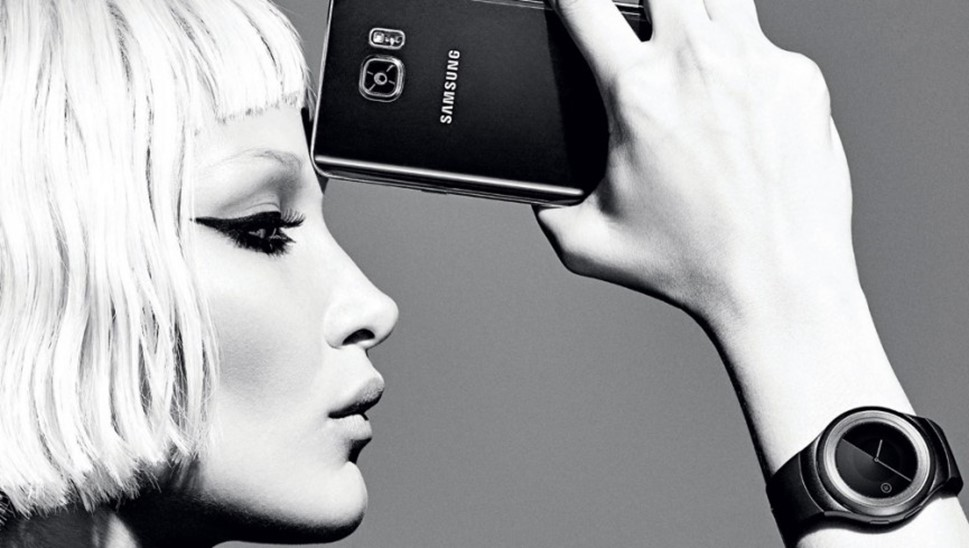

As smartwatches mature, the need for a constant digital umbilical chord to a smartphone starts to feel a little antiquated. The great separation is already underway with [Android Wear](http://www.wareable.com/android-wear) and the Samsung Gear S2 both supporting e-SIMs, which tap into your pre-existing cell network at no extra cost. While the first untethered Android Wear device, the LG Watch Urbane Second Edition has been cancelled, we’d bet that every smartwatch brand with have an LTE version by the end of 2016.

**28. Chris Milk**

Famous for bridging the gap between emerging technologies and storytelling, Chris Milk will be turning his hand to VR movies in 2016 with his Vrse.works production company. He’s already made [VR music videos for Apple Music](http://www.wareable.com/vr/apple-music-virtual-reality-videos),[documentaries with the UN](http://www.wareable.com/saves-the-day/united-nations-virtual-reality-films-gabo-arora-1825) and films that take users through a horrifying POV experience of a psychiatric institution. And he sees virtual reality as the ultimate empathy machine to promote the understanding of the plight of people everywhere. Now teamed up with the Sundance Film Festival, this man has a bigger platform than ever.

**27. Tag Heuer**

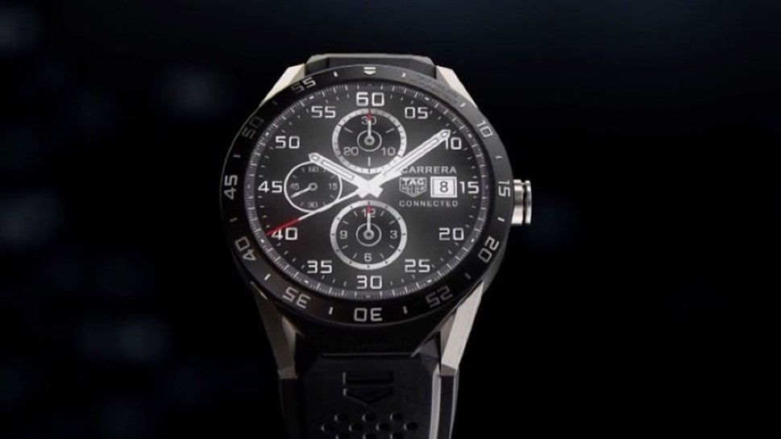

Tag Heuer did it right – plenty of hype, the biggest of partners and [an unsliceable wheel of cheese](http://www.wareable.com/smartwatches/bivers-cheese-1927). All the these elements, plus old-fashioned good design, have meant that the [Tag Heuer Connected](http://www.wareable.com/android-wear/tag-heuer-connected-review-2015) is very credible and very good-looking smartwatch indeed, and it’s promised new designs in 2016. It’s the new blueprint that other smartwatch manufacturers are set to ape.

**26. Pebble Smartstraps**

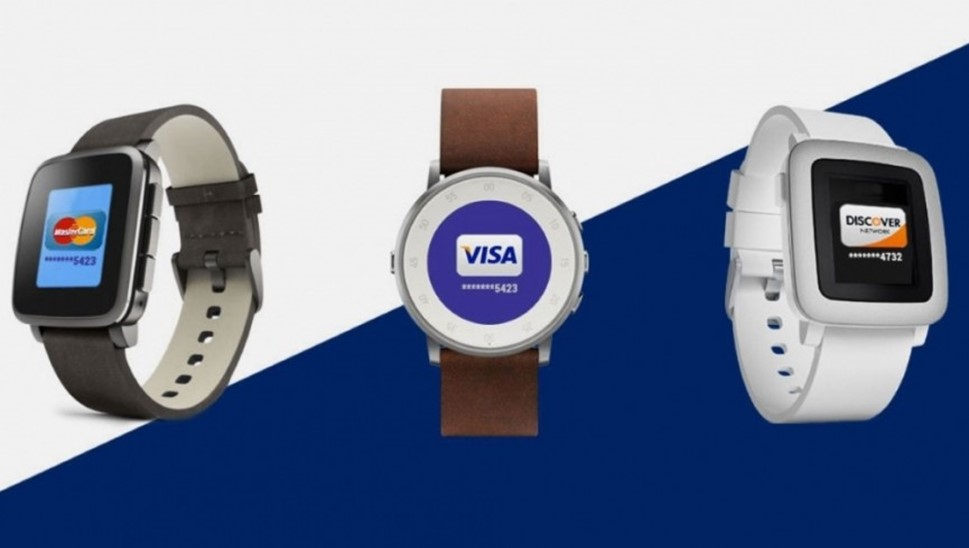

In an inspired move, the [Pebble Time now comes with the ability to accept smartstraps](http://www.wareable.com/smartwatches/pebble-time-to-get-contactless-payment-smartstrap-from-fit-pay-1941) containing whatever gadgets and chips third party developers can dream up. Expect a flow of them throughout 2016.

**25. Adidas**

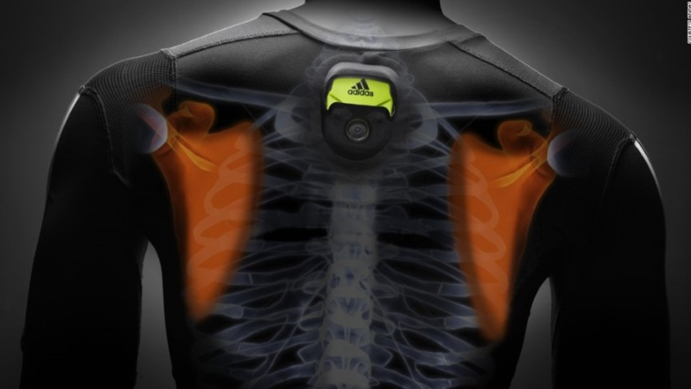

[~~Adidas’s VP for the department told Wareable~~](http://www.wareable.com/meet-the-boss/adidas-wearables-boss-the-trend-is-for-more-sensors-on-the-wrist)~~ that we’re going to see even more sensors in play from the German company next year. After the $239m investment in Runtastic back in August, we’re expecting big things from Adidas over the next 12 months.

**24. Prêt-à-porter wearables**

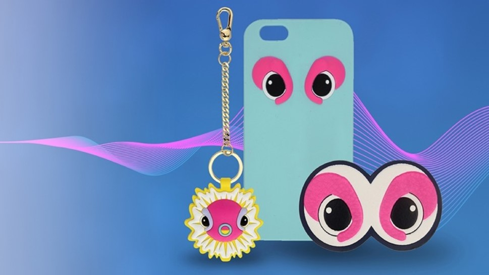

Smart clothing has been something of a trick of couture up until now but expect that to change in 2016. With brands such as Fossil and Guess jumping on smartwatches and even [Topshop selling bPay accessories](http://www.wareable.com/fashion/cute-as-hell-topshop-x-bpay-accessories-payments-1931) in collaboration with Barclaycard – wearable tech isn’t going to be on the catwalk, it’s going to hit the high street.

**23. Hearables**

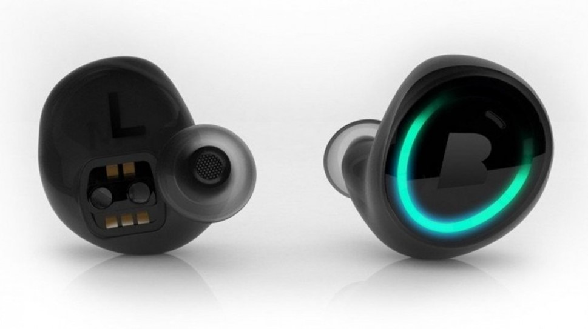

Ears are perfect for biometric measurements and a natural home for all those virtual assistants from the likes of Google, Amazon and Apple. Wareable broke the news that [Microsoft is working on a hearable](http://www.wareable.com/microsoft/cortana-wearable-clip-voice-2016) called Clip, [Jabra’s CEO](http://www.wareable.com/meet-the-boss/jabra-ceo-the-ear-is-a-great-place-for-biometrics-7696) is in on the game, we’re expecting a second crack at the [Moto Hint](http://www.wareable.com/hearables/moto-hint-plus-smart-earbud-price-specs-release-date-1405) and[Bragi Dash](http://www.wareable.com/hearables/bragi-dash-shipping-december-2015) is just about to ship. You heard it here first.

**22. YouTube 360**

YouTube’s 360-degree videos are set to get a whole lot bigger in the coming 12 months. With cheap virtual reality headsets flooding the market, there’s going to be an awful lot of people looking for something to watch and there’s no bigger name in that field than YouTube.

**21. Low-cost wearables**

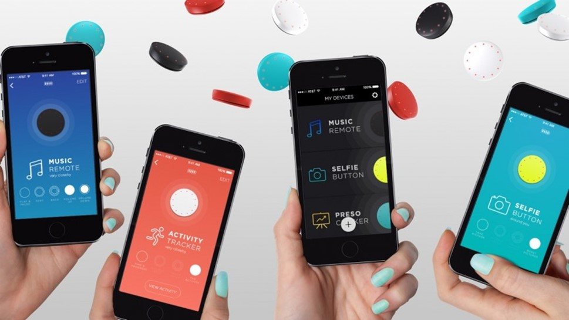

Now that wearables have started to address the issues of design and function, it’s now the cost that needs to be addressed. Xiaomi has shown that fitness tracking can be done on the cheap, and as the likes of Apple and Tag fight it out at the top, expect more manufacturers to do battle at the budget end of the market.

**20. Mind reading tech**

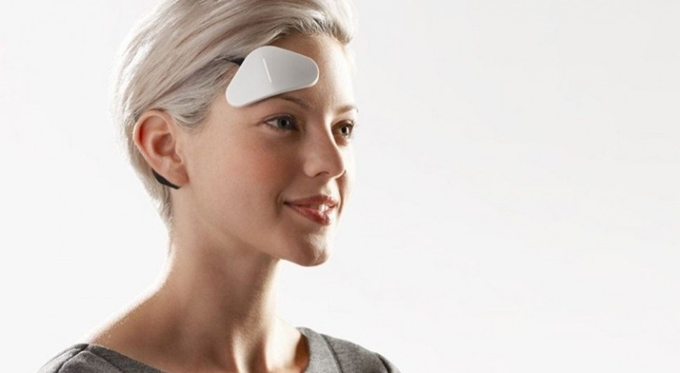

Wearables have more or less bested the body, now it’s time for them to master our minds. There have been only tentative steps with the likes of [Thync](http://www.wareable.com/wearable-tech/thyncs-new-wearable-is-mind-bending-1199) and[Muse](http://www.wareable.com/wearable-tech/muse-brain-sensing-headband-review-938) but, with an interesting bunch of crowdfunded brain training start-ups ready to ship in 2016, it’s going to be a fascinating time as we begin to get an idea of exactly what’s going on inside our noodles.

**19. Microsoft HoloLens**

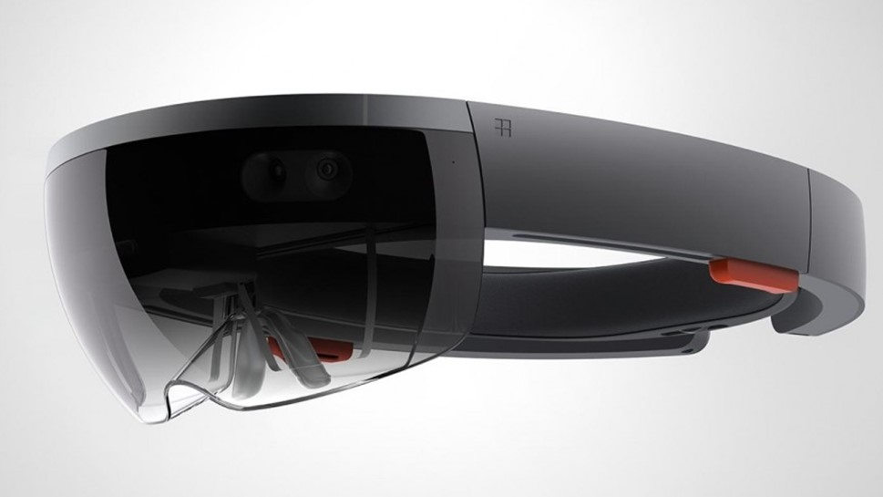

With VR set to take the headlines in 2016, what of augmented reality? The incredibly ambitious [Microsoft HoloLens](http://www.wareable.com/microsoft/microsoft-hololens-everything-you-need-to-know-about-the-futuristic-ar-headset-735) developer edition is arriving for $3,000. Expect a run of mind-blowing demo videos and a setback or two as the realisation of the problems AR still faces comes home to roost. Either way, it’s going to be the talk of the town for a while.

**18. Clothing+ Peak+**

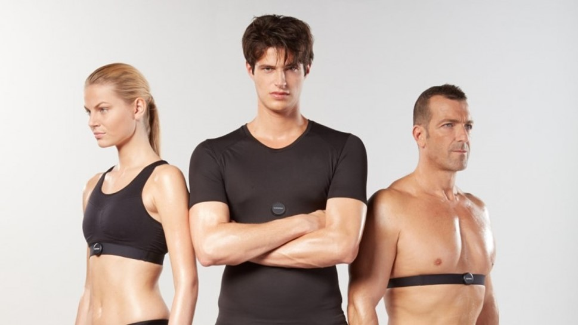

St. Petersburg-based tech company [Jabil and its Peak+](http://www.wareable.com/smart-clothing/jabil-peak-smart-clothing-2015) programme is one of the biggest chances for getting smart clothing for sports done properly in 2016. Having acquired Clothing+, a Finnish expert that’s been responsible for embedding the sensors into Adidas, Polar, Garmin and Philips equipment up until now, Jabil has assembled all the right pieces of the puzzle to bring this development on a pace. It’s set to create the standard of how to build sensors into t-shirts and sports bras and how to record biometric data without sacrificing comfort.

**17. Tony Fadell & Project Aura**

Arguably the most successful man in the Internet of Things, Tony Fadell has been fast-tracked by Google and tasked with perhaps the most difficult job of all – saving augmented reality. Project Aura is the big G’s second crack of the whip after the debatably disastrous [Google Glass](http://www.wareable.com/google-glass) and now it’s down to the man behind Nest to make it all right again. We know very little about what Aura will be, so far, but that’s sure to change next year.

**16. Gesture control**

Gesture control is nothing new but it’s only just starting to get good enough to enjoy. Forget the TV magic remotes, it’s wearables that are embedding to make navigating your smartwatch, smartphone and everything else a whole lot more intuitive. Android Wear has introduced a few simple gesture controls, VR is going to need them to keep the experience natural and immersive and there are devices like the Myo armband looking to stake their reputations on it. Move over touchscreens. It’s all about gestures.

**15. Medical grade consumer tech**

Digital health is an enormous opportunity for both the private and public sectors. More accurate, more constant and better respected measures of individual’s biometrics mean both money- and life-saving. If you’re the NHS, you can axe millions from your costs by ensuring that people are compliant with drugs. If you’re an insurance company, you can price your premiums accordingly. If you’re a tech giant you can capitalise with your health platform and data sales. Whomever you are, it’s a winning situation. The only haunting figure is the spectre of possible identity theft; no small deal but perhaps no big problem.

**14. Invisibles**

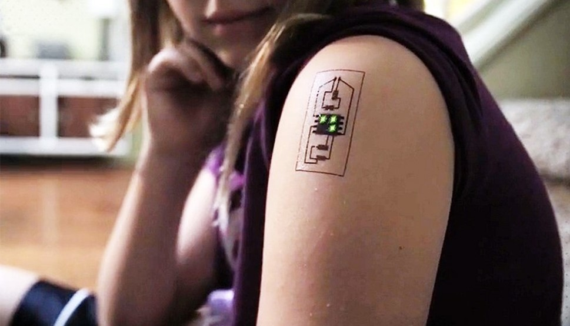

We’ve been talking about it for years but the rest of the world needs to catch up on [invisibles](http://www.wareable.com/wearable-tech/invisible-ingestible-implantable-fashion-forcing-wearables-disappear). Sensory tech is far easier to design when you don’t have to worry about it looking great, so there are [tech tattoos](http://www.wareable.com/wearable-tech/chaotic-moon-shows-off-wearable-tech-tattoo-concept-1987) in development from Chaotic Moon, New Deal Design and more which might only need power from your movement or the current across your skin. And what they could learn from your sweat, we’re sure to find out. You might be wearing an invisible in 2016 but, then, we’ll never know.

**13. Blocks**

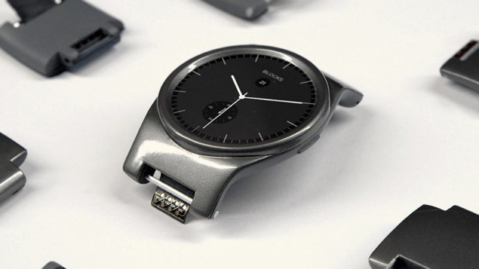

The [10th most funded Kickstarter wearable](http://www.wareable.com/crowdfund/biggest-wearable-crowdfunding-success-stories-of-all-time-911), British based modular smartwatch [Blocks](http://www.wareable.com/smartwatches/blocks-att-ee-cellular-standalone-smartwatch-1930) is set to ship in 2016. The design is impressive and the platform is open to both iOS and Android. What’s more, of course, the range of modules will keep on growing meaning that you’re not trapped with the hardware set that you first purchase. There’s already heart-rate and fingerprint ID available with plenty more to come in the Blockstore, and even

**Opinion: Sonny Vu**

“As far as trends go, I think there are several megatrends that are afoot:

1. **Moving beyond tracking** – I think wearables will start to encompass more and more functionality such as safety, controls, and identity.

2. **Embracing fashion** – I think wearables will finally start to embrace fashion, which will necessarily include better design and more interesting “real” fashion brands.

3. **Hearables** – I think this will start to be a real category with more mainstream adoption and awareness starting to emerge late 2016.”

if Blocks doesn’t succeed in 2016, we’re sure it’s modular legacy will endure.

**12. Sonny Vu & Fossil**

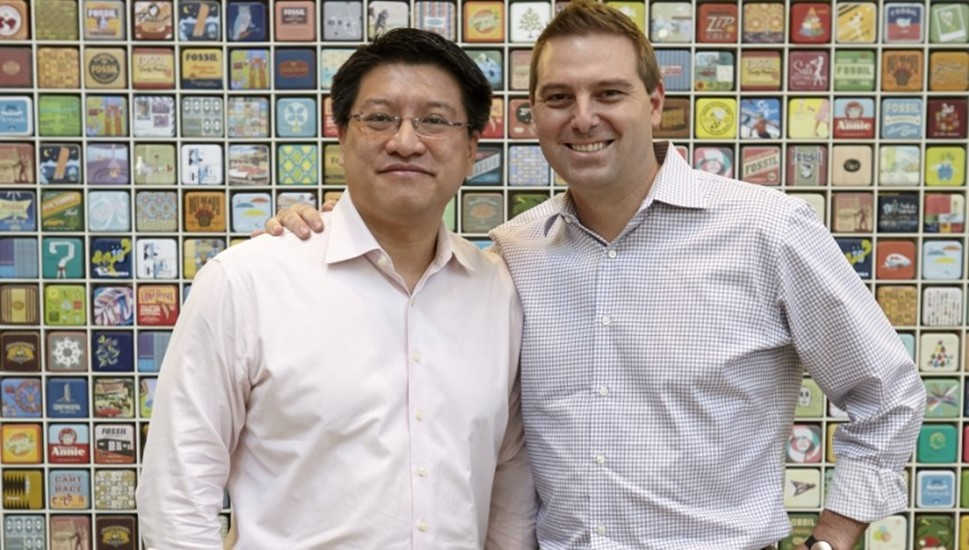

Not only does this impressive partnership sound like a hip-hop act, it also represents two very big players in the field of wearable technology. Fossil got serious about smart kit when it launched the [Q Founder](http://www.wareable.com/smartwatches/fossil-q-release-date-price-specs-2015) and three fitness trackers. Buying up the already highly successful Misfit Wearables and its inspirational leader Sonny Vu for $260 million means absorbing a whole load of clever battery-saving and sleep tracking tech that it would have taken years to develop otherwise. Kept on as president of Misfit and CTO of all connected devices at Fossil, the voodoo that Vu does with that multinational weight behind him is going to be magic.

**11. Samsung Gear S2**

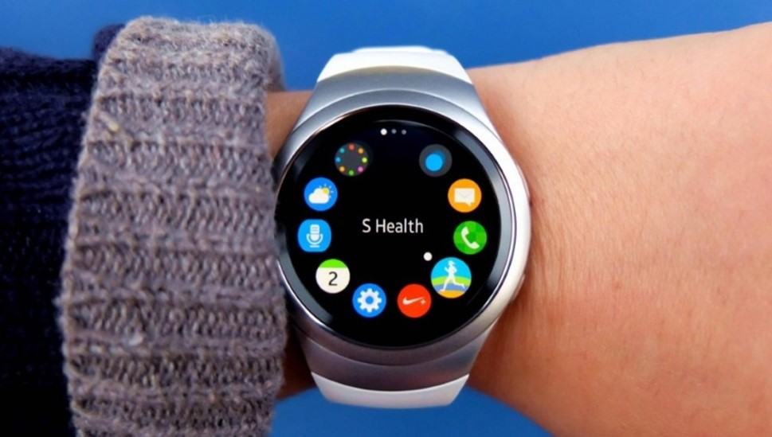

The [Gear S2](http://www.wareable.com/samsung/samsung-gear-s2-review) represents Samsung’s real arrival on the smartwatch scene. It’s a 2015 smash but its real legacy will be how brightly it burns in 2016. Samsung Pay is set to land some time soon but the real boon is the news that you’ll be able to use the S2 with an iPhone and other Android devices. That opens up an enormous opportunity for both the Korean giants and for those iOS users whom are so far unconvinced by what the Apple Watch can do. Expect the fireworks to fly when Apple realises that Samsung is eating its lunch.

**10. Smart home platforms**

The smart home is here, but tying all these disparate gadgets together is still a challenge. Technologies like Zigbee, Z-Wave and Thread are now ready to sit in the background while the major players fight for control with their entire platform solutions.

As we enter the ring in 2016, Samsung SmartThings, Apple HomeKit and Google Brillo will slug it out while the nimbler and more specialist Nest, Hive, Canary and co. will squabble over whose is the system to trust.

It’s the beginning of another format war of sorts. Which will you choose?

**9. Apple Watch 2**

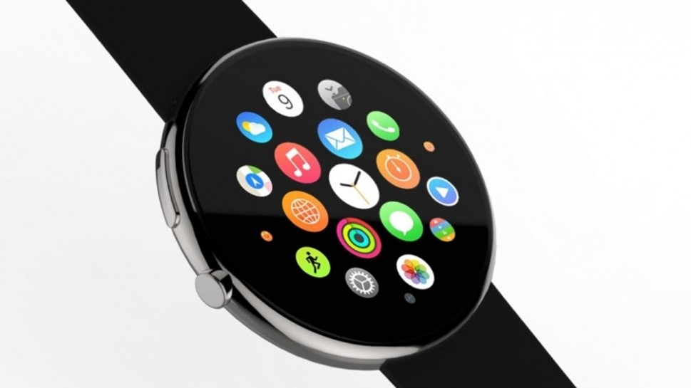

The [Apple Watch](http://www.wareable.com/apple-watch/apple-watch-review) was number one on the Wareable 50 for 2015 and that was before it was even announced. All the same, we were right to champion it as the hot wearable of the year.

Perhaps, once again, the smart money is on the [Apple Watch 2](http://www.wareable.com/apple-watch/new-apple-watch-2-features-specs-release-date-1125) to be another huge deal as the calendar ticks over. The first iPhone had no 3G or Bluetooth. What style gaps and feature flaws will the Apple Watch 2 set out to fill? We look forward to finding out.

**8. Magic Leap**

Google Glass totally put you off AR but [Magic Leap](http://www.wareable.com/ar/magic-leap-ar-teaser-solar-system) is here to get you extremely giddy again. We still don’t know how we’re going to actually access it, all we know is that we want it in front of our eyes ASAP. Everyone from Google to Qualcomm has invested in the augmented reality startup which reportedly uses light field displays to achieve the trick of overlaying 3D visuals seamlessly on top of your view of the room around you. Billed as an “operating system for reality” by its zany creator, Rony Abovitz, Magic Leap will get its moment of reckoning in 2016.

**7. Wearable payments**

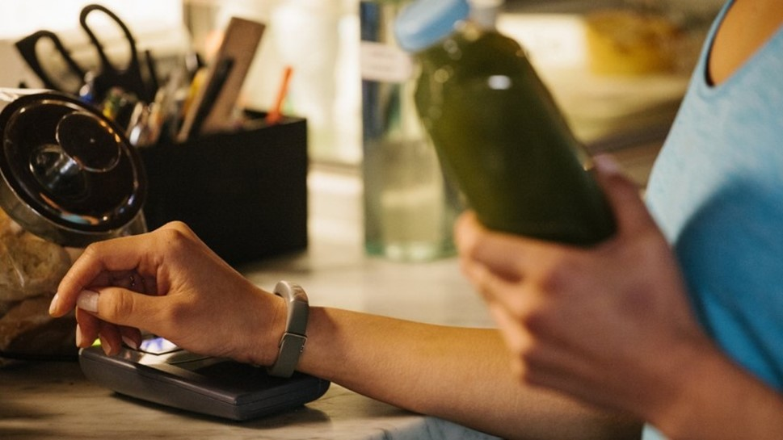

The infrastructure is here but people aren’t paying from their wrists – yet. But wearable payments are set to become the norm in 2016. A few million Apple Watches in the wild, Samsung Pay, Apple Pay, bPay, plus [MasterCard backing the likes of Ringly and Nymi](http://www.wareable.com/wearable-tech/mastercard-gets-ringly-on-board-for-new-wearable-nfc-payment-tech-1872) mean that there are going to be more ways to pay, and more securely than ever. With so many of the big players behind it, it’s sure to be the year for wearable payments.

**6. Fitbit**

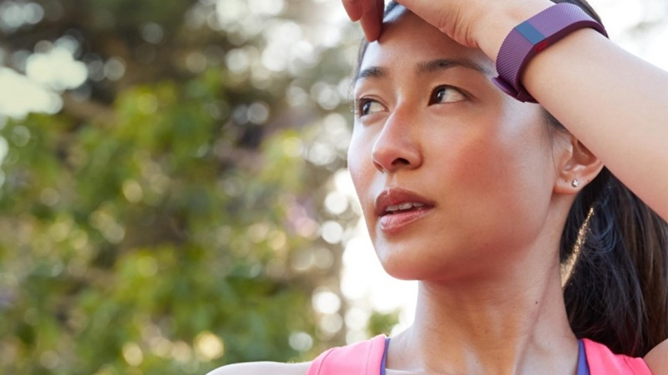

Fitbit has some work to do. The newly-IPO’d incumbent of the fitness tracker castle was the biggest selling wearable in 2015, but there are pretenders plotting against it. From the far cheaper Xiaomi to the more innovative coaching style of Moov. Just in the nick of time for the Wareable 50, we’ve word from the company CEO, [James Park](http://www.wareable.com/fitbit/ceo-advanced-sensors-coaching-fitbit-trackers-2016), of what to expect for 2016.

The answer to that is a three-pronged protection of the crown: more advanced sensors to pick up the likes of stress and blood pressure, more insights from the gathered data for more specific coaching advice and, perhaps key, where other makers will struggle to match Fitbit, is bigger and better partnerships with fashion brands. Thought Fitbit was finished? Think again.

**5. Stress detection**

What can fitness trackers record after steps and sleep? Well, 2016 will see your Fitbit keeping tabs on your stress levels as well as your activity.

A trend towards clever coaching platforms piecing together our different biometrics – our sleep patterns, our heart-rate, even our galvanic skin response – and send users both warnings of stress levels and ways that, perhaps, we can try to reduce them.

And stress is the focus for a number of companies. Fitbit is working on it, and Withings revealed that it had found stress metrics in its sensor data, which could feature on forthcoming devices to be announced at CES.

**4. Women’s wearables**

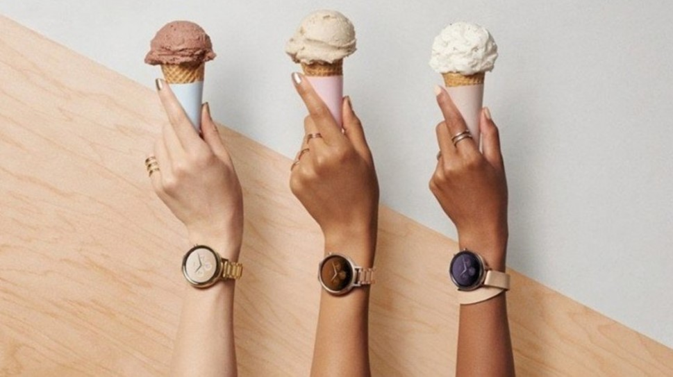

Yes, yes, yes; can we say yes again? Yes! Is it because there’s an unusual amount of [female top brass in the wearable world](http://www.wareable.com/wearable-tech/the-no-diamantes-allowed-club-2015) or just that the gap in the market is so utterly cavernous? We’re not sure. Either way, we’ve seen a hint of it already, but 2016 will be the year that women get wearable. Why? Because companies are actually starting to cater for them in both style and size.

The [Moto 360 2](http://www.wareable.com/motorola/moto-360-2nd-generation-2015-review), the Apple Watch, the [Pebble Time Round](http://www.wareable.com/Pebble/pebble-time-round-review) have clued up to it, plus there’s the growing availability of the smart jewellery, smart clothing products and the [quantified fertility sensors](http://www.wareable.com/health-and-wellbeing/the-quantified-woman-fertility-tracking-1914).

**3. Under Armour**

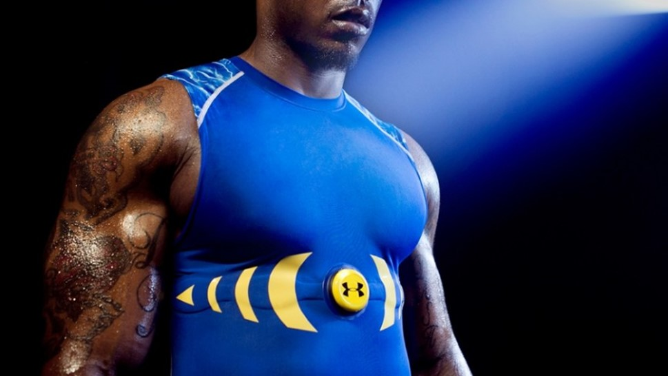

[~~Under Armour~~](http://www.wareable.com/fitness-trackers/under-armours-major-investments-are-paying-off-1706)~~ is going all out attack on the world of sports goods, and wearables are its weapon. It partnered with HTC for the (missing in action)[Grip](http://www.wareable.com/htc/the-htc-grip-isnt-dead-its-just-delayed-until-2016-1864) and back in February, the US giant scoffed up three of the biggest fitness platforms – Endomondo, MyFitnessPal and MapMyFitness – to make the biggest online fitness community.

It’s since struck deals with sports retailers using those three app tools as tempters such that it can gain customer shopping data. With that Under Armour can ensure it’s creating the very smart sports clothing that people are looking for, exactly when they’re looking for it.

**2. Xiaomi**

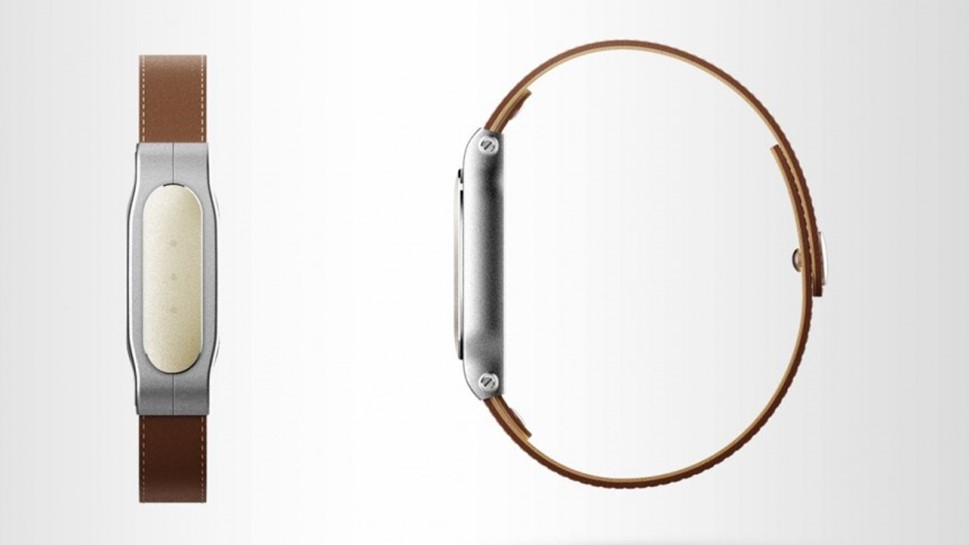

Massive in 2015 and even bigger in 2016 is what we say. The Chinese juggernaut was second only to Fibit in wearable sales but, with its move across to the West timed to coincide with Fitbit’s assault on Asia, it’s going to be fascinating to see who turns up trumps.

2016 will see the heart-rate monitor-toting [Mi Band 1S](http://www.wareable.com/xiaomi/xiaomi-mi-band-1s-specs-price-release-date-1330), a ceramic tracker known as [Amazefit](http://www.wareable.com/fitness-trackers/xiaomi-backed-amazefit-band-is-a-gorgeous-ceramic-tracker-aimed-at-women-1709) and, surely, fruit from the long-standing rumour that Xiaomi will unveil its very first smartwatch. That will begin a shake-up like no other.

**1. VR for all**

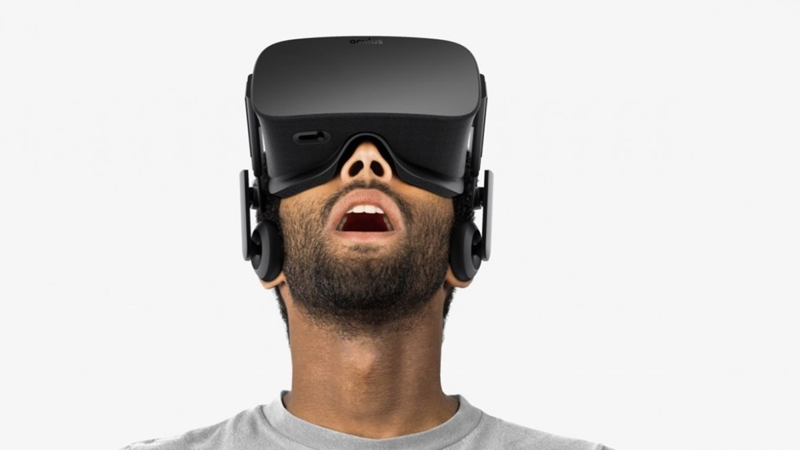

It’s a make or break year for virtual reality in 2016. [Oculus Rift](http://www.wareable.com/oculus-rift/how-oculus-rift-works) is arriving in full consumer edition glory in Q1, but there are almost countless other headsets, games, films, apps and experiences to follow. There’s Wareable favourite [HTC Vive](http://www.wareable.com/vr/htc-vive-review), its partnership with Valve, and Sony’s behemoth-in-waiting PlayStation VR. Add to that Razer OSVR, Fove VR, plus all the peripheral gloves, suits and rigs we’ve yet to meet and things are about to get hectic.

Movie studios, games publishers, sports, music, art, porn, gambling and just about everyone else is trying to figure out how they can use this astonishing tech, finally set to emerge, as a phoenix from its early 1990s flames.

From <[http://www.wareable.com/wareable50/best-wearable-tech](http://www.wareable.com/wareable50/best-wearable-tech)>
