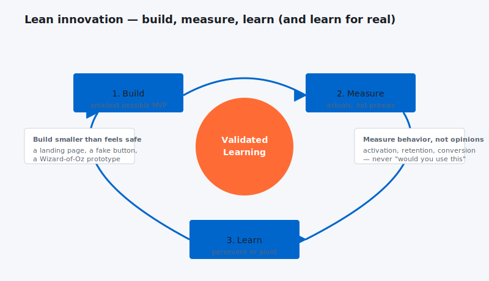

Lean innovation is being embraced by everyone — from the smallest start-ups to the largest global organizations. But in most cases, it’s still falling well short of its full potential because it either lacks or fails to tightly integrate with the mechanisms needed to systematically capture lessons learned and share them outside the team. And that’s where the money is in innovation.

Lean innovation embraces a philosophy of not letting perfection get in the way of progress. It leverages the Pareto principle that 20% of a product’s features (what’s distilled down into the minimal viable product) will most likely deliver 80% of the benefits sought by customers.

As an approach, lean innovation lends itself especially well to corporate cultures, often engineering ones and others strongly focused on process-improvement programs such as Six Sigma. Its straightforward, step-by-step methodology makes it relatively easy to explain and to implement:

- Identify the minimal viable product.

- Develop a version rapidly and test it with customers, ideally in a real-world competitive situation.

- Repeat the process until the core product is competitive or pivot to explore a new approach.

Lean innovation stands in stark contrast to conventional approaches to product development in which teams expend enormous effort trying to create a perfected, many-featured product over an extended period without sufficient in-market customer feedback. The resulting new products are often too expensive, too complicated, too different from what customers want, and too late to market.

But an exclusively process-driven view of lean innovation obscures the underlying reason for its power. And without a deeper understanding, we limit our ability to fully benefit from its potential.

Nielsen,  led a [study of innovation best practices](http://www.rivia.com/innovation-best-practices-study/) in the consumer-packaged-goods (CPG) industry with companies like Procter & Gamble and Kraft that revealed why top-performing companies average 600 times more revenue from their new products than the lowest performers. The research tied variations in new product revenue at almost 30 global companies to differences in processes, culture, organizational structure, senior executive leadership roles, and investment.

One of the key findings was that learning has far and away the single greatest impact on revenue from new products. And creating a better environment for learning is what lean innovation does so well. Its focus on the most important product attributes and rapid cycling of trial and error — ideally in the real-life competitive environment — accumulates critical knowledge at a rapid clip.

In other words, lean innovation is not a better innovation process; rather it’s a more efficient learning process. And by combining the lean perspective with innovation research from CPG companies, we can vastly improve the effectiveness of the lean innovation approach. Here is what the research tells us:

- Companies with mandatory formal debriefs of both success and failure following new product launches average about 100% more revenue from new products in comparison to companies that don’t formally debrief.

- When debriefs are led by an outside third party, the revenue increases substantially more.

- And when the learnings are captured in a knowledge management system, revenue jumps again.

- Companies that apply these learnings to creating, continuously improving, and strictly following decision-making criteria for the evaluation of potential new products average about 130% more revenue from new products.

Success can skyrocket by simply adding the above steps to a lean innovation process.

But this research also points to a cautionary note regarding lean innovation. Given that lean innovation teams move so quickly, the learnings are less likely to be captured than in traditional, slower approaches to product development. Secondly, given that lean innovation teams often exist in parallel with conventional product development teams, valuable learnings from lean teams are not always transferred to the development side.

We need to think of lean innovation as a process that drives more efficient learning. But to maximize success, lean innovation must be married to practices that effectively capture these rich lessons and make them readily available to everyone within the organization.
