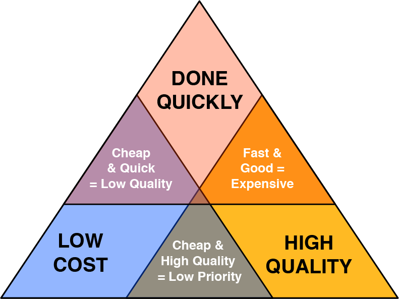
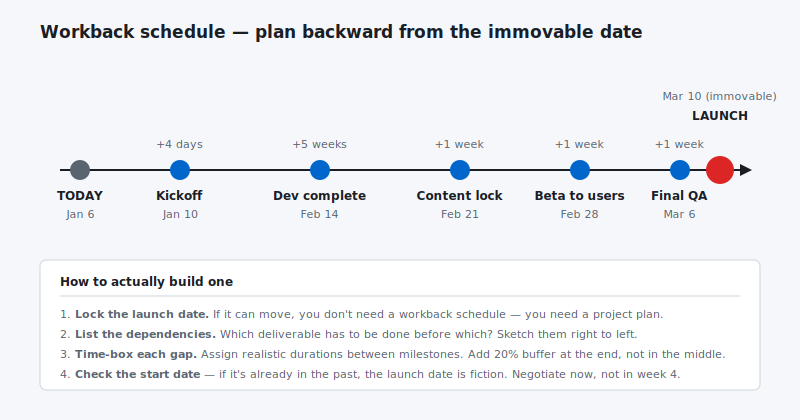

I tend to get a lot of projects that start with a launch date and then come to me with a product vision and little else. This requires the reverse of normal planning forward technique.  We now need to use what is refereed to as a work-back or backward loading method.

## What’s A Work-back Schedule?

Work-back scheduling is taking a job with a number of tasks and allocates those tasks to resources in reverse orders and schedules the task on the resource.   Backwards scheduling requires a delivery date from the customer because the system schedules backwards from the delivery date to arrive at a start date.   Backward scheduling tells the client/manufacturer if this date could be hit based on the allocation of resources.   Unlike forward scheduling which schedules into the future, backward scheduling could potentially schedule into the past because the resources where not available to complete the job.   Backwards scheduling then may turn around and actually forward schedule the job to tell the customer the earliest delivery time.If (most likely when) the client ideal product goes back in time you need to break out the good old Iron Triangle.

## Iron Triangle

There’s different versions of this triangle diagram but I am going to look at the one which covers three key project constraints – Quality, Time to build and Cost. The premise of this triangle is that **you can’t have all three of these outcomes – you can only pick two** and by doing so the third option will suffer.

##  High Quality

If high quality and a large feature set is your most important goal then expect to pay for it. The cost will come either from engaging highly experienced professionals or engaging a top level professional who will take longer than a team. Either way, a high quality product is going to take some time to develop. You can only make things go faster by throwing more people (money) at the job.

### How to manage this constraint

You can maximize the quality of your product by hiring the best people you can and doing plenty of prep work yourself so that your professionals know exactly what you want and can get to work quickly and efficiently.

## Time to build

If a customer came to you wanting a quote on a job that meant you would need to work over the weekend and stay up late to get it finished how do you think you will charge? Like a bull I suspect!

If you need a quality product built in a hurry then you will likely pay a premium for this privilege, i.e. a ‘rush rate’. Whether it is an agency dedicating a number of people to the job or a freelancer staying up over the weekend, expect to pay a premium.

Now on the other hand, if you want it quick and cheap then quality will inevitably suffer. This is the ‘dirty’ in ‘quick and dirty’.

### How to manage this constraint

As with quality, you can maximize the speed with which your product is built by smoothing the way for your professional and making sure everything is available when it is needed. But perhaps most importantly, set yourself a realistic time frame so that there is no need to pay a priority rate.

## Cost

A large budget means you can either hire efficient, high quality professionals or engage less efficient ones for a longer time. Always aim for the former – they will save you money and stress in the long run. Spending hours managing the work of less experienced contractors can be a real drain.

And of course a large budget means you can insist that things are done quickly and expect that they will be done.

There is a important caveat to the cost to think about. My clients usually respond with no cost restriction – “get her done” – mentality. This sounds fantastic. Here are some issues i have run into with this unlimited budget.

- More people tends to equal more management so you need to make sure you don’t take on all the work your self and scale the PMO as well.

- More people don’t always exist.

- At major corporations where vendor approval is required can add weeks to the timeline. So even if you have the people it may be delayed by paperwork. This has happened to quite a few times.

So before you through this out to your client make sure you have all your t’s crossed and don’t over promise.  Good rule of thumb is take all the input in from the client then come back with a new solution.

Unfortunately the flip-side is if you do not have a suitable budget then you may not be able to afford the help needed to re-examine your goals.

### How to manage this constraint

If money is tight then consider starting out small. Features can be added to over time so you don’t need to have a full feature set from day one.

## Conclusion

The Iron Triangle is a great way to help you clarify product goals and priorities. The project becomes a three-way tug of war between time, cost and quality and in the end only two of these options wins out. Which two are the most important to you?

A Work-back Schedule is a useful method that reveals the milestones that a project will have to meet. It forces you to think about what a successful project will look like, and the steps you will have to take to get there. If the deadline is not able to met with the feature set that is required then the Iron Triangle is your friend.

I like to use the triangle to really flush out a MVP(most valuable product) its always better to deliver something rather then nothing. By focusing on whats really important and getting that out and then layering on features to the delivery date is by far the best solution and will produce the happiest clients.

##
