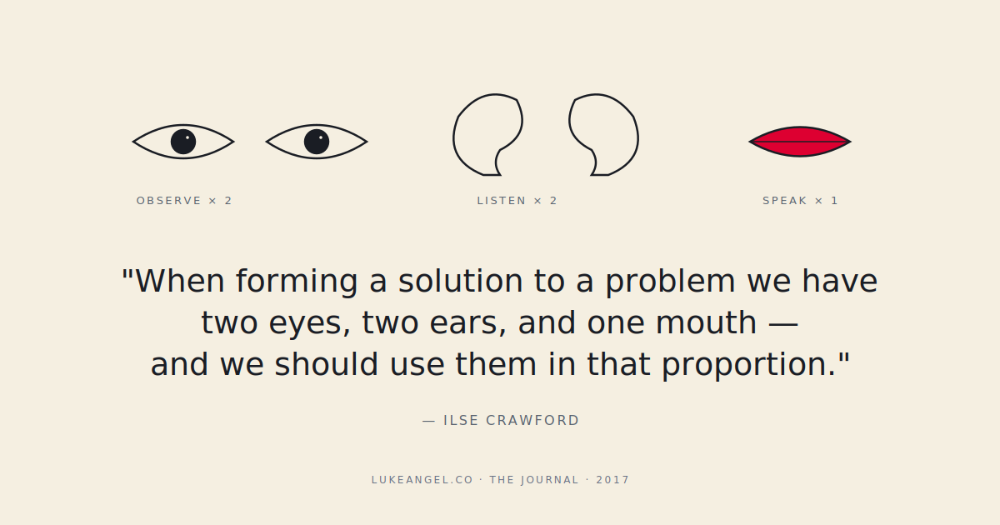

> *When forming a solution to a problem we have two eyes, two ears, and one mouth — and we should use them in that proportion.*  
> — Ilse Crawford

Ilse Crawford is a designer. Her studio's work is *furniture, hotels, kitchens* — not software, not roadmaps. Which makes the quote's PM-fit almost suspiciously perfect. The discipline she's pointing at is universal: **the order of operations on a hard problem is observe, listen, talk — and the time you spend on each should roughly match the ratio.**

Most product meetings I've been in invert this. Two mouths, one ear, zero eyes. Then everybody wonders why the decisions don't land.

## The 2-2-1 in actual numbers

If you took it literally — and I do, on hard product problems — the ratio plays out like this in a one-hour product discussion:

- **24 minutes observing** the actual artifact. The dashboard. The eval report. The session recording. The customer transcript. *Looking at the thing.*
- **24 minutes listening** to the people closest to it. The support lead. The on-call engineer. The user research summary. The customer call recording.
- **12 minutes talking** — proposing options, discussing trade-offs, deciding.

Most product meetings I'm in are 0–5 minutes observing, 5–10 minutes listening, and **the remaining 45+ minutes talking**. Which is why the same meeting tends to need a follow-up next week.

## Three places this ratio breaks in product work

**1. The roadmap review with no data on screen.** Someone is presenting next quarter's plan. Slides are up. The dashboard is *not* up. We're nine minutes in. We've already spent five of them disagreeing about whether retention is up or down. **Nobody opens the chart.** This is a meeting that has skipped the eyes column entirely.

**2. The user research debrief that's mostly opinions.** The researcher did the calls. They wrote up the themes. The team in the room hasn't read the themes. The first 20 minutes are everybody saying what they think users want, *before* the researcher gets to say what users actually said. Ears, skipped. Mouths, full.

**3. The post-mortem that's actually a pre-mortem about the next quarter.** An incident happened. The post-mortem meeting starts and within five minutes people are arguing about whether to restructure the team. **We have not yet looked at the timeline.** Eyes and ears: skipped. The post-mortem is now a vibes session.

## The actual practice

You can fix this in a single meeting if you want to. Three small habits:

1. **Open the artifact first.** Before any opinions are voiced, open the dashboard, the eval report, the support ticket, the session recording. Spend a full minute or two with the room *looking at the thing*. Don't narrate yet. Just look. The silence is uncomfortable; the silence is the point.
2. **Read the customer quotes out loud.** Five quotes, verbatim, no editorializing. The room hears them. *Then* the conversation starts.
3. **Start the talking-portion with a sentence that begins with "given what we just saw and heard…"** This forces a re-anchor on what the eyes and ears actually contributed. It also flushes out the people who'd already decided before the meeting started.

## Why this matters more in the AI era

The break-neck automation post made the point that products now have a higher bar across four axes. Here's the related point: **decisions about AI products fail particularly badly when 2-2-1 is inverted.** Because:

- The artifact (eval scores, model outputs, user reactions) is *deeply non-obvious* without staring at it
- The listening is *deeply non-intuitive* without hearing customer reactions verbatim
- The talking is where everyone's *biases about AI* show up loudest

If you skip the eyes and ears on an AI feature decision, you are essentially talking your priors about AI into the room. **The priors are not data.**

## A nod to the source

Ilse Crawford's whole career is a rebuke to the talking-shop. Her studio's work is *quiet*, deeply observed, deeply listened-for. Even in a different medium, the lesson lands: you cannot solve a problem you haven't bothered to look at.

The 2-2-1 ratio isn't a metaphor. It's the actual ratio. Try it for one meeting this week. Note how unfamiliar the room feels at minute 24, when nobody has spoken yet.

Gratitude beat: thank you to the researchers, support engineers, and on-call team members who do the looking and the listening *for the rest of us* every day. We talk a lot because they listened first.
