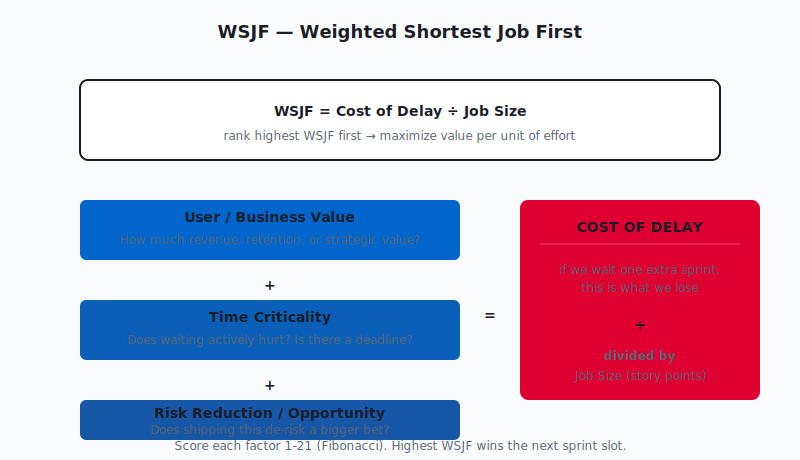

Alright, team, let’s talk *prioritization*. We’ve all been there. Staring at a backlog that’s longer than a CVS receipt, feeling the cold sweat of indecision. Do you tackle the big, hairy, scary feature first? Or maybe that quick win that’ll make your boss smile? 

Enter **Weighted Shortest Job First (WSJF)**. No, it’s not a new type of artisanal coffee. It’s a ridiculously effective way to figure out what to work on *first* to deliver the *most* value in the *shortest* amount of time. Think of it as the Marie Kondo of your backlog – we’re only keeping what sparks *maximum business value*.

## WTF is WSJF (Really)?

WSJF is a prioritization method, primarily used in Agile frameworks (especially SAFe – the Scaled Agile Framework). At its core, it helps you determine the *sequence* of work. Consequently, it’s not just about picking *what* to do, but *when* to do it. It recognizes that time, like that last slice of pizza, is a precious, non-renewable resource.

The magic of WSJF lies in its focus on two key factors:

- **Cost of Delay (CoD):** What’s the impact of *not* doing this now? Will we lose revenue? Miss a market opportunity? Upset our users so much they start tweeting angry emojis?

- **Job Size (or Duration):** How long will this thing take to complete? A quick tweak or a multi-quarter saga?

By combining these, you can create the right order of importance.

## The WSJF Formula Decoded

Here’s the magic equation:****WSJF = (User Value + Time Criticality + Risk Reduction) / Job Duration

sometimes people simplify ** (User Value + Time Criticality + Risk Reduction)** to be *Cost Of Delay *

so the formula will look like WSJF = Cost of Delay/ Job Duration

- **User Value**: How much customers want this feature

- **Time Criticality**: Penalty for delaying delivery

- **Risk Reduction**: Avoided disasters/enabled opportunities

- **Job Duration**: Estimated effort

### **Job Duration/ Job Size – Sizin Up the Job (Size)**

People tend to get tripped up on this. Job Size, also known as Duration. 

We’re *not* trying to predict the exact number of hours or days something will take. Again, we’re using relative sizing or t-shirt sizing. 

Consider:

- **Effort:** How much work is involved?

- **Complexity:** How many moving parts are there?

- **Uncertainty:** How much do we *not* know about this?

## How to Calculate WSJF: 3-Step Process

- **Score Each Factor**: Gather your squad and vote on values either using simple (1=quick, 10=marathon) or using Fibonacci sequencing (1,2,3,5,8,13) to avoid middle-ground bias.

- **Crunch Numbers**: Add User Value + Time Criticality + Risk Reduction, then divide by Job Duration.

- **Sort & Conquer**: Highest WSJF score wins the priority throne.

Pro Tip: Use a simple spreadsheet or Jira plugins like Ducalis to automate calculations

## Real-World WSJF Wins

## Example 1: E-Commerce Platform Overhaul

Imagine you’re on the product team for “Shoes ‘R’ Us,” an online shoe retailer. You have two features in your backlog:

- **Feature A:** Implement a new “AI-powered shoe recommendation engine.” Sounds fancy, right?

- **Feature B:** Fix a bug that causes the checkout process to crash 5% of the time. Not so fancy.

Let’s do some *very* rough WSJF estimation:

| Feature | User-Business Value (UV) | Time Criticality (TC) | Risk Reduction (RR) | Job Size | WSJF |
| --- | --- | --- | --- | --- | --- |
| A (Recommendation Engine) | 5 | 3 | 2 | 8 | 1.25 |
| B (Checkout Bug) | 8 | 8 | 5 | 3 | 7 |

 Even though the AI engine *sounds* cooler, fixing the checkout bug has a *much* higher WSJF score. Why? Because that 5% crash rate is bleeding money *right now*. The Cost of Delay is sky-high.

## Example 2: Healthcare App Compliance

**Dilemma**: Update legacy system vs. add telehealth features

**WSJF Analysis**:

| Task | UV | TC | RR | JS | **WSJF** |
| --- | --- | --- | --- | --- | --- |
| Compliance | 5 | 13 | 13 | 5 | **6.2** |
| Telehealth | 13 | 5 | 8 | 8 | **3.25** |

**Result**: Compliance work prioritized, avoiding $2M in potential HIPAA fines

## Pro Tips for WSJF Success

- **Beware of Sandbagging**: Teams sometimes inflate Job Duration scores – combat this with historical velocity data.

- **Reassess Weekly**: Priorities change like TikTok trends – update scores during sprint reviews.

- **Combine Frameworks**: Use WSJF with RICE scoring for complex decisions involving multiple stakeholders.

## FAQ: WSJF Edition

**Q:** Can WSJF work for bug fixes?****A:** Only if they’re showstoppers – minor bugs often score low on Time Criticality

**Q:** How is this different from RICE?****A:** WSJF adds time pressure and risk factors – RICE focuses on reach/confidence

**Q:** Best WSJF software?****A:** Jira + Advanced Roadmaps or ClickUp’s formula fields work wonders

## WSJF ≠ Crystal Ball (But Close)

While no framework guarantees success, WSJF turns prioritization from political debates into data-driven decisions. 
- **Making informed decisions:** It forces you to think critically about value and urgency.
- **Facilitating conversations:** It provides a common language for stakeholders to discuss priorities.
- **Adapting to change:** As new information emerges, you can re-calculate WSJF and adjust your plans.

- **Maximizing Flow.**~~ Small quick work promotes flow.

One SAFe team at a retail giant used it to reduce decision-making time by 40% while increasing ROI per sprint.Ready to WSJF your backlog into shape? 

Your product roadmap will thank you later
